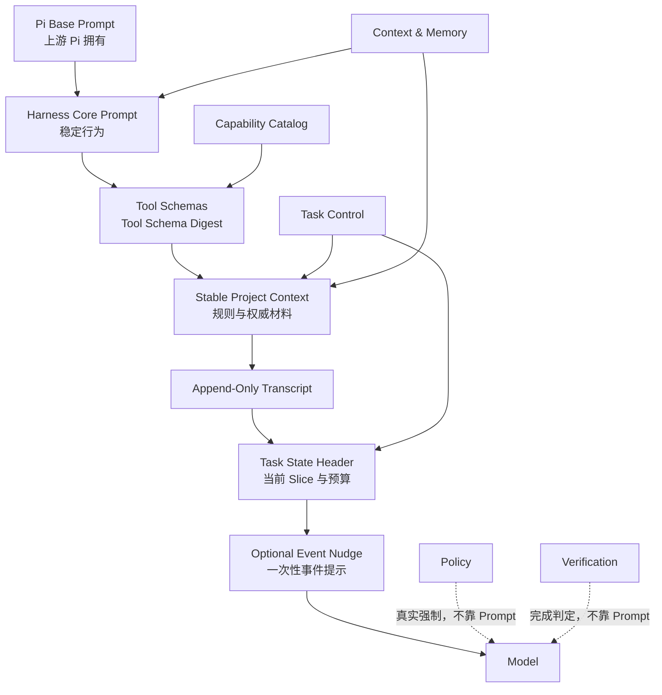

# Picode Harness Prompt System 设计

> **版本提示（2026-08-06）**：`PICODE-NEXT-ARCHITECTURE-REVIEW-2026-08-06.md` 已将默认 Harness 改为 Prompt-thin/event-driven。本文中的长 Harness Core Prompt 不再默认注入，保留为可选 Guided Skill、行为评估与历史设计参考；Task Facts、Event Nudge、Role Prompt 和 Prompt-vs-Enforcement 原则仍可复用。
>
> 状态：设计稿 v2（专家评审修订）  
> 日期：2026-08-04  
> 适用范围：Picode Next 的 Harness Task、Developer TDD、Quick Review、Task Slice、Subagent 与 QA Handoff  
> 不适用范围：Simple Task；Simple 保留上游 Pi Agent 的原始提示词与工具行为  
> 上位设计：[PICODE-NEXT-MASTER-ARCHITECTURE.md](PICODE-NEXT-MASTER-ARCHITECTURE.md)

## 0. 结论

Harness 模式不使用一段不断膨胀的“万能提示词”。模型实际收到的引导由五类材料组成：

1. **Pi Base Prompt**：上游 Pi Agent 原生提示词，由 Pi Runtime 拥有，Picode 不复制、不替换。
2. **Harness Core Prompt**：Picode 的稳定开发行为约定，在一个 Cache Epoch 内保持字节不变。
3. **Context Package**：当前仓库规则、权威设计材料、Task Slice Contract 与真实状态，由 Rust Module 确定性生成。
4. **Event Nudge**：仅在阶段变化、偏离风险、压缩、恢复、完成请求等事件发生时追加的短提示。
5. **Role Prompt**：Reviewer、Subagent、QA Handoff 等临时角色的窄任务契约，不改变主 Agent 的事实权威。

核心原则是：

> Prompt 负责告诉模型如何高效合作；Rust Module 负责决定什么真实、什么允许、什么算完成。

因此，即使模型忽略 Prompt，权限、Developer TDD 的 pre-RED 写入限制、Git 确认、Verification Budget 和 Completion Label 仍然有效。反过来，Prompt 也不会重复解释底层所有安全机制，从而保持 Pi 的简洁和高能力模型的自主性。

### 0.1 完整引导清单

| 类别 | Prompt Block / 引导 | 是否常驻 | 用途 |
|---|---|---|---|
| 上游基础 | Pi Base Prompt | 是 | 原版 Pi 的 Agent 角色、原生工具与循环行为 |
| Harness 核心 | `picode.harness.core/v1` | Harness 内是 | 软件开发者角色、局部修改、证据诚实、授权/Git/完成协作方式 |
| Profile | Developer TDD Overlay | 仅显式 TDD | RED→GREEN→Integration Smoke、flake 与预算行为 |
| 项目上下文 | Project Rules | 当前 Task 稳定 | root→cwd 规则、AGENTS/Grok/Claude/Cursor 兼容规则 |
| 必要上下文 | Required Context Set | 当前 Slice 稳定 | 产品目标、Interface、Contract Edge、验收、ADR 与证据 |
| 工作契约 | Task Slice Contract | 当前 Slice 稳定 | 单一目标、范围、Snapshot、Gate、预算和完成条件 |
| 动态状态 | Task State Header | 状态变化或超出 Attention Horizon 时追加 | 当前 phase、todo、repair budget、下一合法 transition |
| 工具发现 | Tool schema / Capability Catalog | 按层级 | 已加载工具的真实 Interface 与可按需发现能力 |
| 事件提醒 | Event Nudge | 事件驱动、默认一次性 | 计划、偏移、TDD、权限、压缩、恢复、完成等短提醒 |
| 专用角色 | Reviewer/Subagent/Capsule/QA Role Prompt | 对应 Work 内 | 为临时 Agent 建立窄职责和 Authority Ceiling |
| 用户覆盖 | Explicit Skill instructions | 用户明确调用时 | 在声明作用域内覆盖默认工作流，但不伪造权限或事实 |

Simple Task 只保留第一项以及用户自己显式配置的上游 Pi 能力，不加载其余 Harness Block。

---

## 1. 目标与非目标

### 1.1 目标

- 保留原版 Pi Agent 的直接、轻量和可升级性。
- 让 Harness 模式中的模型明确扮演**软件开发者**，能够完成中型软件或游戏项目的本地开发闭环。
- 支持较长任务、跨 Module 修改、Subagent、有限验证和 QA Handoff，降低上下文增长造成的目标失真。
- 让高级模型获得足够自主空间，只在真实风险或明确生命周期事件上增加引导。
- 维持 Cache-First：稳定前缀不被动态状态反复改写。
- 所有事实拥有唯一权威，避免 Prompt、UI 与 Rust 状态各说一套。

### 1.2 非目标

- 不为科研、写作、艺术创作提供额外人设或流程。
- 不把 Picode 设计成游戏引擎；游戏只是重要业务场景，专用验证通过 Tier 3 Adapter 提供。
- 不让 Prompt 成为权限、安全、TDD 或完成判定的执行者。
- 不复制 Claude Code、Grok Build 或其他产品的未授权提示词正文；只独立实现已经确认的行为模式。
- 不将 P5 对抗性安全细节写进默认 Prompt，例如密码学 Permit、CI OIDC、文件对象 Attestation 或恶意扩展攻防。
- 不在每一轮重复模式说明、工具清单、完整计划或长篇安全提醒。

---

## 2. 术语与唯一权威

| 术语 | 定义 | 唯一权威 |
|---|---|---|
| Prompt Block | 具有稳定 ID、版本、所有者和注入条件的一段模型输入 | 对应 Module |
| Pi Base Prompt | Pi Runtime 构建的上游 system prompt | Pi Runtime |
| Harness Core Prompt | Harness 的稳定行为引导 | Context & Memory（内容受本设计约束） |
| Context Package | 当前轮允许模型看见的、经过组织的事实与引用集合 | Context & Memory |
| Project Rules | 从 Repo Root 到 CWD 发现并按优先级解析的项目指令 | Context & Memory |
| Task State Header | 当前 Task、Slice、Profile、预算和执行状态的短结构化区块 | Task Control；Context 只渲染 |
| Task Capsule | Slice 之间传递的 Verbatim Facts 与 Narrative | Task Control |
| Event Nudge | 生命周期事件触发的一次性短行为提醒 | 触发事件对应 Module；Context 负责注入 |
| Role Prompt | Reviewer/Subagent 等窄角色的任务契约 | 发起该 Work 的 Module |
| Guidance Profile | `Lean / Adaptive / Guided`，决定行为提示密度 | Task Control |
| Prompt Revision | 稳定 Prompt Block 的内容版本 | Context & Memory |
| Context Revision | Project Rules、Required Context 或任务叙事变化的版本 | Context & Memory / Task Control |
| Tool Schema Digest | 当前可见工具名与 schema 的摘要 | Capability & Tool Catalog |
| Cache Epoch | Immutable Prefix 保持字节稳定的一段周期 | Context & Memory |
| Volatile Scratch | 临时推演、未承诺计划和不应进入下轮稳定前缀的内容 | Pi Runtime / Context & Memory |

### 2.1 Module 分工

| Module | 提供给 Prompt 管线的事实 | 不允许做的事 |
|---|---|---|
| Pi Runtime | Base Prompt、原生工具语义、Transcript、compaction 事件 | 把模型自述当成 Task 完成事实 |
| Session Gateway | Chat/Session 标识、resume/fork 来源 | 拼接 Harness 规则 |
| Context & Memory | Prompt 排版、项目规则发现、Required Context、缓存与压缩 | 改写 Task Capsule 的 Verbatim Facts |
| Task Control | Task Kind、Slice Contract、Goal/Plan/Todo、预算、Execution Epoch | 通过提示词伪造 Verification 通过 |
| Capability & Tool Catalog | 可见工具 schema、紧凑 Capability Catalog、TOOLS.md digest | 因能力已发现就启动进程 |
| Authorization & Policy | 当前模式、授权状态和可公开的拒绝原因 | 依赖 Prompt 阻止副作用 |
| Work & Sandbox | Worktree、进程、Artifact 和运行状态 | 宣布 Gate 已通过 |
| Verification | Gate Result、Flaky、Completion Label、QA Handoff | 让 Reviewer 意见替代确定性证据 |

Task Control 拥有 Task Capsule 的生命周期和事实内容；Context & Memory 只有一个高 Leverage 的 Interface：把这些事实渲染成模型可读的 Context Package。这个 Seam 防止两个 Module 同时维护“任务现在做到哪里”的副本。

---

## 3. Prompt 管线



### 3.1 注入顺序

模型输入按以下顺序构造：

1. Pi Base Prompt。
2. `picode.harness.core/v1`。
3. 当前已加载工具的 schema；Pi 原生工具永不隐藏。
4. 稳定 Project Context：规则索引、Required Context Set、当前 Task 的固定事实。
5. Pi 的 Append-Only Transcript。
6. 状态 revision 变化或超过 Attention Horizon 时已经追加到 Transcript 尾部的 Task State Header。
7. 当前事件产生并追加的单个或少量 Event Nudge。
8. 用户当前消息。

所有块使用固定 ID、版本和确定性序列化；无内容的块不输出。实现不得由多个 Extension 任意 `appendSystemPrompt`，而应通过 Context & Memory 的单一 Prompt Composer 汇总，确保 Locality 和可测试性。

Task State Header 和 Nudge 不能在每轮重新拼进 system prompt，也不能原地替换旧消息。它们在 revision/事件变化时作为 append-only context event 写入；关键状态超过 Attention Horizon 后可以重申同一 revision。后续请求自然复用这些历史事件，最新 revision 为当前权威。若 Pi 公开 Interface 无法安全写入这种合成上下文事件，Bridge Spike 必须给出最小 Patch 或明确的等价 Adapter，不能用“每轮重写 system prompt”规避。

### 3.2 Pi Adapter

Picode 通过 Pi 公开的 `before_agent_start` 一类 Extension Seam，在 Pi 已构建的 `systemPrompt` 后追加 Harness Core 和稳定 Context；不复制上游 Base Prompt。`ctx.getSystemPrompt()` 只用于诊断实际结果，不成为第二份 Prompt 源。

Bridge Feasibility Spike 必须确认：

- Hook 能否覆盖每次 Agent start/resume，而不会重复追加相同 Block；
- Pi compaction 后能否确定性重建 Context Package；
- rewind/fork 后能否更新 Task Narrative Revision；
- 工具集合变化后能否重建 schema 并开启新 Cache Epoch；
- 注入不会破坏上游 Pi prompt template、用户 `--append-system-prompt` 或显式 Skill。

如果公开 Seam 无法满足这些条件，允许对 Pi 做最小 Patch，但 Patch 必须隔离在 Pi Adapter 内，不向七个 Module 泄漏上游内部结构。

除结构兼容外，P0 还必须对 pinned Pi Base Prompt 做逐段语义冲突审计。Pi 升级、Pi Prompt digest 变化或 Picode Core Revision 变化时自动重跑；发现冲突时优先修改 Picode 的增量规则，只有公开行为无法兼容时才考虑最小 Pi Patch。

---

## 4. Harness Core Prompt

### 4.1 稳定性要求

- 一个 Prompt Revision 内使用同一份规范英文正文，避免因 UI 语言、日期、模型或状态变化破坏缓存。
- 用户响应语言通过一个短稳定字段声明，例如 `Response language: zh-CN`；UI 说明继续由 XML 语言包负责。
- 不列出动态模型名、账号、绝对路径、时间、token 余额或完整扩展列表。
- Core Prompt 建议控制在 **900–1400 英文 tokens**；后续每次修改必须说明增加的 Leverage。
- 高风险事实规则不得只存在于 Core Prompt，必须有 Rust Enforcement。

### 4.2 规范模板

以下是 Picode 自有、可版本控制的首版正文。实现时变量由 Host 渲染，未提供的可选字段不得留下空标题。

```text
<picode_harness_core version="1">
You are the implementation developer for the user's current software task.
Preserve Pi's direct behavior: inspect what matters, make bounded changes, use
tools when evidence is needed, and report concrete results.

Follow the user's current intent and the supplied bounded task. Repository
instructions and a Skill explicitly invoked by the user guide work within their
declared scope. A Skill that is only installed, discovered, or recommended does
not override the task. Never invent project state, test results, permissions,
files read, or work completed.

Before changing code, read enough relevant files and project instructions to
understand the affected parts and how they interact. Prefer the smallest
coherent change and preserve unrelated user work. Use `todo_write` for genuinely
multi-step work, not for trivial tasks. If the requested outcome, scope, or plan
must materially change, explain why instead of silently changing it.

Use the available tools according to their descriptions. If the current tools
lack a needed capability, use `capability_search`; do not guess that an enabled
capability is running or permitted.

Treat Picode's authorization decisions, worktree identity, verification state,
budgets, and completion label as authoritative. Ask for approval when requested,
prefer reversible actions, and never expose secret values. Do not commit, merge,
push, rewrite history, publish, or perform destructive Git operations without an
applicable user grant.

Follow the active verification profile. Report commands actually run,
observable results, remaining risks, and unverified areas. A model review is
advice, not deterministic proof. Before reporting the task complete, call
`harness_result` and use the completion label it returns.

Keep progress communication concise and useful: state material discoveries,
changes of direction, blockers, and verification outcomes. Avoid narrating every
routine tool call or repeating information already visible to the user.

When blocked, repeated attempts add no new evidence, or the repair budget is
exhausted, stop the automatic loop and present the exact decision needed. Do not
turn bounded developer verification into release QA.
</picode_harness_core>
```

### 4.3 为什么 Core Prompt 不写更多规则

Core Prompt 只保留跨项目、跨 Profile 都有价值的行为。以下内容不进入稳定 Core：

- 当前 Task 的目标、Workspace、分支和 Gate；
- TDD 当前处于 RED 还是 GREEN；
- 当前授权询问；
- “重新读设计文档”等一次性提醒；
- 动态工具和扩展全量说明；
- Subagent 的具体任务；
- P5 安全机制。

这些内容要么变化频繁、会破坏 cache，要么应该由专用 Role Prompt 或 Rust Module 强制。

### 4.4 沟通风格的所有权

一般沟通风格继续由 Pi Base Prompt 拥有，Picode 只增加 Harness 所需的 Delta：进度要短、说明重要偏移与阻塞、报告真实验证、避免逐条播报例行 Tool call。P0 必须检查 Pi Base 是否已经覆盖简洁度、Markdown 和工具调用沟通；若足够，Picode 不重复。若不足，只增加经过行为评估的短规则，不移植另一套产品的完整输出风格。

响应语言使用稳定字段声明，例如 `Response language: zh-CN`；规范 Prompt 正文保持英文，UI 文本由 XML 语言包负责。

---

## 5. Stable Project Context

### 5.1 Harness 项目规则发现

Harness 初始加载采用已经确定的 Grok 风格策略：

1. 确定 Repo Root 与当前 CWD。
2. 从 Repo Root 向 CWD 逐层收集规则。
3. 越接近 CWD 的规则优先；同一层按明确的 Adapter 优先级和文件顺序处理。
4. 支持 `AGENTS.md`、`.grok/rules/**`、Claude/Cursor 兼容规则路径，以及 Picode 自有项目配置。
5. 规则文件必须记录来源路径、内容 hash、适用范围和匹配原因。
6. 发现不等于全文常驻。先注入紧凑索引；与当前 Task/文件范围匹配的规则才加载正文。
7. 项目内 Prompt/规则不能授予真实权限，也不能修改 Verification 的权威事实。

建议呈现：

```text
<project_rules revision="{context_revision}">
Precedence: repository root -> current directory; deeper applicable rules win.
Loaded:
- {path} | scope={scope} | digest={digest} | reason={reason}
Conflicts:
- {higher_priority_path} overrides {lower_priority_path} for {scope}
</project_rules>
```

### 5.2 Required Context Set

Context & Memory 从权威文件重建，不让模型自己声称“已经看过”：

```text
<required_context revision="{context_revision}">
- product_goal: {verbatim_or_ref}
- current_stage: {stage}
- module_interfaces: {refs}
- contract_edges: {refs}
- acceptance_conditions: {verbatim_or_ref}
- allowed_change_scope: {paths_or_refs}
- governing_decisions: {adr_refs_with_digest}
- loaded_evidence: {artifact_refs}
</required_context>
```

长文件默认使用“路径 + section anchor + digest + 有界原文摘录”，不能只给模型一段无来源摘要。Hash 证明身份，不证明理解；理解通过后续的设计映射、修改和验证证据体现。

### 5.3 Task Slice Contract

```text
<task_slice_contract id="{slice_id}" revision="{task_narrative_revision}">
objective: {single_objective}
candidate_snapshot: {snapshot_id}
workspace: {workspace_ref}
worktree_branch: {worktree_ref}
allowed_scope: {scope}
affected_modules: {modules}
contract_edges: {edges}
verification_profile: {none|quick_review|developer_tdd}
gate_contracts: {gate_refs}
verification_budget: {budget_ref}
completion_conditions: {verbatim_conditions}
</task_slice_contract>
```

这个 Block 的事实由 Task Control 生成。模型可以建议更改，但只有用户意图或 Task Control transition 能产生新 revision。

---

## 6. Task State Header

Task State Header 是追加到末端的短动态块，不进入 Immutable Prefix。状态 revision 改变时必须追加；状态不变但旧 Header 已超出 Attention Horizon 时允许重申。目标是让模型看到“现在是什么状态”，而不是重复完整设计。

```text
<picode_task_state>
task={task_id} slice={slice_id} execution_epoch={execution_epoch}
mode=harness profile={profile} guidance={guidance}
phase={phase} candidate={snapshot_id}
todo={active}/{total} repair_budget={used}/{limit}
required_next_transition={transition_or_none}
attention={bounded_attention_items}
</picode_task_state>
```

约束：

- 建议不超过 **180 tokens**。
- 只输出发生变化且影响下一步的状态。
- 不包含 secret、完整错误日志、完整计划或工具输出。
- `required_next_transition` 是 Rust 状态，不是模型建议。
- 状态为空时省略字段，不使用自然语言填充。

### 6.1 Attention Horizon

长间隔会造成模型对早期状态的注意力衰减，因此“同一 revision 不重复”不能是绝对规则。默认：

```text
attention_horizon = clamp(effective_context_window × 20%, 8k, 24k tokens)
```

以下情况重申最新 Task State Header，即使 revision 没有变化：

1. 距上次 Header 已超过 Attention Horizon；
2. compaction、resume、fork、模型/账号接续后；
3. 即将执行关键副作用或请求完成，而相关授权/验证状态已离当前尾部过远；
4. Task Control 检测到模型行为与当前 phase 不一致。

重申事件携带相同 `state_revision`、递增的 `reassertion` 和触发原因；它刷新注意力，不创造新事实。不得每轮重申。阈值通过 P2 真实项目的 token、目标漂移和无效提醒数据校准。

---

## 7. Guidance Profile

三档 Guidance 共享同一事实和 Enforcement，只改变行为提示的密度：

| Profile | Prompt 行为 | 适合场景 |
|---|---|---|
| Lean | Core + State；除阻塞/完成外很少 Nudge | 高能力模型、边界清晰的小 Slice |
| Adaptive | 默认；根据跨度、风险、偏离和预算注入 Nudge | 一般 Harness 开发 |
| Guided | 显式计划/Todo、阶段确认、较多解释与检查点 | 新项目、复杂跨 Module 任务、用户主动选择 |

Adaptive 的增减信号：

- 增强：跨 Module、多阶段、规则冲突、重复失败、接近 compaction、恢复/换模型、模型遗漏 required transition。
- 减薄：单文件局部修改、计划已稳定、模型连续给出可靠证据、没有权限/验证分支。
- 绝不随 Guidance 关闭：真实权限、工作区范围、Git Grant、Gate/Candidate 绑定、Verification Budget、Completion Label。

Guidance 改变原则上只影响尾部 Nudge，不重写 Harness Core，从而避免无谓 Cache Epoch。

---

## 8. Plan Mode

Plan Mode 是 Harness 中可选的只读探索状态，不是独立 Agent Runtime，也不自动等同于 Developer TDD。

### 8.1 进入与退出

- 用户可以显式进入；Agent 也可以通过 `enter_plan_mode` 提议进入。
- Authorization & Policy 将该 Execution Epoch 限制为只读；Prompt 只解释行为，不能充当只读强制。
- 允许读取、搜索、查看 Git 状态、分析规则和提出问题。
- 会写文件、生成构建产物、修改依赖、启动有外部副作用的进程仍由 Policy 拒绝或要求退出 Plan Mode。
- Agent 完成计划后调用 `exit_plan_mode` 提交 Plan Artifact；退出请求本身不自动开始实施，由 Task Control 转换状态。
- 用户明确调用的 Skill 可以改变计划流程，但不能绕过当前只读 Policy。

### 8.2 Plan Artifact

```text
<plan_artifact>
goal: {verbatim_goal}
known_facts: {source_refs}
open_questions: {questions}
affected_areas: {paths_or_subsystems}
interaction_points: {cross_area_behaviors}
proposed_steps: {bounded_steps}
verification: {checks_and_expected_evidence}
risks_and_assumptions: {items}
</plan_artifact>
```

计划不是完成证据。进入实施后，`todo_write` 只跟踪当前需要推进的多阶段步骤，不复制整份 Plan Artifact。

### 8.3 判断示例

```text
Good: A cross-module save migration needs repository discovery, affected data
paths, compatibility risks, and verification steps, so create a bounded plan.

Good: A one-line label correction with an obvious file and acceptance condition
does not need Plan Mode or a synthetic todo list.

Bad: Enter Plan Mode only to satisfy ceremony, then restate the user's request
without inspecting the repository or identifying verification.
```

---

## 9. Event Nudge 目录

Nudge 是短、一次性、事件驱动的行为引导。它不能循环刷屏，也不能充当状态机。

| ID | 触发者 | 触发条件 | 主要提示 |
|---|---|---|---|
| `context.inspect` | Context | 首次进入 Harness Slice | 先读取适用规则和相关 Interface，再修改 |
| `plan.required` | Task Control | Guided 或跨 Module 且无计划 | 建立有界计划与 Todo |
| `todo.stale` | Task Control | 活跃计划与 Todo 长时间不一致 | 更新 Todo，不要求为了形式制造 Todo |
| `scope.drift` | Task Control | 修改/计划偏离 Slice Contract | 回到目标或请求修改 Contract |
| `design.align` | Task Control | 大 Module/阶段、compaction、恢复、集成前、完成前 | 重新加载权威设计并映射目标/修改/Gate |
| `tdd.gate_required` | Verification | Developer TDD 未定义 Gate | 先提交 Gate Contract |
| `tdd.red_required` | Verification | Gate 已写但未观察目标 RED | 证明目标失败后才能写生产实现 |
| `tdd.integration` | Verification | Module Gate 绿但 Contract Edge 未验证 | 运行受影响 Contract/Integration Smoke |
| `verification.flaky` | Verification | 相同 Snapshot 的确认重跑结果不一致 | 标记 Flaky、停止刷绿、纳入 QA Risk |
| `budget.near_limit` | Task Control | 修复/时间/token 接近上限 | 只做最高价值尝试并准备准确降级 |
| `budget.exhausted` | Task Control | 预算耗尽 | 停止自动修复，请求用户决定或 QA Handoff |
| `permission.ask` | Policy | 产生 Ask Decision | 精确说明操作、目标和原因，等待授权 |
| `git.confirm` | Policy | commit/merge/push/发布等无 Grant | 不执行，提出精确确认 |
| `capability.missing` | Capability | 当前能力不足 | 使用 capability_search，不猜测不存在的工具 |
| `slice.propose` | Task Control | 达到 Slice 信号 | 收敛产物并建议切片，用户可否决 |
| `compact.notice` | Context | 接近上下文上限 | 保存关键证据/Artifact，准备 Snip/Prune/Compact |
| `recovery.align` | Task Control | 用户输入“继续”、换账号或恢复 | 根据 Capsule/权威源重建，不凭旧模型记忆继续 |
| `work.result_ready` | Work & Sandbox | 相关异步 Work 完成但结果尚未读取 | 提示 WorkHandle 和读取入口，不注入结果正文 |
| `completion.request` | Task Control | 模型准备结束 | 请求 harness_result，不自行宣称通过 |

### 9.1 Nudge 模板

```text
<picode_nudge id="{id}" occurrence="{n}">
{one_actionable_instruction}
Reason: {one_sentence_reason_or_authoritative_state}
</picode_nudge>
```

### 9.2 防骚扰规则

- 同一 Nudge 在相同状态 revision 下最多显示一次；Task State Header 的 Attention Horizon 重申和未读取 WorkHandle 的关键阶段提醒除外。
- 状态没有新变化时不重复普通 Nudge；只允许前一条声明的注意力刷新例外。
- 连续多个 Nudge 合并为最多三条 attention 项，按 `阻塞 > 权限 > 验证 > 流程建议` 排序。
- Todo Nudge 只在已有多阶段计划且状态明显陈旧时出现；不要求所有小任务都创建 Todo。
- 模型忽略 Nudge 时，事实性限制由对应 Module 处理；不得通过不断重复 Prompt 试图“说服”模型。

---

## 10. Developer TDD Prompt Overlay

Developer TDD 由用户显式选择。Prompt 解释当前阶段与期望行为，Rust Policy 和 Verification 执行状态转换。

### 10.1 稳定 Overlay

```text
<developer_tdd_profile version="1">
This Slice uses bounded developer TDD. Define a Gate Contract for the target
behavior, observe a relevant RED, then implement and reach GREEN. After local
Module gates pass, verify affected Contract Edges and run one bounded Integration
Smoke. Do not broaden this into release QA, full platform testing, repeated
reviewer debate, or subjective acceptance loops.

If a test is changed after RED, state why and re-establish the current Slice's
RED. An unexpected failure permits one identical confirmation rerun. Inconsistent
results are Flaky evidence, not stable GREEN. Follow the supplied repair and
review budget and report unresolved risk accurately.
</developer_tdd_profile>
```

### 10.2 阶段动态提示

| 状态 | 动态引导 | Rust 强制 |
|---|---|---|
| GateRequired | 定义目标行为、命令、RED/GREEN、边界、超时/flake | 没有合格 Gate 不进入下一状态 |
| TestAuthored | 运行 Gate 并证明失败与目标相关 | 未获 `RedObserved` 禁止目标生产实现写入 |
| RedObserved | 做最小实现，不弱化 Gate | 写入范围仍受 Slice/Policy 限制 |
| ImplementationAllowed | 实现并运行目标 Gate | 结果绑定 Candidate Snapshot |
| GreenObserved | 检查 Contract Edge | 不能跳过受影响 Integration Smoke |
| IntegrationSmoke | 运行一次有界组合验证 | 决定 DeveloperVerified/FlakeCheck |
| FlakeCheck | 同 Snapshot/命令/环境只确认重跑一次 | 禁止反复刷绿 |
| NeedsDecision | 列出证据、选项和风险 | 停止自动循环 |

### 10.3 Quick Review 不复用 TDD Prompt

默认 Harness 使用 Quick Review，不要求先验 RED，不阻止生产实现写入。它只在候选修改后启动一次新鲜、只读 Reviewer，避免把一个小功能变成实现 Agent 与评判 Agent 的无限对话。

---

## 11. Role Prompt

### 11.1 Quick Reviewer

```text
<picode_role role="quick_reviewer" version="1">
Review the supplied Candidate Snapshot against the verbatim user goal,
acceptance conditions, applicable project rules, affected Module Interfaces,
and changed files. Use read-only tools. Focus on goal drift, functional defects,
missing Contract Edge coverage, accidental scope expansion, and obvious
regressions. Distinguish deterministic evidence from inference.

Return a bounded list of findings with severity, file/evidence reference,
reason, and suggested verification. Do not edit files, redefine the task,
change Gate criteria, or declare the task complete. If no actionable issue is
found, say so without claiming release quality.
</picode_role>
```

Reviewer 最多自动运行一次。它的输出是候选 Review Evidence；Verification 决定是否影响 Completion Label。

判断类行为使用短示例，不把示例塞进 Harness Core：

```text
Good finding: "High — save_reader.rs accepts schema v3, but the migration writes
v4 before updating the version marker; loading the produced file takes the
legacy branch. Evidence: save_reader.rs:{line}, migration.rs:{line}. Add an
integration check that writes v3, migrates, then loads the result."

Bad finding: "The code may have edge cases and should be tested more."
```

### 11.2 Subagent 通用契约

Picode 复用上游 `pi-subagents` 的角色与执行机制，只追加窄 Authority Overlay：

```text
<picode_role role="subagent" version="1">
You are a bounded child worker. Perform only the assigned objective within the
declared scope and authority ceiling. Do not broaden the task, change parent
completion criteria, publish, commit, merge, push, or seek unrelated access.
Return evidence, artifact references, changed paths if authorized, unresolved
questions, and a concise handoff. The parent reviews and integrates; Picode
Verification decides promotion.
</picode_role>
```

变体：

- **Scout**：只读搜索和证据定位，不写文件。
- **Implementer**：只处理边界清晰、独立且可验证的 Slice；写入指定 Worktree/范围。
- **Reviewer**：只读，使用上面的 Quick Reviewer 约束。
- **Monitor**：只观察 WorkHandle/日志与状态，不向主对话自动注入或触发模型。

子 Agent 使用独立 Pi Session 和 Context Package。异步完成只产生 WorkHandle 状态；主 Agent 必须显式读取结果，不允许后台任务自动打断或偷偷扩充上下文。

这是有意区别于“完成后自动作为 Tool Result 回灌”的设计：自动回灌可能打断原子修改、让多个并发结果以不确定顺序污染当前推理，并在主 Agent Review 前扩大上下文。Work 完成时只追加 `work.result_ready`，包含 WorkHandle、状态和读取入口，不包含正文。进入集成、切片或完成前仍有相关未读结果时可以再次提醒；结果是否相关由 Task Control 的 Work 绑定决定，不能无限提醒。

### 11.3 Capsule Narrative Writer

Task Control 复制 Verbatim Facts，模型只允许生成 Narrative：

```text
<picode_role role="capsule_narrative_writer" version="1">
Summarize only the non-authoritative narrative for the next Slice: completed
work, rationale, failed approaches not worth repeating, known risks, unverified
items, and suggested next steps. Attach provenance references. Do not restate or
replace the supplied verbatim goal, acceptance conditions, Gate Results,
Candidate Snapshot, worktree identity, or governing document references.
</picode_role>
```

### 11.4 QA Handoff Writer

```text
<picode_role role="qa_handoff_writer" version="1">
Prepare a developer-to-QA handoff from authoritative Task and Verification
facts. Include the Candidate Snapshot, goal, changed scope, gates actually run,
known flaky or unresolved risks, unverified areas, reproduction material, and
recommended QA scope. Do not describe Developer Verified as release approval.
</picode_role>
```

---

## 12. Design Alignment Checkpoint

触发点：完成大 Module、完成大阶段、compaction 后、恢复/换账号后、Subagent 集成前、最终完成声明前。

```text
<picode_nudge id="design.align">
Reload the authoritative design sections listed in Required Context. Map the
current Slice objective, changed Module Interfaces, Contract Edges, executed
Gates, and remaining work back to those sources. Report any mismatch before
continuing. A statement that the documents were read is not sufficient; cite
the loaded sections and show how they affect the plan or candidate.
</picode_nudge>
```

Document Grounding 的事实检查由 Context & Memory / Verification 完成：

- 所需材料是否在当前 Context Revision 实际加载；
- 路径、section、digest 是否与权威源匹配；
- 计划/修改/Gate 是否映射到相关 Interface 与验收条件；
- Candidate Snapshot 是否仍与证据匹配。

这不是让模型机械复述全文，而是防止超长任务把错误摘要当成产品设计。

---

## 13. Compaction、恢复与账号接续

### 13.1 压缩前 Notice

```text
<picode_nudge id="compact.notice">
Context is approaching its budget. Finish the current atomic tool/write action.
Preserve large outputs as Artifacts, identify authoritative references, update
the current plan/todo, and prepare a bounded Slice narrative. Do not rewrite or
summarize the verbatim Task facts.
</picode_nudge>
```

### 13.2 Compact Package

Compact 后的新 Context 不依赖一条自由摘要，而由以下材料重建：

1. 当前 Prompt Revision 与工具 schema；
2. Task Control 复制的 Capsule Verbatim Facts；
3. 有来源的 Narrative；
4. 从 Git、权威文件和 Gate Result 重新推导的 Required Context Set；
5. 最近必要对话与成对的 tool call/result；
6. 大输出 Artifact 的有界摘要和引用。

Compact 会开启新 Cache Epoch；允许该轮 cache miss，随后前缀重新稳定。

### 13.3 恢复/换账号

Provider 断开后不自动继续。用户输入本地化的“继续”才开启新 Execution Epoch，并注入：

```text
<picode_nudge id="recovery.align">
This is a new Execution Epoch. Resume from the authoritative Task Capsule,
Required Context, Git snapshot, and Gate Results—not from assumptions about the
previous model's memory. Confirm the current Slice state and next allowed
transition before taking a side effect.
</picode_nudge>
```

账号、模型和凭据值不进入 Prompt；只提供完成任务必要的 provider capability 和非秘密状态。

---

## 14. 权限、Git 与秘密的提示边界

Prompt 只包含以下实用行为：

- 执行副作用前使用真实授权流程；
- 优先可逆、局部操作；
- 不暴露 Secret Value；
- 不静默覆盖 dirty/untracked 用户内容；
- commit、merge、push、历史重写、删分支、tag、发布与破坏性操作需要适用的用户 Grant；
- 授权后命令、目标或脚本内容变化时重新请求。

Prompt 不负责：

- 路径规范化和工作区范围判断；
- `allow / ask / deny` 匹配；
- `approval_fingerprint` 重算；
- Plan Mode 只读；
- 沙箱、进程树回收和网络限制；
- Git/发布操作真正阻止。

这些全部由 Authorization & Policy 和 Work & Sandbox 的 Implementation 执行。将规则同时写进 Prompt 的目的仅是减少无效请求和改善解释，不是建立第二个授权系统。

---

## 15. 工具与能力发现提示

### 15.1 常驻可见

Pi 原生工具 schema 永不隐藏。Harness 固定语义优先映射到 Pi 原生工具，避免 `read` 与 `read_file` 等重复 Interface；只有语义确实不同才增加 schema。

Harness Core 不逐个解释所有工具。工具自身 schema/description 是调用 Interface 的唯一说明；Core 只说明选择原则。

### 15.2 Tier 2

模型看到紧凑 Capability Catalog，例如：

```text
<capability_catalog digest="{digest}">
- lsp: language diagnostics and navigation; load with capability_search
- web: current public information; load with capability_search
- memory: approved project memory lookup; load with capability_search
</capability_catalog>
```

完整 schema 只在加载时进入新的 Cache Epoch。未运行能力没有进程、端口或网络。

### 15.3 Tier 3

默认关闭的能力不向模型显示，也不能被 `capability_search` 找到。用户启用并信任后，它才进入 Tier 2。Matt Pocock Skills 随包提供但不在启动时整体加载，只有用户显式使用技能命令时才按需物化；Herdr 或 CodebaseMemoryProvider 的首次启用也不会污染 Simple Prompt。

### 15.4 用户 Skill 优先级

- 用户在当前 Task 中**明确调用** Skill：该 Skill 的工作流可以覆盖 Picode 默认计划、TDD 或 Completion Gate，作用域必须可见。
- 仅安装、默认启用、自动匹配、推荐或被 Agent 发现：不获得覆盖权。
- Skill 不能伪造外部事实，也不能替用户授予真实权限或破坏性操作。
- Skill 覆盖导致 Profile 变化时，由 Task Control 建立新 revision；不能仅靠 Prompt 文本悄悄改变状态。

---

## 16. 完成提示与输出契约

模型准备结束时不直接输出“已完成”，而是提交候选声明：

```text
<picode_nudge id="completion.request">
Before ending, request Harness evaluation. Provide the candidate snapshot,
scope changed, evidence references, tests/checks actually run, known risks,
unverified areas, and any user decision still required. Use the Completion Label
returned by Picode; do not upgrade it in prose.
</picode_nudge>
```

最终面向用户的报告使用 Verification 返回的标签：

- `Developer Verified`
- `Developer Verified with Known Risks`
- `Blocked by Deterministic Test`
- `Needs User Decision`
- `Handed Off to QA`

推荐输出顺序：

1. 结果与 Completion Label；
2. 实际修改范围；
3. 实际运行的 Gate 与证据；
4. 已知风险和未验证项；
5. 用户需要做的决定或 QA 建议。

Prompt 不允许把 Quick Reviewer 的“未发现问题”改写成“生产质量已通过”。

完成报告使用短示例约束判断，不把格式细节放进 Core：

```text
Good:
Developer Verified with Known Risks — implemented save schema migration at
snapshot abc123. `cargo test save_migration` and the affected load/save
integration smoke passed. One timing-dependent replay check was flaky on the
confirmation rerun and is included in the QA handoff. No commit or push was made.

Bad:
Everything is complete and production-ready. All tests look good.
```

---

## 17. Prompt 与 Enforcement 对照

| 关注点 | Prompt 引导 | 确定性执行者 |
|---|---|---|
| 先理解项目再修改 | Core + `context.inspect` | Required Context / Grounding 检查 |
| 不偏离目标 | Core + `scope.drift` | Task Control 的 Slice Contract |
| 使用 Todo/计划 | `plan.required` / `todo.stale` | Task Control 状态；不是完成证据 |
| TDD 先红后绿 | TDD Overlay | Policy + Verification 状态机 |
| 跨 Module 验证 | `tdd.integration` | Gate Graph + Verification |
| 不无限修复 | `budget.near_limit/exhausted` | Verification Budget |
| 权限询问 | Core + `permission.ask` | Authorization & Policy |
| Git/发布确认 | Core + `git.confirm` | Policy Grant |
| 不泄露秘密 | Core | Secret Handle、日志/Context 脱敏 |
| 不覆盖用户文件 | Core | Worktree、路径和 Git 检查 |
| Subagent 不扩权 | Role Prompt | Authority Ceiling + Policy |
| 文档已实际加载 | `design.align` | Document Grounding Gate |
| 完成声明准确 | `completion.request` | Verification Completion Label |
| 后台任务不偷跑 | Role Prompt | WorkHandle 与显式读取语义 |

如果某条规则只有 Prompt、没有表中确定性执行者，它只能被描述为“建议”，不能写入产品安全或正确性承诺。

---

## 18. Prompt 版本、缓存与可观测性

### 18.1 版本

每个 Block 至少记录：

```text
block_id
semantic_version
content_digest
owner_module
injection_reason
cache_class = immutable | stable-context | volatile-tail
source_provenance
```

Core Prompt 或 tool schema 的字节变化开启新 Cache Epoch。仅 State Header/Nudge 变化不修改历史前缀，只追加到当前请求尾部。

### 18.2 观测指标

- 最终 system prompt 字符/token 数；
- 每个 Block token 占比；
- Prefix hash、Cache Epoch、命中/未命中原因；
- Nudge 触发次数、被合并/抑制次数；
- Project Rules 与 Required Context 加载量；
- compaction 前后 token、Artifact 化体积；
- Prompt Revision 与 Tool Schema Digest；
- 模型请求了被 Policy 拒绝的操作次数；
- 模型候选完成被 Verification 打回次数。

日志不得记录 Secret Value；默认不记录完整 Prompt 正文，只记录版本、digest、大小和 Block ID。诊断模式显示正文前必须由用户明确开启。

---

## 19. 验证策略

### 19.1 单元 Gate

- Prompt Composer 的 Block 顺序固定。
- 同输入得到字节完全相同的 Immutable Prefix。
- 空 Block 不产生空标题或随机空白。
- XML UI 语言变化不会改写规范 Core Prompt。
- Task State Header 有 token 上限并正确脱敏。
- 相同 state revision 超过 Attention Horizon 会重申，但阈值内不会重复。
- Project Rules 的 root→cwd 优先级和 scope 匹配可红。
- Task Capsule 的 Verbatim Facts 无法被 Narrative 覆盖。
- Tier 3 Disabled 能力不出现在 Prompt/Catalog/schema。
- 用户显式 Skill 与仅自动发现 Skill 的优先级不同。

### 19.2 集成 Gate

- Pi `before_agent_start` 只追加一次 Harness Block。
- Simple Task 的 effective system prompt 不包含任何 Picode Harness Block。
- resume、fork、rewind、compaction 后 revision/epoch 正确。
- 工具 schema 改变会产生新 digest、Cache Epoch，并使相关 Evidence stale。
- Developer TDD 在 `RedObserved` 前即使模型要求写生产代码也被阻止。
- 没有 Git Grant 时，即使 Prompt 被模型忽略，commit/merge/push 仍失败。
- 预算耗尽后，即使模型声称“再试一次”，自动 repair 不再启动。
- Reviewer 不能写文件、改变 Gate 或签发 Completion Label。

### 19.3 Pi Base Prompt Compatibility Gate

Picode 不拥有 Pi Base Prompt，因此每个 pinned Pi 版本必须保存 Base Prompt digest，并针对有效组合执行语义兼容 Gate：

```text
Pi Base Prompt
+ Picode Harness Core
+ active Profile Overlay
+ selected tool schemas
```

检查项：

- Pi 是否要求模型直接结束或自行总结为完成，与 `harness_result` 冲突；
- Pi 与 Picode 是否重复或矛盾地描述权限、Git、工具和计划行为；
- 同名工具是否具有不同语义；
- 用户 prompt template、`--append-system-prompt` 和显式 Skill 的优先关系是否保持；
- Simple effective prompt 是否仍与该版本原版 Pi 等价；
- Harness 组合后的 Immutable Prefix 是否确定、可复现且在 token 预算内。

Gate 包括静态规则扫描、golden effective-prompt snapshot 和代表性行为任务。Pi 升级、Base Prompt digest 变化、Core Revision 变化或 resident tool schema 变化时必须重跑。审计报告记录已知重叠、裁定和 Adapter 处理；不能只比较字符串是否变化。

### 19.4 Prompt 行为评估

Prompt 行为测试不能只检查模型是否说了正确的话，应在固定任务集上比较：

- 达成目标所需 turns 和 tool calls；
- 无效权限请求；
- 不必要计划/Todo；
- 目标漂移；
- 未读规则直接修改；
- 重复测试与 Reviewer 循环；
- cache hit 与上下文成本；
- 完成报告和真实 Evidence 的一致性。

Lean/Adaptive/Guided 使用同一任务集比较。若新增 Prompt 没有改善行为，却增加 token、心智模型或缓存 miss，应删除或改为事件 Nudge。

### 19.5 “Prompt 失效”红灯 Gate

测试必须故意让模拟模型忽略以下提示：权限确认、pre-RED 禁写、Git 禁止、预算耗尽和完成标签。预期结果是 Rust Module 仍然阻止或准确降级。只有这个 Gate 能红，才能证明系统没有把 Prompt 当 Enforcement。

---

## 20. 一次 Harness Task 的提示词流程示例

### 20.1 新建任务

用户选择 Harness、Workspace、Quick Review，目标为“为存档系统增加版本迁移”：

1. Pi 构建 Base Prompt。
2. Picode 追加 Harness Core。
3. Context 发现 root→cwd 规则，建立 Required Context Set。
4. Task Control 建立 Slice Contract 和初始 State Header。
5. Adaptive Guidance 触发一次 `context.inspect`；如果跨 Module，再触发 `plan.required`。
6. 模型读取相关 Interface、制定有界计划并开始开发。

### 20.2 实施与审查

1. 工具意图经过 Policy/Work；Prompt 不决定允许与否。
2. 计划变化时 Task Control 更新状态，Context 只追加新的 State Header。
3. 候选修改完成后启动一次只读 Quick Reviewer。
4. Reviewer 发现跨 Module 漏项时提交 finding；主 Agent 可以修复一次或按预算请求决定。
5. Verification 根据实际测试和 Review 证据签发标签。

### 20.3 长任务切片

1. Context 占用或阶段完成触发 `slice.propose`。
2. 当前原子写入/工具调用完成后，Task Control 决定切片；用户可否决。
3. Task Control 从权威源复制 Verbatim Facts；模型只写 Narrative。
4. 新 Pi Session 加载稳定 Prompt、新 Capsule、重新推导的 Required Context 与必要源码，不重放完整旧 Transcript。
5. 新 Slice 执行 `design.align` 后继续。

### 20.4 Developer TDD 差异

如果用户选择 Developer TDD：

1. 额外加载稳定 TDD Overlay。
2. State Header 显示 `GateRequired`。
3. 模型定义 Gate 后运行并证明目标 RED；Rust 在此之前阻止目标生产实现写入。
4. GREEN 后只跑相关 Contract Edge 和一次 Integration Smoke。
5. 不稳定结果只确认重跑一次；Flaky 进入 Known Risks/QA Handoff。
6. 最多两轮自动修复和一轮 Reviewer，避免游戏开发被本地评判循环拖死。

---

## 21. 实施切面

### P0：可行性与 Pi 兼容

- 验证 Pi Base Prompt 可追加而非替换。
- 验证 start/resume/fork/rewind/compaction 的注入时机。
- 建立 Prompt Composer、Block ID、digest 和 effective-prompt 诊断。
- 证明 Simple 零 Harness 注入。
- 建立 Pi Base Prompt Compatibility Gate，并在 pinned Pi 升级时自动重跑。

### P1：Harness Core 与 Context

- Core Prompt v1、Guidance Profile、Project Rules 发现。
- Required Context、Slice Contract、State Header。
- Plan Mode、Attention Horizon 与关键判断示例。
- Nudge Dispatcher、防重复与 token 预算。
- Quick Reviewer 和 Design Alignment。

### P2：Developer TDD 与长任务

- TDD Overlay 与阶段 Nudge。
- Task Capsule Verbatim/Narrative 分区。
- compaction/recovery/QA Handoff Prompt。
- Subagent Authority Overlay。
- Prompt 失效红灯 Gate 和真实项目行为评估。

P3–P4 只增加产品入口、语言 UI、模型/账号与 GUI 展示，不应让 Harness Core 持续变厚。新扩展的说明进入 Capability Catalog，而不是追加到常驻 system prompt。

---

## 22. 验收标准

本设计进入实现前必须满足：

1. Simple effective prompt 与原版 Pi 等价，不含 Harness 人设和长尾工具。
2. Harness 的稳定 Core、动态事实、事件 Nudge 和 Role Prompt 有清楚的所有者与 Seam。
3. Prompt 不能签发权限、Gate Result 或 Completion Label。
4. Core Prompt、State Header 和 Nudge 均有明确 token 预算。
5. Task Capsule 事实不能由模型摘要替换。
6. Developer TDD 与 Quick Review 使用不同 Overlay，不把所有 Harness 任务强制变成 TDD。
7. 用户显式 Skill 优先规则不会变成隐式自动覆盖。
8. Tier 3 Disabled 能力对模型不可见且不运行。
9. Prompt 被忽略时，关键事实约束仍能通过可红 Gate 证明有效。
10. 每次 Prompt Revision 可以追溯来源、变更原因、缓存影响和行为评估结果。
11. Pi 升级时可以自动发现 Base Prompt 与 Harness Overlay 的语义冲突。
12. 长间隔状态重申不会创造新状态，也不会每轮污染上下文。
13. 异步 Work 结果保持显式读取，同时不会在集成/完成前被静默遗忘。

---

## 23. 最终判断

Picode Harness 需要的不是更长的提示词，而是**更清楚的 Prompt Interface**：稳定 Core 只定义开发者协作方式；Task/Context/Verification 的真实状态以短结构化 Block 出现；偏离、TDD、压缩和恢复用一次性 Nudge；Reviewer/Subagent 使用窄 Role Prompt。其余约束全部留在拥有真实权威的 Rust Module。

这套设计同时满足三项目标：保留 Pi Agent 的简洁和升级兼容性；让中型软件开发获得足够完整的 Workflow；让 Prompt 在高能力模型上可以减薄，而不会减弱权限、证据与完成语义。
