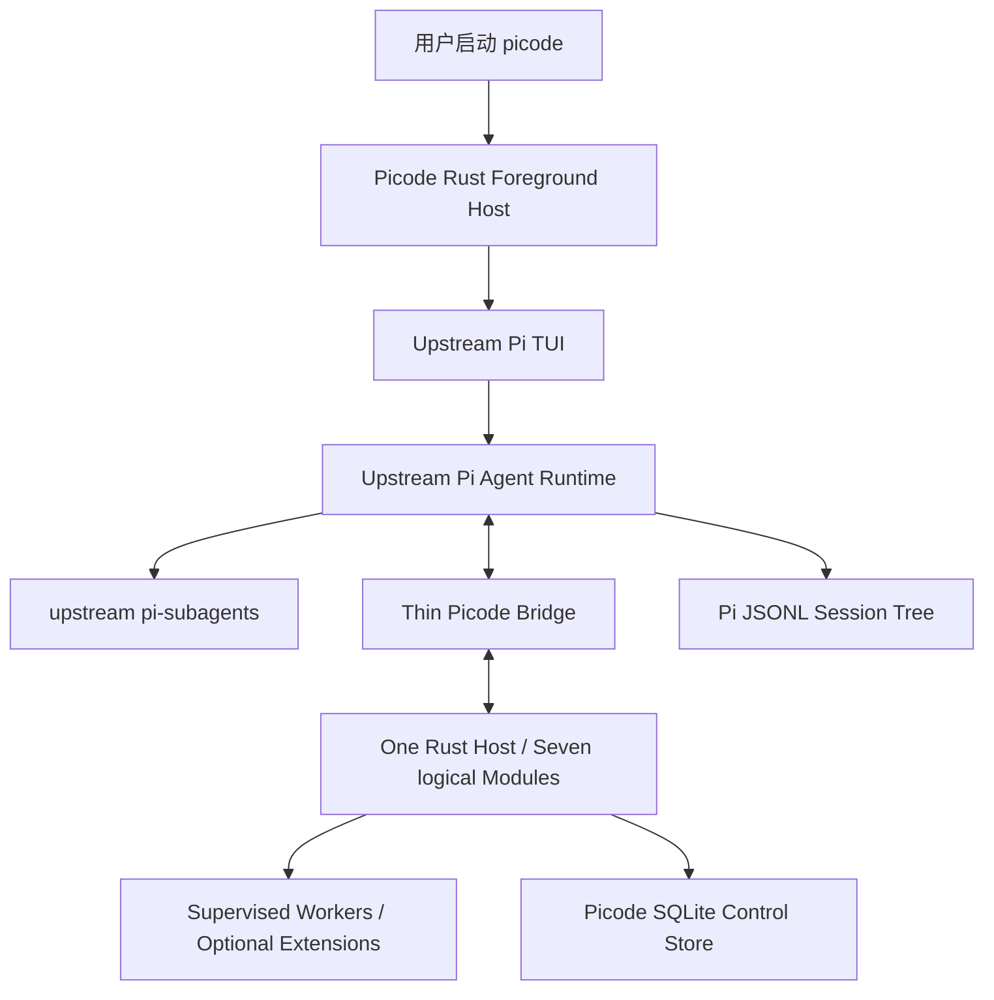
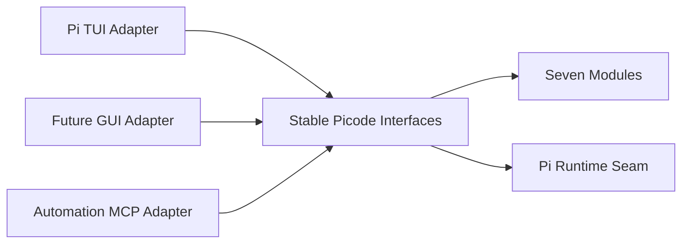
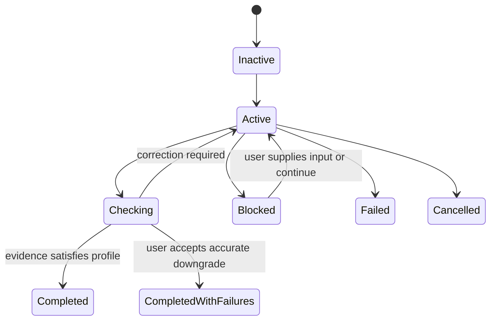
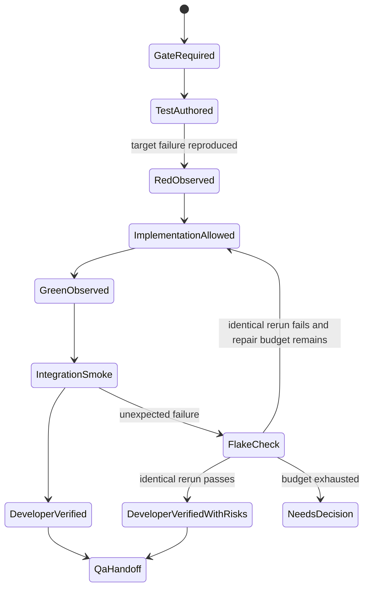
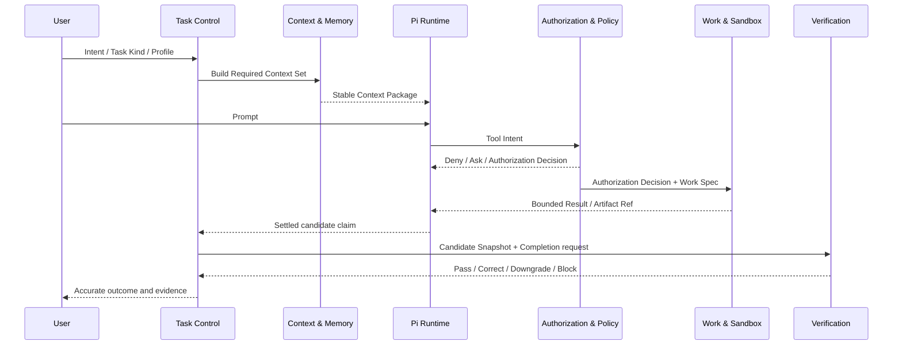
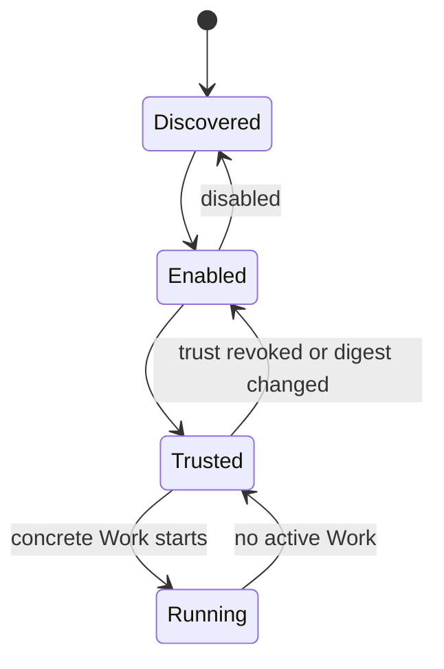
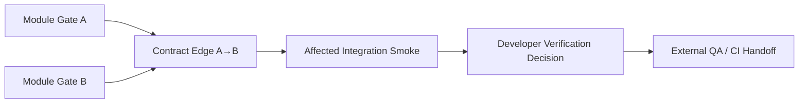

# Picode Next 总体架构与闭环设计

> **版本提示（2026-08-06）**：本文件已被 `PICODE-NEXT-ARCHITECTURE-REVIEW-2026-08-06.md` 取代为当前团队评审入口。本文保留为上一轮完整设计来源；其中“Rust Host 为不可动摇选择”“Adaptive/长 Harness Core Prompt 为默认”“跨模式全局 Resident Picode 工具”等内容不再代表最新候选架构。
>
> 文档状态：第三轮架构评审稿（Ownership, Bridge and Flake Revision）  
> 日期：2026-08-04  
> 适用对象：产品架构师、安全架构师、Harness / Agent Runtime 开发者  
> 当前阶段：只定义新版本设计，不授权产品代码实施  
> 设计目标：以原版 Pi Agent 为核心，构建精简、模块化、可验证的中型软件开发 Harness  
> 修改说明：`修改思路.md`

---

## 0. 评审摘要

### 0.1 一句话架构

Picode Next 是一个由 Rust 编写的前台 Host：它启动并保留上游 Pi TUI 与 Pi Agent Loop，通过极薄的 Pi Bridge 接收生命周期与工具意图；权限、受控执行、任务治理、验证和可选扩展由七个深 Module 承担，而不是重写第二套 Agent Runtime。

### 0.2 设计是否已经闭环

从**设计逻辑**看，正常开发主循环、Developer TDD、权限、Git/Worktree、长任务上下文、扩展生命周期和失败恢复已经形成可组合方案。第二轮把安全基线收敛到 Grok Build 这类成熟商业 Harness 的实用水平；第三轮进一步封闭 Bridge 清单、Capsule 权威/摘要链、Slice Trigger、Flaky 和 P3 隆起段。

本架构仍不能在实现前宣称“生产闭环”。最先要验证的最高风险假设是：Pi 公开扩展 Interface 是否能覆盖原生工具、MCP、Hook 与 Subagent 的必要生命周期和副作用 Intent，并满足 compaction、rewind/fork、终端所有权和交互延迟要求。该 Bridge Spike 在正式 P0 前执行；如果必须修改 Pi，则先确定最小 Patch 和升级成本，再校准后续 Interface。

P0–P4 的完成标准是一个功能完整、轻量、适合个人开发者的桌面/TUI 产品，并在真实中型项目中完成受时间预算约束的 Developer TDD 闭环。Windows 强沙箱、对抗性 Permit、签名 CI Evidence、恶意扩展防御、手机与跨设备控制统一进入 P5。

### 0.3 不可动摇的选择

- 不重写 Pi Agent Loop；修改 Pi 源码仅作为无法通过公开扩展接口完成时的最后手段。
- Simple Task 保持原版 Pi 的简洁；Harness 和 TDD 是显式选择，不反向污染 Simple。
- Picode 自有的 Host 与核心 Module 使用 Rust；上游 Pi 及其必要 Bridge 保持其原生技术栈。
- 上游 Pi 原生工具永远可见，不通过 Picode 隐藏或伪装。
- TUI 第一阶段复用原版 Pi TUI；GUI 第二阶段复用同一组 Module Interface，不另建业务权威。
- 模型、Skill、扩展、Hook 与子 Agent 都不能给自己授权，也不能自证 Gate 通过。
- 用户是最终所有者，可以明确降低保证等级或选择灵活工作流，但系统必须准确标注结果，不能把降级结果伪装成严格通过。
- 通用安全能力以经固定版本审查的 Grok Build 为复杂度上限；超过该上限的安全机制默认进入 P5，除非它低成本地直接保护 Picode 的 TDD 正确性、用户文件或 Git 所有权。

---

## 1. 产品定位、目标与非目标

### 1.1 产品定位

Picode 面向软件开发者，尤其是具有多个模块、较长任务和完整测试流程的中型软件或游戏项目。它希望保留 Pi Agent 的轻量、直接与优雅，同时补足以下开发 Harness 能力：

- 上下文与项目规则发现；
- 权限审批与沙盒；
- Goal / Todo / 计划与长任务治理；
- Subagent 与异步工作；
- Git / Worktree 隔离；
- 测试、审查、跨模块验证与失败纠正；
- 状态、成本、资源与证据可观测；
- 可选的 LSP、MCP、记忆、浏览器等工具。

### 1.2 非目标

- 不成为科研、写作、艺术创作的通用工作台。
- 不把所有可用工具常驻内存。
- 不复制 Oh My Pi 的全部功能，也不以功能数量为目标。
- 不用复杂 Harness 约束每一次简单对话。
- 不重新发明 Pi 已经成熟的模型调用、ReAct Loop、会话树、TUI 与普通工具回灌。
- 不代替团队 CI 服务器、Main 分支审核者或发布负责人；开发者仍应完成本地 Gate 设计与验证。
- 不成为游戏引擎、游戏运行时或某一引擎的专用测试框架；游戏开发是验证中型工程 Harness 的重要业务场景，而不是核心领域模型。

### 1.3 “先进模型不需要过度 Harness”原则

Picode 把 Harness 分成事实约束与行为引导：

- **事实约束**：权限、文件所有权、测试证据、Git 授权、资源上限和完成资格；模型越先进也不能伪造事实。
- **行为引导**：提示词、Skill、Todo Nudge、计划深度与工具建议；根据模型能力和任务风险自适应减薄。

提供三档 Guidance：

| Guidance | 行为 | 不会被关闭的内容 |
|---|---|---|
| Lean | 最少提示、最少自动工具建议 | 用户权限、真实副作用控制、证据绑定 |
| Adaptive | 默认；按任务跨度和风险增加引导 | 同上 |
| Guided | 显式计划、Todo、阶段检查点和更多解释 | 同上 |

这使 Picode 对高能力模型保持简洁，同时避免“模型更聪明，所以可以绕过安全或验收”的错误推论。

---

## 2. 设计权威与实施参考顺序

### 2.1 架构权威层级

发生冲突时按以下顺序处理：

1. 用户当前明确决定。
2. 本文档及未来从本文拆出的 `CONTEXT.md`、规格和 ADR。
3. 新版本已通过的可执行契约与 Conformance Gate。
4. 上游 Pi / `pi-subagents` 的公开兼容约束。
5. V2 文档、研究报告和旧代码；它们都是参考资料，不是新架构权威。

### 2.2 实施参考顺序

上游依赖与参考代码是两个不同概念：

- **运行基础**：优先直接使用并兼容最新版上游 Pi Agent 与 `pi-subagents`，不把它们重写成 Rust。
- **直接集成预检**：若一个兼容的现有 Pi Extension/Package 已完整满足能力，优先集成而不再写一份 Picode Implementation；这属于复用上游能力，不改变下面的“参考代码”顺序。
- **Picode 自有 Harness 能力的实施参考**：确实需要 Picode 编写时，第一优先研究并采用 Grok Build 已成熟、许可证允许且与本架构兼容的代码与模式；第二优先复用 Picode V2 已验证的旧实现。
- Grok Build 与 V2 都不合适时，再评估 Oh My Pi、OpenCode 或其他合法开源实现；最后才自行设计新实现。

每项能力实施前必须生成 Source Review，记录：固定 Commit/版本、许可证、所需声明、采用范围、拒绝原因、安全影响、运行成本和上游 Pi 兼容性。不得复制许可证不允许的代码；只能参考行为的项目必须独立实现。

### 2.3 为什么 Grok Build 优先于 V2

V2 证明了许多产品能力可行，但其共享 Core、GUI RPC、扩展状态和 Harness 生命周期逐步叠加，产生了多处重复权威。新版本需要的是从零建立的清晰管线。Grok Build 优先用于成熟工程模式，V2 优先用于迁移账号、聊天、国际化、模型配置等 Picode 特有能力；V2 安全 Conformance 主要作为 P5 参考，而不是整体搬回旧拓扑。

---

## 3. 总体拓扑与交付阶段

### 3.0 实施前置：Bridge Feasibility Spike

该 Spike 不构成 Mini/MVP 版本，也不减少最终产品功能；它是正式重构前的技术判定。用最薄 TypeScript Pi Extension 逐项验证：

1. 原生 `read/write/edit/bash`、扩展工具、MCP、Hook 与 `pi-subagents` 的 Operation Intent 能否被一致观察和治理；不能覆盖的通道必须列出旁路。
2. Agent/Tool/Work 的开始、进度、结果、错误、取消和退出事件是否足以驱动 Task Control。
3. Pi compaction 能否被观察、区分自动/手动原因并由 Host 请求；Cache Epoch 与 Slice 切换能否得到确定事件。
4. resume、fork、rewind 和 branch switch 是否暴露稳定身份与生命周期事件，使 Task Narrative Revision 和 Gate stale 规则可以执行。
5. Rust Host 包裹原版 Pi TUI 时，PTY、stdin/stdout、信号、Ctrl+C、终端 resize、退出码和 Windows/Unix 差异由谁拥有，是否仍保持原版交互体验。
6. 每次 Tool Intent 经 Bridge→Policy→Bridge 的额外延迟；记录 p50/p95，普通自动允许路径的初始目标为 p95 不高于 20ms（不含工具执行和用户等待）。
7. Pi/Bridge 协议版本协商、断连恢复和上游升级失败方式是否清楚。

输出只能是：`无需 Pi Patch`、`需要最小可维护 Pi Patch` 或 `当前公开 Interface 不可行`，并附覆盖矩阵、延迟数据和终端原型结果。没有结论前不大规模展开 Rust Implementation。

### 3.1 第一阶段：前台 Rust Host + 原版 Pi TUI



图中的 Seven Picode Modules 是同一个 Rust Host 进程内的七个逻辑 Module，不是七个进程、微服务或七条 IPC 链。它们的 Interface 用于划分唯一权威和测试 Seam；Module 之间通常是进程内 Rust 调用。跨语言、需要版本协商的主要 Seam 只有 Pi Runtime ↔ Thin Bridge ↔ Rust Host。

第一阶段不需要常驻后台 Core。Rust Host 与 TUI 同生命周期：

- 正常退出时如仍有任务，必须再次确认是否取消。
- 用户确认退出后，主 Agent、子 Agent、Picode 所有的 Worker 与租约按顺序取消和回收。
- 异常崩溃时，Host 采用有界宽限期、进程树回收和下次启动状态校正。
- “关闭 TUI 后任务继续跑”不是第一阶段目标。

### 3.2 第二阶段：GUI

GUI 只新增 Presentation Adapter，不新增任务、权限、扩展或会话的独立权威。是否需要常驻 Shared Core，要在 GUI 原型证明“跨客户端任务存活”是必要需求后再决定。



### 3.3 第三阶段：远程与手机

手机遥控与 Windows 强沙箱同列 P5。远程端不能直接写会话文件，只能通过会话写入租约与 Command Registry 操作。

---

## 4. 统一领域词汇

本文用以下词汇建立一致心智模型：

| 术语 | 定义 | 唯一权威 |
|---|---|---|
| Pi Runtime | 上游 Pi 的模型调用、Agent Loop、实时会话和 TUI | Pi |
| Host | Rust 前台进程，装配 Picode Module、监督进程并启动 Pi | Picode |
| Module | 隐藏大量策略与数据、提供窄 Interface 的深模块 | 对应 Module |
| Interface | Module 对外稳定操作与事实查询，不暴露内部状态机细节 | 对应 Module |
| Implementation | Interface 背后的 Rust 逻辑或被采用的合法上游实现 | 对应 Module |
| Seam | 两个权威交界且可替换、可对抗测试的位置 | 由双方契约定义 |
| Adapter | 把外部协议或平台行为翻译为内部 Interface 的薄层 | 不拥有领域事实 |
| Chat Session | 持久对话容器，可跨账号、模型和 Execution Epoch | Pi transcript + Picode catalog |
| Task Run | 一项用户工作及其 Goal、Plan、证据和完成状态 | Task Control |
| Task Slice | Task Run 中一个边界清晰、可独立验证、默认使用新 Pi Session 的工作切片 | Task Control |
| Task Capsule | Slice 之间传递的有界事实包；Task Control 拥有生命周期与内容事实，Context 只负责渲染 | Task Control |
| Execution Epoch | Task Run 中固定账号、Channel、模型与能力集合的一段执行 | Task Control |
| Task Narrative Revision | 用户 steer、rewind/fork 或恢复改变任务叙事后递增的版本；使依赖旧叙事的 Capsule/Gate 显式 stale | Task Control |
| Cache Epoch | 上游请求 Immutable Prefix 固定的一段缓存周期 | Context & Memory |
| Tool Schema Digest | 当前可见工具名称、schema、来源与 Adapter 身份的摘要；变化后重载并使受影响 Gate stale | Capability & Tool Catalog |
| Foreign Transcript Snapshot | 外部 Agent 原始聊天的不可变导入副本；只用于追溯、浏览和重新编译投影，不是 Pi 实时 Transcript | Session Gateway |
| Historical Tool Trace | 从外部 tool call/result 编译的惰性历史证据，引用 Tool Contract Registry 的确定性判定，保留来源、执行状态和兼容损失，永不自动执行 | Session Gateway |
| Tool Semantic Operation | 跨 Harness 的稳定工具语义，如 `fs.read@1`、`fs.search_text@1`、`process.exec@1`；不等于某个模型可见工具名 | Capability & Tool Catalog |
| Tool Compatibility | `Equivalent`、`AdaptedLossless`、`AdaptedLossy`、`HistoricalOnly` 或 `Unsupported`；由确定性 Adapter 判定 | Capability & Tool Catalog |
| Task Kind | `Simple` 或 `Harness`，决定是否启用工程治理 | Task Control |
| Verification Profile | `None`、`Quick Review` 或 `Developer TDD` | Verification |
| Harness | 可选的开发契约，不是第二个 Agent Runtime | Task Control + Verification |
| Gate | 对候选 Snapshot 运行并产生结构化 Evidence 的验证规则 | Verification |
| Flaky Gate | 在相同 Candidate Snapshot、命令和环境下出现不一致结果的 Gate；不消耗修复轮次，转为 QA Risk | Verification |
| Completion Label | 对开发验证结果的准确说明，如 Developer Verified、Known Risks、Needs Decision | Verification |
| Work | 一个可取消、可观察、有资源边界的受监督执行 | Work & Sandbox |
| Work Handle | 查询、等待、取消或读取 Work 产物的稳定句柄 | Work & Sandbox |
| Workspace Identity | 与平台路径表示分离的工作区身份 | Session Gateway |
| Candidate Snapshot | 一次开发验证所对应的精确代码身份；代码变化后相关 Gate Result 失效 | Verification |
| Operation Intent | 对一次 Shell、文件、网络或 Git 副作用的结构化请求，包含用户实际批准内容的轻量 Fingerprint | Authorization & Policy |
| QA Handoff | 开发验证结束后交给外部 QA/CI 的风险、复现、Snapshot 与未验证项 | Verification |
| Extension | 可发现、可启用、可信后按需运行的外部能力包 | Capability & Tool Catalog |
| Project Memory | 经明确提议与批准后保存的项目知识，不等于聊天全文 | Context & Memory |

Chat Session 的稳定 `chat_id` 是可查询的领域事实。Pi Context 中提供一个轻量 Session Identity 条目，或通过只读 Session 工具返回它；当用户询问“当前对话 ID”时，模型应取得真实 ID，不能从文件路径或标题猜测。

### 4.1 深模块准则

七个 Module 必须满足：

- **Depth**：Interface 小，Implementation 能隐藏复杂策略。
- **Leverage**：一个正确决策可以被 TUI、GUI、MCP 和子 Agent 复用。
- **Locality**：规则变化集中在拥有该事实的 Module，不要求多个 Adapter 同步猜测。
- Adapter 只翻译，不保存独立生命周期状态。
- Module 之间通过稳定事实和命令协作，不共享可变全局对象。

“七个”描述的是七类不可重复的领域权威，不是要求一次性实现七套完整 Interface。P0–P4 按纵向功能逐步加深这些 Module；没有第二个 Adapter、没有真实变化需求的内部 Seam 不提前抽象。删除任一 Module 后，如果其复杂性只是消失而不会散落到多个调用者，说明该 Module 过浅，应当合并 Implementation，而不是为了图形完整保留空壳。

---

## 5. 权威分配与数据所有权

| 事实 | 权威 | 禁止的重复权威 |
|---|---|---|
| 模型调用、ReAct、多轮 Tool Result 回灌 | Pi Runtime | Rust 重写 Agent Loop |
| 实时 Transcript、分支、resume、fork、retry、Pi compaction | Pi Runtime / Pi JSONL | SQLite 作为第二份可写实时 Transcript |
| Chat 目录、外部导入、归档、Workspace 绑定、备份索引 | Session Gateway / SQLite | GUI 自己扫描并维护状态 |
| 外部 Transcript 原文、来源事件分类和 tool call/result 关联 | Session Gateway / Foreign Transcript Snapshot | 来源 Adapter 直接改写 Pi JSONL |
| 外部工具签名到规范语义、规范语义到当前工具的映射 | Capability & Tool Catalog / Tool Contract Registry | 每个来源 Parser、Context Renderer 或模型各自猜测等价关系 |
| Task 状态、Goal、Plan、完成资格、Execution Epoch | Task Control | Prompt 或 Todo 自称完成 |
| 模型实际看见的 Context Package、缓存 Epoch、Memory Proposal | Context & Memory | 扩展直接拼 system prompt |
| 工具/Skill/MCP/LSP/DAP/Hook 的发现和生命周期 | Capability & Tool Catalog | 每种扩展各自一套 enabled/running 状态 |
| 副作用是否允许 | Authorization & Policy | Shell/Hook/MCP 自己判断权限 |
| 进程、取消、超时、资源、沙盒与产物 | Work & Sandbox | Extension 自己守护长期进程 |
| Gate、Gate Result、Completion Label、Quick Review、QA Handoff | Verification | 主 Agent 或 Gate 作者自证通过 |
| 本机 GUI/TUI 当前写入者 | Session Gateway 的 local Writer Lease | 客户端直接并发写文件；跨设备治理为 P5 |

---

## 6. 七个深 Module 与 Pi Runtime Seam

### 6.1 Module 1：Session Gateway

职责：

- Chat Session 的目录、选中、resume/fork、Archive、删除与 Workspace 绑定。
- Pi JSONL 与 Picode SQLite 投影之间的一致映射。
- Codex、Cursor、Claude、OpenCode 等外部聊天的选择性导入。
- 外部来源 Adapter、不可变 Foreign Transcript Snapshot、统一事件 IR、tool call/result 关联、导入诊断与兼容报告。
- 本机 GUI/TUI 的轻量 Writer Lease、心跳和接管；跨设备 fencing generation 为 P5。
- 便携备份、跨平台路径重绑定和只读未绑定状态。

窄 Interface：

```text
current()
list(filter, sort, page)
resume(chat_id)
fork(chat_id, point)
archive(chat_id, value)
remove(chat_id, confirmation_token)
bindWorkspace(chat_id, workspace_identity)
acquireWriter(chat_id, client_id)
renewWriter(lease)
releaseWriter(lease)
snapshot(chat_id)
usage(chat_id)
importForeign(selection, options)
compatibility(chat_id)
prepareContinuation(chat_id, workspace_binding)
```

删除必须两次确认；Archive 可逆。第二个客户端只有在当前写入者不活跃或心跳过期时才可抢占；活跃写入者返回明确冲突，不能依赖文件锁碰运气。

本机客户端以可写方式选中 Chat 时可以申请 Writer Lease，只读查看不抢占；真正发送消息前必须再次核对租约。当前 owner 健康且活跃时，其他 GUI/TUI 只能只读或等待；owner 崩溃、失联或租约过期后，第二个客户端无需旧 owner 同意即可接管。

### 6.2 Module 2：Context & Memory

职责：

- 构建模型实际接收的 Context Package。
- 管理 Immutable Prefix、Append-Only Log、Volatile Scratch 与 Cache Epoch。
- Harness 的项目规则发现、Required Context Set 与阶段性设计回顾。
- 将 Task Control 拥有的 Task Capsule 与权威文件/Evidence 渲染为 Context Package；不自行改写 Capsule 事实。
- Project Memory 提议、脱敏、批准与检索。
- 可选 CodebaseMemoryProvider Adapter。

窄 Interface：

```text
baseContext(task_id)
requiredContext(task_id, stage)
search(query, scope)
read(ref)
memoryPropose(content, provenance)
memoryWrite(approved_proposal)
compactRequest(reason)
cacheSnapshot(task_id)
```

Pi 仍负责真正的模型窗口和原生 compaction；本 Module 提供确定性的材料与压缩策略，不能伪造“模型已经读过”。

### 6.3 Module 3：Task Control

职责：

- Task Kind、Verification Profile、Guidance、Goal、Plan 与 Todo。
- Task Slice、Execution Epoch、steer、interrupt、continue 与 bounded repair。
- Completion Engine：判断“可以停止”和“可以声称成功”是两回事。
- 大阶段后触发 Design Alignment Checkpoint。

窄 Interface：

```text
start(task_spec)
startSlice(task_id, slice_contract)
completeSlice(slice_id, capsule_ref)
updateGoal(task_id, goal)
updatePlan(task_id, plan)
applyIntent(task_id, user_intent)
steer(task_id, message)
interrupt(task_id, reason)
continueWith(task_id, account_model)
finish(task_id, completion_claim)
snapshot(task_id)
```

核心状态：



长任务默认拆成可独立验证的 Task Slice。Task Control 独占 Slice/Capsule 生命周期与内容事实；Context & Memory 只把 Capsule 渲染进模型输入。每个 Slice 在边界成立时使用新的 Pi Session，只加载 Task Capsule、Required Context Set、当前相关源码和必要 Evidence，而不是重放完整旧对话。默认最多两轮基于新证据的修复；用户可以明确要求持续多轮尝试。若达到 Verification Budget、没有新增信息或进入重复循环，Agent 停止自动往返并请求用户决定、接受已知风险或移交 QA。

新建 Chat/Task 时 Task Objective 始终可选，可以只输入第一条消息后再形成 Objective。Todo 是协作与可观测事实，不是 TDD 或完成状态的隐式开关；Objective 或 Todo 都不能让 Verification 失效，也不能自动宣称完成。

### 6.4 Module 4：Capability & Tool Catalog

职责：

- Pi 原生工具、Picode 工具、Skills、MCP、LSP、DAP、Hooks、Firstmate 等能力的唯一目录。
- 能力三层、Extension 四态、精简 Manifest、按任务绑定和模型可见性。
- `capability_search` 与确定性 `TOOLS.md` 摘要。
- 配置与运行状态分离。
- `Tool Contract Registry`：外部来源工具签名到稳定语义、稳定语义到当前 live tool 的唯一映射；历史工具不因此进入当前模型 schema。

窄 Interface：

```text
list(scope)
search(query, task_id)
enable(extension_id)
disable(extension_id)
trust(extension_id, manifest_digest)
revokeTrust(extension_id)
bindTask(extension_id, task_id)
load(capability_id, task_id)
unload(capability_id, task_id)
resolveHistoricalTool(source_signature)
resolveLiveTool(semantic_operation, task_id)
toolContractSnapshot()
snapshot()
```

该 Module 不启动进程；需要运行时向 Work & Sandbox 提交 Work Spec。

### 6.5 Module 5：Authorization & Policy

职责：

- 对所有副作用通道执行同一 Policy。
- 支持拒绝、询问、允许一次、允许某命令、全局允许。
- 对 Operation Intent 生成可审计的授权决定。
- 管理 Plan Mode、用户授权、路径/网络/Git/发布规则。

窄 Interface：

```text
evaluate(operation_intent)
respond(decision_request, user_decision)
grant(scope, constraints)
revoke(grant_id)
snapshot(task_id)
```

全局允许不是无限权限：不可覆盖密钥保护、工作区限制、明确禁止的破坏性操作或超出规则范围的行为。绑定内容 Hash、单次加密 Permit、Actor ceiling 与重放防御保留为 P5 Hardened Profile，不增加 P0–P4 普通开发路径的复杂度。

### 6.6 Module 6：Work & Sandbox

职责：

- Shell、MCP、LSP、DAP、Hook、浏览器、子进程与后台任务的统一进程 Adapter。
- 启动、等待、流式进度、取消、超时、崩溃、资源预算、进程树回收和 Artifact。
- Workspace、Managed Worktree、沙盒 Adapter 与规范化路径检查。
- Owned / SharedExternal 运行时所有权。

窄 Interface：

```text
start(work_spec, authorization_decision)
status(work_handle)
result(work_handle)
wait(work_handle, bound)
cancel(work_handle)
artifact(work_handle, artifact_ref)
shutdownAll(owner)
platformCapabilities()
```

异步 Work 立即返回 Work Handle。完成时只产生通知，不自动触发新模型轮次、不偷偷注入 Transcript，也不与用户争夺会话控制权；Agent 或用户必须显式读取结果。

### 6.7 Module 7：Verification

职责：

- Gate Graph、Developer TDD 状态机、Quick Review 与 QA Handoff。
- Candidate Snapshot、结构化 Gate Result 与 Verification Budget。
- 目标 RED、跨模块 Contract/Integration Gate 与有限范围 Smoke。
- 判断开发完成资格、已知风险和准确 Completion Label。

窄 Interface：

```text
defineContract(gate_contract)
run(candidate_snapshot, gate_set)
status(verification_handle)
result(verification_handle)
cancel(verification_handle)
decide(task_snapshot, evidence_set)
createQaHandoff(task_id)
summary(task_id)
```

Verification 是开发 Gate 结果与 Completion Label 的唯一权威；主 Agent、Reviewer 或扩展只能提交候选事实。它不冒充外部 QA 或发布认证机构。

### 6.8 外部 Seam：Pi Runtime

Pi Runtime 不算第八个 Picode Module，因为它是上游运行时。Bridge Interface 只包含必要控制与事实：

```text
identity()
state()
sendIntent(intent)
cancel(turn_or_session)
subscribeLifecycle()
subscribeSessionEvents()
subscribeContextEvents()
requestCompaction(reason)
shutdown()
```

第一阶段 Adapter 是 `PiTuiBridgeAdapter`；未来 GUI 可使用 `PiRpcWorkerAdapter`。Bridge 不传输第二份完整 Transcript，不拥有账号、任务或扩展状态。

---

## 7. 用户工作流与 Agent Loop

### 7.1 Simple Task

适合快速问答、小脚本或不需要工程模板的工作：

- 工作区可选；未选择时使用 Picode 安全 Scratch Space，绝不能默认 `C:\Windows\System32`。
- 使用上游 Pi 原始提示词、Context 发现和原生工具。
- 不自动加载 Harness 固定工具、Herdr、CodebaseMemory 或工程 Gate。
- 默认 `Verification Profile = None`，不自动审查代码。
- 需要直接写入已附加工作区时，仍经过真实副作用 Policy。

### 7.2 Harness Task

适合中型工程开发：

- 必须选择或绑定 Workspace。
- 初始 Context 采用 Grok Build 风格：从 Repo Root 到 CWD 收集，越深规则优先；兼容 `AGENTS.md`、`.grok/rules`、Claude/Cursor 项目规则路径等。
- 固定增加工程工具面，默认 `Quick Review`。
- 大阶段后重新加载并映射产品设计文档。
- 跨模块变更必须有 Contract / Integration Gate。
- 可以使用当前干净工作区；并发写入、子 Agent 修改或高风险任务触发 Managed Worktree。

### 7.3 Task Slice 与 Task Capsule

Task Slice 是解决长上下文失真的主要机制，compaction 只是单会话补救。Task Control 将长任务拆成边界清晰、可独立验证的 Slice；每个 Slice 默认使用新 Pi Session，避免旧讨论、失败尝试和无关 Tool Result 无限累积。

每个 Slice Contract 至少包含：单一目标、输入 Candidate Snapshot、Required Context、相关 Module/Contract Edge、允许范围、Gate、Verification Budget 和完成条件。Slice 结束时由 Task Control 生成 Task Capsule，并严格分区：

**Verbatim Facts（禁止模型摘要或改写）**：

- 用户目标、验收条件和用户决定；
- Slice Contract、允许修改范围和相关 Contract Edge；
- 当前 Candidate Snapshot、Worktree/分支身份；
- 仍为红色/Flaky 的 Gate、原始命令和结构化结果引用；
- 权威设计文档路径、版本/Hash 和 Required Context Set。

这些内容从 Task、Git、Verification 和文档权威源复制，模型只能补充引用，不能重述后替代原文。

**Narrative（允许有来源的摘要）**：

- 已完成工作和决策理由；
- 失败尝试与不应重复的路径；
- 已知风险、未验证内容和下一 Slice 建议。

下一 Slice 的 Required Context Set 必须重新从权威文件、Git 与 Gate Result 推导，不能只相信 Narrative 或上一 Slice 的模型记忆。下一 Slice 只加载 Capsule、重新推导的 Required Context、相关源码和必要 Evidence，不把完整旧 Transcript 重新塞入上下文；用户仍可查看和恢复完整 Pi 会话树。

Slice 边界可以由模型提议，但最终由 Task Control 根据以下信号决定：阶段目标完成、Context 占用阈值、轮次/Token 预算、compaction 临界点、账号/模型接续或用户显式命令。Task Control 不在未完成 Tool call 或文件写入中间切片；用户可以否决自动切片。每次自动切片记录原因和预计 Context/缓存代价，真实项目据此校准阈值，避免过碎导致交接开销和 cache miss。

### 7.4 Developer TDD

Developer TDD 是显式 Verification Profile，不由 Task Objective、模型猜测或 Todo 隐式触发。它提供有限范围、有限轮次的开发反馈，不替代 QA：



- 在 `RedObserved` 前，本 Slice 的目标生产实现写入由 Rust Policy 阻止；未选择 Developer TDD 的 Harness 不受此规则约束。
- “测试失败”不自动等于有效 RED；必须能关联当前目标。Gate 新建或实质修改时证明一次能红，普通重复运行不做昂贵对抗 Challenge。
- 默认自动修复最多两轮、LLM Reviewer 最多一轮，并同时受时间/Token/测试范围预算限制。
- 模块单测全绿不代表跨模块完成；只运行受影响 Contract Edge 和一次有限 Integration Smoke，不在本地默认跑发布级全矩阵。
- 测试意外失败时允许在相同 Candidate Snapshot、命令和环境下确认性重跑一次；无代码变化而转绿则标记 `Flaky`，不消耗修复轮次，但 Completion Label 降为 `Developer Verified with Known Risks` 并进入 QA Handoff。不得反复重跑直到绿色。
- 确认性重跑仍失败才视为可复现失败，并在修改代码时消耗修复轮次。预算耗尽或主观行为无法机器裁决时，进入 `Needs User Decision`，不允许开发 Agent 与评判 Agent 无限往返。
- 外部 QA 的失败结果创建新的缺陷 Task Slice，不延长原 Slice 的上下文。

### 7.5 完整循环



Pi Loop 负责思考和工具回灌；Picode 只在工具副作用和完成声明的 Seam 上治理。这样模型不会“怎么都不调用 Workflow Engine”：它无需自觉调用另一个循环，Task Control 根据生命周期事件和结构化状态确定性参与。

---

## 8. 提示词、上下文、缓存与记忆

### 8.1 提示词策略

- Simple：原版 Pi，不注入 Picode Harness 人设。
- Harness：独立实现与 Claude Code 成熟开发行为相近的提示策略，但不复制无许可证文本；测试部分使用 Picode 自有 TDD 规则。
- 权限、Context 发现与沙盒提示模式优先参考 Grok Build。
- Prompt 只解释可用能力、当前模式和如何合作；真正阻止行为的是 Rust Policy 和 Verification。
- 明确角色为软件开发者，避免加入科研、写作和艺术工作流噪音。
- 用户明确调用的 Skill 可以覆盖默认工作流和 Completion Gate；仅安装、自动发现或推荐的 Skill 没有覆盖权。底层真实权限和破坏性操作确认仍有效。

### 8.2 Cache-First 三层机制

采用 Reasonix 所体现的缓存友好原则：

1. **Immutable Prefix**：一个 Cache Epoch 内冻结 system、tool schema 与稳定项目前缀，保持字节级一致。
2. **Append-Only Log**：对话与 Tool Result 只追加，不重排、不原地改历史。
3. **Volatile Scratch**：模型 CoT、临时推演和未承诺计划不作为下轮稳定上游前缀。

接近上限时执行 `Notice → Snip → Prune → Compact`：

- Notice：告知预算和需要收敛的产物。
- Snip：大 Tool Result 保存完整 Artifact，Transcript 保留有界摘要与引用。
- Prune：清理可重建、低价值的临时内容，同时保持 tool-call/result 成对。
- Compact：生成有来源的压缩包，开启新 Cache Epoch；该轮允许缓存 miss，之后重新稳定。

P0–P4 不建立独立 Capability Epoch 运行时实体。工具名称/schema/来源改变时更新 Tool Schema Digest，使关联 Gate Result stale，并因 Immutable Prefix 改变开启新的 Cache Epoch。完整 Capability Epoch 与重放防御只属于 P5。

### 8.3 Required Context Set 与文档回顾 Gate

长任务启动时建立 Required Context Set，至少包含：产品目标、当前阶段、相关 Module Interface、验收条件、修改范围和关键 ADR。以下时点必须执行 Design Alignment Checkpoint：

- 完成一个大 Module；
- 完成 P0–P5 中一个大阶段；
- compaction 后；
- 账号/模型接续或失败恢复后；
- 子 Agent 结果集成前；
- 最终完成声明前。

“Agent 声称已读”不是证据。Document Grounding Gate 检查材料是否被实际加载进该 Epoch、对应章节是否映射到计划/修改/验证，以及 Candidate Snapshot 是否仍匹配。Hash 只能证明文件身份，不能单独证明理解。

### 8.4 Project Memory 与 CodebaseMemoryProvider

Project Memory 存放于 `.picode/memory/`，只接受带来源的 proposal，经用户或 Profile 授权后写入；聊天全文不自动变成记忆，秘密在写入前脱敏。

CodebaseMemoryProvider 是第三级默认关闭能力：

- 启用后成为第二级可发现、按需加载能力。
- 默认使用 CLI Adapter，不常驻进程；后台 MCP/Watcher 是独立开关。
- Codebase Memory 图数据库与 Picode 控制 SQLite 分离。
- 必须绑定 Workspace Identity、Worktree、Generation 与 Snapshot。
- 图索引只提供导航证据，不能充当测试、Git 或完成证据。
- Runtime Ownership 为 `Owned` 或 `SharedExternal`；关闭时必须零 Picode-owned 进程/端口/任务/模型可见性，但不会杀死用户独立启动的共享 daemon。

---

## 9. 工具、能力与扩展

### 9.1 三层能力

| 层级 | 含义 | 运行成本 |
|---|---|---|
| Tier 1 Resident | 当前模式必须可见的核心能力 | schema/极少状态常驻；进程仍按需 |
| Tier 2 Discoverable | 模型能通过 `capability_search` 找到并按需加载 | 未调用时无进程 |
| Tier 3 Disabled | 设置中可见，但模型搜索不到；用户启用后进入 Tier 2 | 零 Picode-owned 运行资源 |

层级与 `Installed / Loaded / Running / Permitted` 正交，不能把“已启用”误写成“正在运行”。

### 9.2 Pi 原生与 Harness 固定工具

Pi 原生 `read/write/edit/bash` 等工具永远保留。Harness 固定增加以下语义；能映射原生工具时使用 Alias/Adapter，避免同义重复 schema：

1. `read_file`
2. `search_replace`
3. `grep`
4. `list_dir`
5. `run_terminal_command`
6. `todo_write`

全局最小 Resident Picode 能力：

- `subagent`
- `subagent_wait`
- `capability_search`
- `work_status`
- `work_cancel`

Harness 额外最小 Resident：

- `harness_status`
- `harness_plan`
- `harness_update`
- `harness_run_check`
- `harness_result`
- `context_search`
- `memory_propose`

### 9.3 Tier 2 与 Tier 3 初始归类

Tier 2 默认可发现：

- LSP；
- `memory_search / memory_get`；
- `enter_plan_mode / exit_plan_mode`；
- `ask_user_question`；
- `web_search / web_fetch`；
- 持久 Shell / REPL execution session（只有被任务调用时才启动）；
- 已启用且可信的任务相关 MCP。

Tier 3 默认关闭：

- Herdr；
- CodebaseMemoryProvider；
- Matt Pocock Skills 集合；
- Firstmate；
- DAP、浏览器自动化、专业安全分析与重型诊断模块；
- Game Verification Pack（无头运行、确定性回放、黄金快照等引擎 Adapter）；
- 用户尚未启用/信任的 MCP、Hook 和扩展。

设置页可展示 Tier 2 与 Tier 3 的全部能力；Tier 3 默认未勾选。Skills 集合可以聚合成一个产品条目，展开时查看内部 Skill，避免 Matt Pocock Skills 在 GUI 中占满列表。

全局扩展不通过常驻长提示词告诉模型，而是把短元数据放入 Capability Catalog，模型按需 `capability_search`。任务绑定扩展由 Host 确定性解析该任务的 `TOOLS.md`，只把紧凑的名称、用途、调用入口和约束摘要加入 Context Package；完整 schema 仅在实际加载时进入新的 Capability/Cache Epoch。两类扩展都不因为“可被发现”而常驻进程。

### 9.4 Extension 四态与精简 Manifest



- Enabled 不等于启动进程。
- Trusted 不等于获得更高权限。
- Manifest、版本、Commit、SHA 或权限变化必须重新信任。
- Disabled 必须满足零 Picode-owned 进程、端口、网络、任务绑定与模型可见性。

P0–P4 Manifest 只强制记录：来源、固定版本/Commit、完整性 Hash、许可证与声明、平台、入口、权限和组件。健康检查、资源提示、运行所有权、Adapter 类型可以按扩展类型补充，但不建立签名注册中心或恶意 Manifest 对抗系统；这些属于 P5 Hardened Profile。

ExtensionManager 是 Skills、Hooks、MCP、LSP、DAP、Firstmate 的唯一生命周期状态来源；所有进程交给 Work & Sandbox。

MCP Adapter 支持 stdio、Streamable HTTP 与仍需兼容的 SSE transport；本地 server 进程由 Work & Sandbox 所有，远程 server 只建立受 Policy 管理的网络 Work。认证只接收 Secret Reference。每个 MCP server 必须单独启用、信任和绑定任务，不能因为启用了“MCP 功能”就向模型暴露全部 server。

### 9.5 首次启动推荐

第一次启动 Picode 时，按当前语言分别介绍并询问两次 Y/N：

1. Herdr
2. CodebaseMemoryProvider

规则：

- 不提供“全部启用”；Enter 不等于 Yes。
- 每个模块有中文/英文介绍，语言文本来自版本化 `zh-CN.xml` / `en.xml`。
- 支持中途退出后从最后未回答项继续；单机使用一个带 owner/pid/过期时间的 onboarding lockfile 防止重复弹窗，不建立 Wizard Lease Module。
- Yes 只代表信任并启用固定版本，不代表获得运行权限或立即启动进程。
- No 保持 Discovered/Disabled，不下载、不运行、不向模型暴露，且不反复骚扰；可在设置中重置。
- 即使两项全启用，Simple Task 也不自动注入 Skill、启动 Herdr 或索引 Codebase Memory。
- Matt Pocock Skills 不进入首次引导：完整固定快照随 Picode 分发，但只有用户显式执行 `/plan` 或其它技能命令时，才按需物化对应依赖闭包到私有 Pi skill root。

### 9.6 Subagent 与 Herdr

- 首选上游 `pi-subagents`，版本与 Pi 成对固定并做 latest-compatible CI。
- 用户可以为子 Agent 配置 provider/account/model 候选。
- 只有边界清晰、只读或独立、可验证的简单任务自动路由到便宜模型；价格只是合格候选中的次级排序，不盲目降级。
- 子 Agent 继承更窄 Authority Ceiling，不能自行扩权或改变主任务完成标准。
- 每个子 Agent 有独立 Pi Session/Context Package；主 Agent负责审查和集成，Verification 独立决定能否晋升。
- Herdr 是可选多任务编排入口，不替换 `pi-subagents` 的基础兼容目标。
- Firstmate 保持可选能力；未来 GUI 可提供专用聊天入口，但不进入核心任务循环。

---

## 10. 权限、安全、秘密与沙盒

### 10.1 实际使用场景与安全预算

Picode 的 P0–P4 面向单机个人开发者：用户选择自己的模型，处理自己的代码仓库。主要风险是模型误操作、仓库内容造成提示偏移、误删/越界写入、误 push、弱化测试、泄露秘密和孤儿进程，而不是多租户平台中的主动攻击者。

通用安全以经固定版本审查的 Grok Build 为复杂度基线。每个超出该基线的机制都必须回答：它是否直接保护 Picode 的 TDD 正确性、用户文件或 Git 所有权？它的 Implementation 与心智成本是否足够低？任一答案为否，则进入 P5，不阻塞完整桌面产品。

Developer TDD、Task Slice、Gate 与 Candidate Snapshot 属于开发正确性，不因比 Grok 更严格而自动删减；它们解决的是 Picode 的核心目标，而不是扩大攻击者模型。

### 10.2 P0–P4 实用安全基线

1. Prompt 说明执行前确认、优先可逆和不暴露密钥，但 Prompt 不是强制层。
2. Rust Policy 对 Shell、文件、Git 和已知外部操作提供 `allow / ask / deny`。
3. 用户可以允许一次、允许精确命令/规则或全局允许；全局规则仍受工作区和破坏性操作限制。
4. Plan Mode 通过同一 Policy 保持只读。
5. Managed Worktree、规范化路径和 Git 检查保护用户 dirty/untracked 内容。
6. Agent 未经用户授权不能 commit、merge、push、删除分支、重写历史或发布。
7. Work 具有取消、超时、预算和进程树回收。
8. Linux/macOS 尽量复用 Grok Build 已成熟且许可证兼容的沙盒 Implementation；Windows 强沙箱进入 P5。

### 10.3 Operation Intent 与授权

工具准备产生副作用时提交结构化 Operation Intent：Actor、操作类别、规范化目标、精确命令、引用脚本、网络端点和 Task。Policy 匹配拒绝规则、已有 Grant 或生成用户询问，再把普通 Authorization Decision 交给 Work & Sandbox。

P0–P4 保留一项低成本的一致性检查：用户确认时记录 `approval_fingerprint`，由操作类别、规范化目标、精确命令字符串和被执行脚本的内容摘要组成。Work 真正启动前重新计算；任何变化都使原决定失效并重新询问。它防止 Agent 在批准后无意修改命令或脚本，但不扩展成密码学单次 Permit、跨 Actor 重放协议或物理 File Object Attestation；后者仍属于 P5。

### 10.4 秘密

- 临时 API/密码可以放入受控临时 Secret Store，任务结束自动删除。
- 长期秘密只保存引用，例如 `D:\ssh密码.txt` 的路径或系统密码库条目，不保存明文。
- 模型 Context、Transcript、日志、Evidence、Git diff 和崩溃报告都不能包含 Secret Value。
- 扩展按声明用途获得 Secret Reference/Handle，不能枚举整个秘密库。

### 10.5 沙盒能力

- Linux 优先实现 bubblewrap 等强沙盒 Adapter。
- macOS 使用系统可行的限制机制并执行自检。
- Windows 原生强沙盒为 P5；P0–P4 只声明实际具备的路径、权限和进程限制，不声称 OS-level Proven。
- Worktree 是并发/Git 隔离，不是安全沙盒。

### 10.6 P0–P4 核心不变量

1. 模型、子 Agent、Skill、Hook 和扩展不能自授权，也不能替用户确认 Git/发布操作。
2. Pi 原生工具、Picode 工具和已知扩展产生的同类副作用使用同一 Policy；Bridge Spike 负责证明覆盖范围并公开旁路。
3. 用户批准后，命令、目标或被执行脚本内容变化必须重新询问。
4. Developer TDD 的完成声明只能来自实际 Gate Result，不能来自模型文字。
5. Gate Result 必须对应当前 Candidate Snapshot；Snapshot 改变后运行受影响 Gate。
6. 用户 dirty/untracked 内容和工作区范围不得被静默覆盖或清理。
7. 达到 Verification Budget、无法稳定复现或缺少机器可判定结果时，停止自动循环并准确暴露风险。

### 10.7 P5 Hardened Security

P5 才评估：密码学 Permit 与 TOCTOU、junction/hardlink/ADS 和现有 FD/mmap 防御、Host-signed Parser/Inspector Registry、Shared Base/cache 投毒、CI OIDC 与签名 Evidence、恶意 Manifest fuzzing、跨设备 Writer Lease、完整外部 Publication Effect 分类以及 Windows 强沙箱。V2 R1–R6 文档保留为该阶段的设计资料，不再作为 P0–P4 交付门槛。

---

## 11. Verification、TDD、Git 与 Worktree 闭环

### 11.1 三种 Verification Profile

| Profile | 默认场景 | 完成要求 |
|---|---|---|
| None | Simple | 不自动审查；只准确报告执行结果 |
| Quick Review | Harness | 新鲜上下文、只读 Reviewer 快速检查变更与目标 |
| Developer TDD | 用户显式选择 | 目标 RED → GREEN → 受影响 Integration Smoke → QA Handoff |

用户可以接受已知风险或延后非关键测试；最终标签使用 `Developer Verified`、`Developer Verified with Known Risks`、`Blocked by Deterministic Test`、`Needs User Decision` 或 `Handed Off to QA`。Picode 不使用“生产完全通过”替代外部 QA 结论。

Quick/Developer TDD Reviewer 使用新鲜、只读、无发布权的 Context，只检查目标偏移、明显遗漏和设计问题。LLM 意见默认是建议而不是硬门禁；确定性编译/测试和用户明确验收条件优先。默认最多进行一轮 LLM Review，避免实现 Agent 与评判 Agent 无限互改。

### 11.2 Gate Graph

Gate 不是平面测试列表，而是图：



局部变更运行受影响子图；跨多个 Module 运行相关 Contract Edge 和一次有限 Integration Smoke。长批次最终运行累计开发 Workflow Gate，并在大阶段后回顾设计文档，解决“每个阶段单测都绿但组合失败”和“超长任务目标漂移”。全量回归、多平台、长稳、性能压力、视觉与主观体验属于 QA/CI。

### 11.3 Gate Contract 与 Verification Budget

- Gate Contract 至少声明：目标行为、测试命令、受影响 Module/Contract Edge、预期 RED、GREEN 条件、超时和 flake 处理。
- 新 Gate 或实质变化的 Gate 证明一次可以红；后续运行不重复昂贵 mutation/challenge。
- 修复明确 Bug 时，在修改前稳定复现失败即可作为 RED。
- RED 后如发现测试本身错误，可以修改，但必须记录原因并重新开始当前 Slice；不能静默删除或削弱失败条件。
- Verification Budget 默认包含：最多两轮自动修复、最多一轮 LLM Review、一次受影响 Integration Smoke，以及可配置的时间/Token 上限。
- Gate 意外失败时只允许在同一 Snapshot/命令/环境下确认性重跑一次。结果不一致则状态为 `Flaky`，不消耗修复轮次、不作为稳定 GREEN，并自动进入 QA Risk；结果再次失败才进入普通修复流程。
- 游戏手感、视觉表现、硬件兼容、长稳和非确定性问题无法稳定机器裁决时，记录为 QA Risk，不让本地 Gate 无限阻塞。

### 11.4 Worktree 策略

- Simple：默认直接工作；无需自动建 Worktree。
- Harness Quick：可安全接管当前 Worktree；并发写入、子 Agent 写入、跨模块高风险修改时创建 Managed Worktree。
- Developer TDD：默认 Managed Worktree；通过干净状态、分支和路径检查后允许接管当前 Worktree。
- RED/GREEN/REFACTOR 使用同一受控 Worktree 和可见阶段记录，不强制建立复杂 Overlay。
- 用户 dirty/untracked 内容属于用户 Baseline，不得被 Agent 清理、覆盖或据为己有。
- Child 候选进入 Integration Worktree 后，需独立 Review/Verification 决定是否晋升。

### 11.5 Git Authority

| 操作 | 默认策略 |
|---|---|
| status/diff/log/show/blame 等只读 | 自动允许，使用 Controlled Git Read |
| Picode 内部 append-only refs | Host 可自动维护 |
| Managed task branch checkpoint commit | 仅在用户授予该任务范围后允许，不得 rewrite/merge/push |
| `picode/*` 专用远程 fast-forward | 可对精确 remote+namespace 做持久授权 |
| 用户本地/远程/保护分支 commit/merge/push | 每项精确确认，除非已有同范围用户 Grant |
| force push、删分支、tag、历史重写、保护目标 | 永远精确确认 |

Agent 永远不能在没有用户 Grant 时主动 commit/merge/push。通过 `gh`、包管理器、商店或 Release 工具进行外部发布同样需要用户确认，但 P0–P4 不构建完整对抗性 Publication Authority。

### 11.6 QA / CI 分工

Picode 扮演开发者而不是最终 QA。开发结束生成 QA Handoff：Candidate Snapshot、目标、改动范围、已运行 Gate、已知风险、未验证项、复现材料和建议 QA 范围。外部 QA 发现问题后创建新的缺陷 Task Slice，不在原 Slice 的长上下文里持续往返。

- 本地 Picode：目标 RED/GREEN、相关单元/Contract、有限 Integration Smoke、编译和静态检查。
- QA/CI：全量回归、多平台/硬件、长时间运行、性能压力、视觉/交互体验、发布候选验收。
- P0–P4 可以记录普通 CI 状态和链接，但不以 OIDC/签名 Admission 作为开发完成前提。
- 用户可开启交叉模型测试作为一次性建议；它不是硬门禁，也不能自行修改 Gate 后宣布通过。

### 11.7 游戏开发场景

核心 Verification 保持通用，不内置某个游戏引擎的领域模型。无头运行、固定时间步/种子、回放一致性、黄金图像和性能抖动检测可以作为 Tier 3 `Game Verification Pack` Adapter。它们帮助真实游戏项目提供可靠 Gate，但不把 Picode 变成 Unity、Unreal、Godot 或自研引擎的专用测试框架。

Tier 3 描述模型可见性和默认运行状态，不代表可以忽略日程风险。P2 真实项目实验若选择游戏仓库，必须在 P2 内完成该仓库所需的最小项目级 Adapter（优先复用现有命令/CI 脚本）；只有验证出跨项目复用价值后，P4 才把它泛化为正式 Game Verification Pack。引擎启动时间、headless 稳定性和 flake 率必须进入 Verification Budget 测量。

---

## 12. 账号、Provider、模型与接续

### 12.1 V2 能力迁移

新版本保留但重构以下 V2 能力：

- 手动导入本机 Codex、Cursor、Claude 的 JSON/OAuth/配置；绝不自动导入。
- Codex 当前使用反代时，导入其 Base URL、API Key 引用和模型；导入官方 JSON 时保留现有反代但停用，并警告 Channel 将变化。
- 支持多个凭据记录，但同一 Provider 同时只有一个 Active Account；不同 Provider 可以并行。
- 支持 OpenAI-compatible 和 Anthropic-compatible 自定义 Provider，包括 Base URL、Key 引用和模型发现/手动配置。
- 模型身份为 `provider/account/channel/model`，相同模型名必须分行显示，不能让用户猜调用 Cursor 还是 Codex。
- 默认可选模型列表为空，由用户在模型设置中启用；下拉列表与 Subagent 策略共享同一 Catalog，但 Subagent 有独立选择。

凭据值进入加密 Account Vault 或上游 Pi 支持的安全 Credential Store；SQLite 只保存 Account ID、来源、状态、显示信息和 Secret Reference。OAuth refresh token、API Key 和反代密钥不得明文进入普通配置、日志或备份。导入多个 JSON/OAuth 记录不会覆盖其他记录，只改变用户明确选择的 Active Account。

模型发现必须保留 Provider 返回的 canonical model ID 与真实能力。Picode 不对 `medium/max/fast` 等维度做笛卡尔积，不把 reasoning effort 或 speed option 伪造成多个模型；只有 Provider 明确返回的独立可调用 ID 才成为模型行。动态发现失败时显示来源与失败状态，不回退到陈旧的全局模型大全。

### 12.2 Cursor

Cursor 正式聊天 Channel 通过与当前 `pi-cursor-sdk` 路径兼容的 Provider Adapter 使用官方 Cursor 本地 Agent：每个 Pi Session 使用隔离状态目录，严格匹配 resume；恢复失败时从当前 Transcript bootstrap。OAuth/IDE 会话的可用范围按 Adapter 实际能力标注，不能把“可备份凭据”伪装成“可聊天”。

### 12.3 账号接续

一个 Execution Epoch 固定 Provider、Account、Channel 和 Model。若 A 账号欠费/退出：

1. 立即断开与 A 相关的连接和运行 Work；其他 Provider 的任务不受影响。
2. Chat、Task、Goal、Plan、Todo 和 Evidence 保留。
3. 用户明确选择 B 替换 A 后，所有原本绑定 A 的 Chat association 自动交给 B；A 的记录保留但停用。
4. 只有用户输入本地化的“继续”后，才创建新 Execution Epoch，并尽可能无缝承接 A 的工作。
5. 旧 Epoch 的账号特定连接和易失状态不能假装仍有效；相关 Evidence 按规则 stale。

Chat Session 内可以顺序拥有多个 Task Run；不同 Chat 可以并行运行。一个 Active Account 可以服务同 Provider 的多个 Chat，但同 Provider 不允许同时激活两个 Account。

---

## 13. 会话、SQLite、导入与备份

### 13.1 存储选择

为了兼容上游 Pi，不采用“把实时 Transcript 全部改写成 SQLite”的方案：

- **Pi JSONL**：实时对话、分支树、resume/fork、原生 compaction 的权威。
- **Picode SQLite**：Chat Catalog、标题/摘要索引、Task、Epoch、账号映射、Workspace Identity、Archive、外部导入、扩展、权限、Work、Evidence、备份清单等控制面权威。
- 外部聊天可作为不可变 SQLite Snapshot 导入；当用户继续该聊天时，创建新的受映射 Pi Session，不把外部格式伪装成 Pi 原生 branch。

这实现了 OpenCode 风格的统一检索和事务控制，同时不替换 Pi 的 Session 语义。若未来坚持 SQLite 成为实时 Transcript 唯一权威，就必须承认这是对 Pi Session Runtime 的重写，与当前目标冲突，应单独 ADR 和原型。

### 13.2 本机聊天扫描

扫描只读取建立候选列表所需的最少字段：标题、最后一条用户可读消息、时间、大小、Archive、来源和原 Workspace。不得为了列表预览全文解析数十 MB 文件。

列表支持：

- 按时间或源文件大小排序；
- 按 Codex/Cursor/Claude 等来源筛选；
- 非归档为默认，可切换归档/全部；
- 显示原始标题、最近消息截取、更新时间和大小；
- 按稳定原始 Chat ID/Session ID 去重，不按文件分片误判多个聊天。

系统提示、环境 Context、工具日志、审批日志和 reasoning 默认不作为用户消息或摘要。导入时可选择“包含完整思考过程”；即使导入，列表和摘要仍隐藏，全文查看中默认折叠，用户点击才展开。空聊天不导入。

全文查看使用分页而不是一次性渲染全部记录；默认最近页优先，每页容量比旧 V2 略大但有严格上限。解析器按来源使用独立 Adapter，把 user/assistant 文本、tool call/result、reasoning、system/environment/approval 先归类再渲染，禁止用一套模糊 JSON 遍历把日志或安全审计误当聊天。Cursor 的 Workspace URI 必须整体规范化，不能因 `/D:/...`、空格或路径分隔符把一个 Session 切成多个 Chat。

### 13.3 外部 Tool Contract 兼容

外部聊天不能把 native tool messages 原样写入新的 Pi Session。每个被选择导入的 Chat 先保存不可变 `Foreign Transcript Snapshot`，来源 Adapter 再把事件编译为统一 IR；Tool Contract Registry 根据来源、版本、原工具名和 schema digest 生成 `Historical Tool Trace`，并将兼容性判定为 `Equivalent`、`AdaptedLossless`、`AdaptedLossy`、`HistoricalOnly` 或 `Unsupported`。

规范化投影保留原始工具名、raw arguments/result Artifact、执行状态、规范语义、Adapter 版本和损失标记。若来源 Session 或固定来源版本能够提供当时的 tool definitions，还要保存不可执行的 `Source Tool Contract Manifest` 与 schema digest；拿不到旧 schema/version 时不能仅凭同名工具判为 `Equivalent`。IDE buffer、selection、notebook、MCP 私有语义等不能静默降级成普通文件工具。未知或损坏工具只降级该事件，不能使整条 Chat 导入失败。

外部历史工具永远是 inert evidence，不在导入、浏览、继续或映射升级时执行。用户明确输入“继续”并完成 Workspace rebind 后，Session Gateway 创建新的 Pi Session；Context & Memory 注入 `Foreign Resume Capsule`，其中包含目标、最近有效对话、历史操作、Artifacts、未决任务、兼容损失和当前可用替代工具。外部 structured tool call/result 不作为 Provider-native tool messages 重放。

历史 call/result 配对必须检测重复 ID、orphan/displaced ToolResult、dangling ToolCall 和截断记录。修复只改变规范化 projection，不改原始 Snapshot；无法可靠恢复的调用标记 `Interrupted/Unknown`，不能伪造成成功。外部测试结论属于 `Imported Claim/Artifact`，在当前 Candidate 上重跑前不能使 Gate 变绿。

扫描候选列表仍保持 metadata-only；完整工具解析只发生在用户勾选 Chat 后。导入预览显示等价、无损适配、有损适配、仅历史、未知和结构修复数量，并区分“可浏览”“可继续”“需要重新验证”“只读”。详细设计与可红 Gate 见 `PICODE-FOREIGN-TOOL-CONTRACT-COMPATIBILITY.md`。

### 13.4 Chat 操作契约

TUI 命令和未来 GUI 右键菜单共享以下 Session Gateway 命令：

- Pin / Unpin；
- Rename；
- Mark as Unread / Read；
- Copy ID；
- Copy Transcript（遵循 reasoning 折叠/导出选项）；
- Fork；
- Archive / Unarchive；
- Remove。

Remove 使用两阶段确认：第一次展示将删除的 Picode 副本、任务/Evidence 影响和源数据是否保留；第二次要求确认精确 Chat。运行中的 Chat 先执行取消/租约释放流程，不能边写边删。Archive 列表必须能从来源筛选和 Archive 筛选中访问。

### 13.5 Workspace 绑定与跨平台

- 导入时按原 Workspace 分组，每组必须绑定现有本地目录后才能继续执行。
- 未绑定聊天保持只读。
- Archive 状态原样保留。
- Workspace Identity 使用规范化身份与平台路径映射，不直接把 `D:\...` 翻译成 `/D:/...`。
- Windows→Linux、Linux→Windows 后要求显式 rebind；执行前再次解析并确认目标存在于允许根内。
- Scratch Space 是专用安全目录，不继承启动 shell 的 CWD。

### 13.6 备份

- 默认加密，也可明确选择不加密。
- 不打包项目文件、账号 Secret Value 或系统凭据。
- 支持全文包与上下文压缩包；压缩实现优先复用经许可证审查的 memory-journal 上下文压缩思想，保留来源、阶段、Goal/Plan/Todo、决策、关键 Tool Artifact 引用和恢复映射。
- 跨系统恢复后先完成 Workspace rebind，再允许写入或运行任务。
- 删除副本执行两次确认，并明确删除 Picode 副本是否影响原始外部记录；默认不删除源应用数据。

备份格式必须版本化，Manifest 记录 schema、内容 Hash、压缩方式、加密参数和来源映射；恢复前验证完整性。加密模式使用成熟 AEAD 与有成本的 KDF，不设计自有密码算法。

---

## 14. TUI、GUI、命令与自动化 MCP

### 14.1 TUI

- 启动入口是 `picode` / `picode-tui`，Host 启动后进入原版 Pi TUI，而不是打印 JSON 状态列表。
- 常规启动进入当前/新会话；通过特定命令选择或切换历史 Chat。
- TUI 与 GUI 共享账号、模型、扩展、Task、Chat Catalog 和权限配置。
- 首次 TUI 可建议启用 Herdr，但必须遵循两项独立 Y/N 引导；不弹出 Matt Pocock Skills 的安装询问。
- 退出前如有运行任务必须二次确认；确认后取消，不在后台偷偷继续。

### 14.2 GUI

GUI 只负责显示与交互：

- Chat、Task、Todo、模型、账号、扩展、Work、资源与 Evidence。
- 专业扩展显示真实四态、来源、版本、权限、最近错误、进程和任务绑定。
- Firstmate 若启用，可出现专用入口。
- 模型列表按 Provider/Account 分组，避免同名模型歧义。
- Chat 底部模型下拉只显示用户已启用模型，末尾提供“更多模型设置”并跳转统一模型面板；列表有纵向滚动且不产生水平滚动条。
- 中文和英文由 XML 语言包提供；能力说明、状态、错误和首次引导全部本地化；统一字体 tokens。

### 14.3 Command Registry

GUI、TUI、RPC 与自动化 MCP 只能调用统一 Command Registry。命令按版本化类别组织：

- task/mode
- session
- provider/account/model
- extension/capability
- workspace/git
- verification
- work/runtime
- system/onboarding

Adapter 不得自己实现同名业务命令。所有命令有 schema、权限效果、幂等性、可取消性和结果类型。

### 14.4 第三方自动化 MCP

为其他 Agent 自动化测试 Picode 提供独立 Test/Control Surface：

- loopback 或显式绑定地址；默认临时端口和一次性 token；
- 独立测试 Profile 与临时 Workspace；
- 经 Command Registry、Policy、Work 与 Verification 执行，不能绕过权限；
- 可查询功能、创建任务、发送输入、读取结构化状态、执行 Gate、截图/导出测试 Artifact；
- 不能直接写 SQLite、JSONL 或伪造 Evidence；
- 产品 MCP Provider 与测试 MCP Adapter 分离，避免生产数据被测试控制面误用。

---

## 15. 可观测、失败恢复与并发

### 15.1 运行监看

按 Agent/Work 层级显示：

- Task、Chat、Provider/Account/Model；
- Parent/Child 关系；
- running/waiting/blocked/cancelling/completed/failed；
- 当前动作、最后进度、等待原因；
- CPU、内存、token、成本、启动时间与资源归属；
- 进程、端口、Worktree、Extension 和 Tool Schema Digest。

低 CPU 或运行时间长只能产生 `stall suspected`，不能自动判定卡死。等待用户、等待网络、等待子 Agent 和正常编译必须可区分。

### 15.2 状态栏

稳定槽位：

```text
Picode | mode | current task state | global work/fleet | attention
```

详细状态进入面板，避免状态栏随着 Harness 工具启用而无限变长。

### 15.3 失败恢复

- Work 进程崩溃：记录结构化原因、回收子进程树、保持 Artifact 和 Evidence，交由 bounded repair。
- Host/TUI 崩溃：租约超时、进程树回收；下次启动做 reconciliation。
- Provider 中断：结束当前 Execution Epoch，保留 Task 并等待用户 `继续`。
- Session rewind/fork：推进 Task Narrative Revision，使与旧叙事绑定的完成 Evidence stale。
- Capability/Extension 改变：更新 Tool Schema Digest、重载 schema，并重跑受影响 Gate。
- compaction：推进 Cache Epoch，执行 Document Alignment，不自动使安全证据有效或无效，除非 Candidate/Capability 同时变化。

---

## 16. 性能与精简约束

### 16.1 性能预算原则

- 未运行的 Tier 2/Tier 3 能力不得拥有进程、端口或网络活动。
- 目录列表、聊天扫描、模型 Catalog 和 Codebase 索引必须分页/增量，禁止 UI 线程全文扫描。
- 大 Tool Result 存 Artifact，模型只接收有界摘要和可重读引用。
- SQLite 使用单写入调度、WAL/事务和索引；Pi JSONL 不被多个客户端直接写。
- Extension、MCP、LSP、DAP、Hook 使用统一 Work Adapter，避免每套 SDK 常驻一套监控器。
- Simple 的提示词和工具 schema 不包含 Harness 长尾能力。
- Cache-First 指标至少记录 prefix hash、命中/未命中原因、Cache Epoch 和 compaction 成本。

### 16.2 精简判据

某能力只有满足至少一项才进入核心：

1. 每个开发任务都需要；
2. 负责不可旁路的安全/所有权事实；
3. 是多个 Adapter 共享的高 Leverage Interface。

否则进入 Tier 2 或 Tier 3。模块化不是把每个功能拆成进程；能作为 Rust 库内状态机的能力不应无故 IPC 化。

---

## 17. 版本、兼容与迁移

### 17.1 Pi / pi-subagents 兼容

- Release 固定经过验证的 Pi + `pi-subagents` 版本对。
- CI 同时测试 pinned pair 与 latest stable pair。
- Bridge 进行 protocol/version negotiation；未知版本明确拒绝或进入兼容降级，不静默错用。
- Pi Patch 必须小、集中、带上游差异测试、可重复应用，并记录删除条件。
- 每次升级优先保证 Pi Agent 和 `pi-subagents` 兼容，而非保留 Picode 内部偶然 Implementation。

### 17.2 V2 迁移边界

优先迁移 V2 中已经验证的领域能力：

- 账号/Provider/模型与 JSON 导入；
- 聊天迁移、Archive、备份与跨平台 Workspace 绑定；
- 国际化与 GUI 交互经验；
- Writer Lease、Runtime 监看、Extension Manifest 和四态模型；
- Developer TDD/Git 的实用部分，以及 R6 高级安全作为 P5 参考。

不直接迁移：

- 多套 Extension lifecycle 状态；
- GUI/TUI/Bridge 各自保存业务权威；
- 把 Rust Core 变成普通聊天代理；
- 与上游 Pi 重复的 Agent Loop、Session Runtime 或 compaction；
- 未经证据证明且只在 UI 中存在的半成品功能。

### 17.3 许可证与品牌

- Picode 是基于 Pi Agent 与 Picot 思路演进的独立 Fork/衍生项目，README 明确感谢和声明来源。
- 所有采用代码保留许可证与 notices。
- Claude 等不可复制文本仅作为行为研究，独立撰写实现。
- 每个插件记录来源与许可证，未知许可证默认不纳入发行。

---

## 18. P0–P5 实施路线

> 本节是完整产品的重构顺序，不是 Mini/MVP 路线，也不代表当前已授权开发。正式 P0 前先完成第 3.0 节 Bridge Feasibility Spike。

### P0：Pi 基础与真实 Seam

- Rust Foreground Host、原版 Pi TUI 与最薄 TypeScript Bridge。
- 根据 Spike 结果确定无需 Patch 或最小可维护 Pi Patch。
- 七类唯一权威在同一 Rust 进程中建立最小可用 Implementation，不创建七个服务骨架。
- Pi / `pi-subagents` pinned+latest 兼容测试。
- Simple Task、安全 Scratch Space、退出取消与无孤儿进程。
- Command Registry 和最小生命周期事件。

验收：Simple 行为和资源接近原版 Pi；Bridge 对已支持/未支持通道给出可重复证据和公开限制。

### P1：Context 与 Harness

- Grok 风格 Context 发现、Harness 固定工具和 Grok 级权限/沙箱。
- Task Run、Task Slice、Task Capsule、Goal/Plan/Todo。
- Required Context Set、Design Alignment Checkpoint 与 Quick Review。
- Immutable Prefix、Append-Only Log、Artifact Snip 和 auto-compact。
- Allow once/command/global、统一 Work Adapter 和基础 Managed Worktree。

验收：长任务可以跨新 Pi Session 继续，Task Capsule 不依赖完整旧 Transcript，阶段目标没有静默漂移。

### P2：Developer TDD 与工程闭环

- Developer TDD 状态机和目标 pre-RED 写入阻止。
- Gate Contract、Verification Budget 与 Candidate Snapshot。
- Module/Contract Gate、受影响 Integration Smoke 和累计开发 Workflow Gate。
- Managed Worktree、Git 用户确认、Subagent 模型策略和结果集成。
- QA Handoff 与外部 QA 失败生成新缺陷 Slice。
- 在一个真实中型仓库运行跨 Module 实验；若是游戏仓库，完成其所需的最小项目级 Gate Adapter，而不是先建设通用游戏框架。

验收：Gate 能在定义时真实变红；跨 Module 通信缺陷能被有限 Integration Gate 捕获；错误或 flake 不会造成无限自动修复循环。实验必须记录 Slice 数量/长度、Context 占用、Cache miss、目标漂移、Gate 真/假失败、flake、自动修复和人工纠正；Capsule 机制若未改善这些指标，P3 前先修订设计。

### P3：迁移 V2 完整产品能力

P3 拆成三个可独立交付、可单独回退的子 Gate，避免形成整条路线的隆起停摆点：

**P3-A Provider / Account / Model**

- 账号 Vault、Provider、Codex/Cursor/Claude 手动配置导入与自定义 OpenAI/Anthropic Channel。
- 模型 Catalog、聊天模型和 Subagent 模型选择。
- 验收：多 Provider 并行、同 Provider 单 Active Account、反代/官方 Channel 切换和账号接续语义成立。

**P3-B Capability / Extension**

- Capability Catalog、三层能力与四态 `Discovered → Enabled → Trusted → Running`。
- 稳定 Tool Semantic Operation vocabulary、Tool Contract Registry、历史来源签名映射和 current live tool resolution；历史兼容不会污染当前 Tool Schema。
- 精简 Manifest 先实现来源、版本/digest、许可证、平台、入口和权限；健康/资源字段有真实扩展需求时再加深。
- MCP/LSP/DAP/Hook/Firstmate、Herdr、CodebaseMemoryProvider 与 Skills。
- 验收：Enabled 不等于 Running、Trusted 不等于扩权；Disabled 模块没有 Picode-owned 进程、端口或模型可见性。

**P3-C Session Productization**

- Pi JSONL 实时会话 + SQLite Chat/Task 投影。
- Archive、Remove、备份、Workspace rebind 和 XML 中英文语言包。
- Codex/Cursor/Claude 外部聊天选择性导入放在 P3-C 后半段，不移入 P5；每个来源 Adapter 生成不可变 Snapshot、Foreign Transcript IR、Historical Tool Trace、兼容报告和 Compiled Resume，独立验收且不阻塞 P3-A/P3-B。
- 两项首次启动 Y/N 和共享设置，使用单机 onboarding lockfile；随包 Skills 由显式命令按需物化。
- 验收：V2 的主要会话/迁移能力在新权威模型下完整可用，单个来源 Parser 延期不会阻塞其他 P3 子 Gate。

### P4：完整 GUI、产品收尾与真实项目验收

- GUI Presentation Adapter 复用同一 Task/Session/Capability/Work Interface。
- TUI/GUI 的 Chat、账号、模型、扩展和 Workflow 一致。
- Runtime 监看、专业扩展面板和自动化测试 MCP。
- 性能、内存、分页、缓存命中与崩溃恢复优化。
- Linux/macOS 实用沙箱验证和实际能力标注。
- 扩大 P2 真实项目实验的样本和时间跨度；根据数据调整 Slice 阈值、Verification Budget，并仅在证明复用价值后泛化 Game Verification Pack。

验收：Picode 是功能完整的轻量桌面/TUI Harness，不依赖 P5 高级安全或移动能力才能完成日常开发流。

### P5：Hardened Security、Windows 强沙箱与远程

- Windows 原生强沙箱和平台对抗探测。
- 手机/远程控制、跨设备 Writer Lease；必要时评估 Shared Core。
- 密码学 Permit/TOCTOU、File Object alias/现有句柄防御。
- CI OIDC/签名 Evidence、Host-signed Parser/Inspector、Shared Base/cache 投毒防御。
- 恶意 Manifest/Extension、完整外部 Publication Effect 与多租户式对抗测试。
- 需要时提供 Hardened Assurance Profile，不改变默认轻量开发路径。

验收：高级保证与平台能力准确标注；任何 P5 Module 关闭后不增加普通 P0–P4 路径的运行成本或心智负担。

---

## 19. 闭环矩阵

| 用户目标/风险 | 入口 | 唯一治理者 | 证据/终态 | 当前设计状态 |
|---|---|---|---|---|
| Simple 保持轻量 | Task Kind | Task Control + Pi | 无 Harness 注入 | 已闭合 |
| Harness 不靠模型自觉调用 | Pi lifecycle Seam | Task Control | 结构化 transition | 已闭合 |
| 长上下文/摘要链导致任务失真 | Slice transition | Task Control + Context | Verbatim Capsule + re-derived Context + fresh Pi Session | 已闭合，P2 真实项目验证 |
| Developer TDD 必须先红 | target write + Gate | Policy + Verification | recorded RED on current Slice | 已闭合，待实现证明 |
| TDD/Reviewer/flake 无限循环 | Verification Budget | Verification | one confirm rerun + Flaky/Needs Decision/QA Handoff | 已闭合 |
| 跨 Module 耦合缺陷 | affected Gate Graph | Verification | Contract + Integration Smoke | 已闭合 |
| 长阶段目标漂移 | stage/compact/recovery | Context + Task Control | Grounding checkpoint | 已闭合 |
| 工具旁路权限 | Pi/extension Seam | Policy | Operation Intent decision | 最高实施风险，先做 Bridge Spike |
| 多 Agent 并发写 | Work/Workspace | Work & Sandbox | Managed Worktree | 已闭合 |
| Agent 自行 Git/发布 | Git/API/CLI intent | Policy | User Grant | 已闭合 |
| 批准后命令/脚本被改写 | Work start | Policy + Work | approval fingerprint mismatch → re-ask | 已闭合 |
| Gate 由模型文字自证 | completion request | Verification | actual Gate Result + Snapshot | 已闭合 |
| 扩展关闭仍耗资源 | Extension state | Catalog + Work | zero-owned-resource test | 已闭合 |
| 账号断开后接续 | Provider failure | Task Control | new Execution Epoch + user continue | 已闭合 |
| 本机 GUI/TUI 同时写聊天 | send/select | Session Gateway | local writer lease | 已闭合；跨设备进入 P5 |
| 聊天跨平台路径损坏 | restore/import | Session Gateway | explicit rebind | 已闭合 |
| SQLite 与 Pi 会话冲突 | storage write | Pi + Session Gateway | JSONL live authority, SQLite projection | 已决策 |
| 外部工具契约失效拖垮整条 Chat | foreign import/continue | Session Gateway + Tool Contract Registry | per-event compatibility + inert trace + fresh Pi Session | 已闭合，待 P3-C fixture 证明 |
| 外部测试/工具历史伪装当前证据 | foreign continue/completion | Verification | Imported/Unverified + current Candidate rerun | 已闭合 |
| Context 过长/cache 失效 | token threshold | Context & Memory | Cache Epoch + compact package | 已闭合 |
| Codebase graph 伪装验证 | memory lookup | Context + Verification | navigation-only label | 已闭合 |
| Windows 强沙箱 | work start | Work & Sandbox | Hardened platform evidence | 有意延期至 P5 |
| 未来 GUI 后台任务存活 | GUI lifecycle | 待 Shared Core ADR | prototype evidence | 有意延期 |

### 19.1 V2 R1–R6 安全设计的去向

| V2 安全能力 | P0–P4 处理 | P5 处理 |
|---|---|---|
| 模型自授权/自行发布 | Grok 级 Policy + 用户确认 | 细粒度 Publication Effect 对抗 |
| Gate 自证 | 实际命令结果 + Candidate Snapshot | signed Registry、Challenge/Inspector 对抗 |
| 动态工具变化 | 重新加载 schema，重跑受影响 Gate | 完整 Capability Epoch 重放模型 |
| Child 自动集成 | Managed Worktree + 一次 Review/Integration Smoke | 对抗 prompt injection 的独立 promotion authority |
| 批准后脚本漂移 | approval fingerprint；命令/目标/脚本变化重新询问 | 单次 Permit、跨 Actor 重放与完整 TOCTOU |
| 共享 cache 投毒 | 默认任务级 cache 与普通失效 | Host-signed Shared Base Registry |
| 路径别名/现有句柄 | 规范化路径和工作区检查 | hardlink/ADS/mmap/FD fence |
| CI 结果伪造 | 普通 CI 状态只作开发参考 | OIDC/签名 Evidence Admission |
| 恶意扩展 | 启用、信任、权限提示与进程管理 | Manifest fuzzing/签名供应链 |

R1–R6 不是废弃，而是从默认产品基线移到 P5 资料库。P0–P4 不再以“比 Grok Build 更安全”为成功标准，而以“达到成熟 Harness 的实用安全，同时不妨碍个人开发速度”为标准。

---

## 20. 尚需架构师确认的开放决策

这些不是当前逻辑漏洞，而是必须在实施前/原型后做出的选择：

1. **Bridge 传输**：第一阶段采用 ephemeral loopback WebSocket + 随机端口 + one-time token，还是 stdio framed protocol；应以最小 Pi 插件和跨平台可靠性原型决定。
2. **GUI 进程模型**：GUI 是否要求关闭窗口后任务继续；若需要，才引入 Shared Core，不能预先把前台 Host 复杂化。
3. **Windows Strong Sandbox**：选用 AppContainer、Job Object + ACL、Windows Sandbox/WSL 或组合；必须有攻击原型，不能只写策略。
4. **实时会话 SQLite**：本文选择 Pi JSONL 权威；若产品要求跨客户端完全事务式 Transcript，需独立评估修改 Pi 的成本。
5. **Grok Build 采用范围**：每项能力需许可证与版本审查，不能把“优先参考”解释为无条件复制。
6. **Provider Adapter 合规性**：Cursor、Codex、Claude 的账号导入与聊天 Channel 必须分别验证官方条款和技术能力。
7. **Task Slice 阈值**：触发权已归 Task Control、用户可否决；仍需用 P2 真实项目校准 Context 占用、轮次/Token、compaction 临界值，避免切得过碎或过晚。
8. **Verification/Flake Budget 默认值**：两轮修复、一轮 Reviewer、一次 Integration Smoke、一次同 Snapshot 确认重跑是初始建议，需要真实项目校准。
9. **Completion 标签产品文案**：Developer Verified、Known Risks、Needs Decision、QA Handoff 的中文/英文说明需防止被误解为发布认证。
10. **P3 子 Gate 排序**：A/B/C 均为完整产品范围，但可依据依赖和用户价值调整先后；任何单一来源 Parser 不得阻塞其他子 Gate。
11. **外部 Tool Adapter 覆盖面**：P3-C 必须用真实 Claude/Codex/Cursor 版本 fixture 校准 schema 与损失分类；未知版本默认局部降级，不能靠工具名乐观判定等价。

---

## 21. 架构师评审问题

请架构师重点回答：

1. 七个 Module 是否各自拥有唯一事实，是否还有跨 Module 的循环权威？
2. 是否已经明确七个 Module 是同一 Rust Host 内的逻辑权威，而非七个服务；哪些 Interface 仍过浅？
3. Pi Runtime Seam 是否足够薄，能否在不 Fork Pi 的前提下观察必要生命周期和 Operation Intent？
4. Session JSONL + SQLite projection 的一致性和恢复语义是否充分？
5. Task Control 独占 Capsule 后，Verbatim/Narrative 分区与重新推导 Required Context 是否封住摘要链漂移，同时不制造过多 Session 和交接成本？
6. Developer TDD、Flaky 确认重跑、Verification Budget 和 QA Handoff 是否在可信度与交付速度之间取得合理平衡？
7. Grok Build 安全上限规则是否清楚，P0–P4 是否仍有不必要的企业级安全机制？
8. Managed Worktree 与 Git 确认是否覆盖个人开发的主要风险，同时保持低摩擦？
9. Extension 三层能力、四态生命周期和 Runtime Ownership 是否能保证关闭时零 Picode-owned 资源？
10. Foreground Host 是否足以支持第一阶段；哪些需求真正需要 Shared Core？
11. P2 提前真实项目实验、P3-A/B/C 独立 Gate 是否能逐阶段交付完整产品能力，而不是形成新的隆起段或 Mini/MVP 分叉？
12. Foreign Transcript Snapshot、Tool Contract Registry 与 fresh Pi Session 的分工，是否能在不重放外部 native tool messages 的前提下保住足够工作证据，并保证单个未知工具不拖垮整条 Chat？
12. Grok Build 优先、V2 次优的实施来源策略，是否会与上游 Pi 的兼容目标冲突？
13. 哪些核心设计应下沉为机器可执行 schema，哪些 P5 安全规则应继续留在文档而不进入默认路径？

建议评审输出采用：`Closed / Conditionally Closed / Not Closed`。除指出逻辑漏洞外，请同时标记任何超过 Grok Build 实用安全水平、但没有直接核心收益的复杂度，并说明它应删除、简化还是移入 P5。

---

## 22. 参考资料与继承关系

- `C:\Users\awang\Documents\Codex\2026-07-28\za\PICODE-HARNESS-PROMPT-DESIGN.md`：Harness Prompt 分层、注入顺序、模板、Nudge、Role Prompt、缓存与 Enforcement 对照的专项设计权威。
- `C:\Users\awang\Documents\Codex\2026-07-28\za\PICODE-FOREIGN-TOOL-CONTRACT-COMPATIBILITY.md`：外部聊天工具契约、规范 IR、局部降级、Compiled Resume 与可红 Gate 的专项设计权威。

本文是新 Picode 的单一评审入口。以下文档是设计来源和证据快照，不高于本文：

- `C:\Users\awang\Documents\Codex\2026-07-28\za\CLAUDE-HANDOFF-PICODE-2026-08-02.md`：新架构讨论交接。
- `C:\Users\awang\Documents\Codex\2026-07-28\za\work\picode-gui-tui\docs\specs\tdd-harness-governance.md`：V2 TDD/Harness 治理规格。
- `C:\Users\awang\Documents\Codex\2026-07-28\za\work\picode-gui-tui\docs\specs\secure-tdd-git-execution.md`：V2 R1–R6 安全、Git、Gate 设计；高级部分现为 P5 参考。
- `C:\Users\awang\Documents\Codex\2026-07-28\za\work\picode-gui-tui\docs\verification\SECURE-ASSURANCE-CONFORMANCE-2026-08-03.md`：V2 可执行 Conformance 证据，仅作 P5 与回归测试参考。
- `C:\Users\awang\Documents\Codex\2026-07-28\za\work\picot-next\CONTEXT.md`：V2 领域词汇和产品规则来源。
- `C:\Users\awang\Documents\Codex\2026-07-28\za\work\picot-next\docs\specs\task-execution.md`：V2 Task/Chat/Account/Git/Tool 运行规则来源。
- `C:\Users\awang\Documents\Codex\2026-07-28\za\work\picot-next\docs\research\codebase-memory-mcp-integration-review-2026-08-04.md`：CodebaseMemoryProvider 集成研究。

正式新仓库创建后，本文应拆分为：

- `ARCHITECTURE.md`：拓扑、七个 Module 与 Interface；
- `CONTEXT.md`：本文第 4 节领域词汇；
- `docs/specs/`：Task、Context、Capability、Policy、Work、Verification、Session 规格；
- `docs/adr/`：本文已决策与开放决策；
- `docs/verification/`：只存新版本重新执行得到的 Evidence。

在拆分完成前，任何局部文档不得默默改变本文的权威分配。

---

## 23. 最终判断

这套设计的核心优势不是“比 Pi 多很多工具”，而是把 Pi 保留为一个小而成熟的 Agent Runtime，再用少量高 Leverage 的 Rust Module 提供开发者真正缺少的闭环：上下文可达、权限真实、工作可控、测试能红、跨模块可验、Git 不越权、失败能接续、扩展不常驻。

它在纸面上已经形成完整但经过减重的 Harness：P0–P4 追求 Grok Build 水平的实用安全，以及更强但有预算的长任务和 Developer TDD；P5 才承接企业级对抗安全与移动能力。生产承诺仍取决于 Bridge Spike、真实中型项目验收和逐阶段可红 Gate。实施时优先参考 Grok Build 的成熟代码与工程模式，其次复用 Picode V2 已验证的旧代码；任何复用都必须服从上游 Pi 兼容、本文唯一权威和许可证要求。
