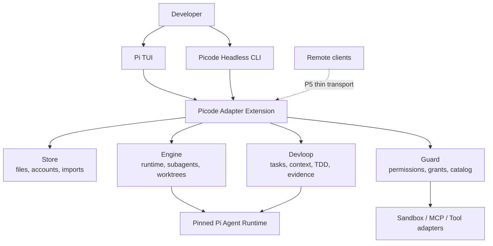
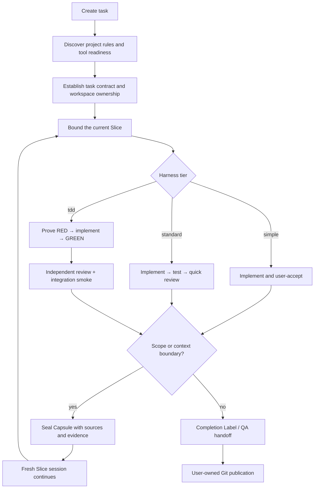

# Picode

<p align="right"><a href="README.md">中文</a></p>

**Picode is an independent, lightweight agent harness for real software development.**

It uses a pinned [Pi Agent](https://github.com/earendil-works/pi) runtime, TUI, session format, and extension API as its execution foundation, then adds permissions, sandboxing, task state, subagents, worktrees, TDD gates, long-context governance, and CLI automation in the same process. Picode has its own product boundary, architecture, data directory, release cadence, and roadmap. It is not a continuation or rebrand of another desktop project.

> [!WARNING]
> **This is a development build, not a stable release.** The Windows primary path and codeable P0–P4 contracts pass automated verification. Linux/macOS hardware validation, long-running real-provider measurements, some optional components, and strong Windows sandboxing still require separate acceptance.

### Current release highlights

| Area | Current implementation |
|---|---|
| Runtime spine | Native Pi Agent Loop, TUI, tools, and JSONL sessions; no independent Core or resident daemon |
| Development tiers | Session-level `simple / standard / tdd`, with independently adjustable prompt guidance |
| Engineering loop | Permissions, Todo, subagents, worktrees, RED/GREEN, Review, Integration, and Completion Labels |
| Long context | Full tool-output retention, request-boundary Context Governor, a 400K reliable ceiling, and automatic Slice/Capsule continuation |
| Capability loading | Resident core, lazy trusted discovery, and professional extensions that default to invisible and zero-process |
| Product surfaces | Native Pi TUI, structured headless CLI, and remote adapters fenced by a Writer Lease |

Run `/pico-help` in the TUI to browse the Pi, Picode, extension, and skill commands **actually available now**. Unloaded capabilities do not appear in the directory.

## Why Picode exists

Upstream Pi is small, fast, and highly extensible without dictating a workflow. Large integrated agents are convenient, but fixed prompts, resident tools, and always-on governance can also make small work unnecessarily heavy. Picode takes a middle path:

- small tasks remain close to upstream Pi;
- medium projects can opt into a complete engineering loop;
- workflow facts are enforced by code and evidence rather than repeated prompt requests;
- tools, MCP, LSP, and professional extensions appear only when needed;
- features do not require a daemon, a second session database, or an independent Core.

The goal is not to be the agent with the most tools. The goal is to help one developer reliably complete understand → change → verify → hand off work in a real repository with finite context and time.

## Core principles

1. **Keep Pi small**: Pi's Agent Loop, TUI, native tools, and JSONL sessions remain the execution spine. Public extension APIs come first; source patches are a last resort.
2. **Governance has gears**: `simple / standard / tdd` are session-level tiers. A small edit does not need the full harness.
3. **Prompts do not own facts**: prompts describe collaboration; Guard, Tasks, Gates, Evidence, Workspace Fences, and Worktrees enforce facts.
4. **Files are authority**: Tasks, Capsules, Grants, and Evidence use auditable files. Indexes are rebuildable and never become hidden truth.
5. **The developer owns the outcome**: routine work can be granted per session. High-risk and publication boundaries remain explicit. `danger-full-access` must be selected by the user.
6. **Long work must hand off cleanly**: Slices bound work; Capsules preserve verbatim facts, sources, decisions, changes, open questions, and verification references.
7. **A Gate must prove it can fail**: TDD requires a controlled RED before accepting GREEN, Review, and Integration evidence for the same candidate snapshot.
8. **Capabilities appear at their real cost**: Pi native tools remain visible. Long-tail capabilities pass readiness, trust, and harness-tier filters before they become model-visible or run.
9. **One workflow, multiple clients**: TUI and headless CLI share Store, Engine, Guard, and Devloop. Remote clients are thin adapters, not second authorities.

## How Picode differs from other coding agents

This is a positioning comparison, not a benchmark or intelligence ranking:

| Project/category | Typical direction | Picode's choice |
|---|---|---|
| [Upstream Pi](https://github.com/earendil-works/pi) | Minimal agent and extension surface; no prescribed permission/Todo/MCP/subagent workflow | Keep Pi's runtime and TUI while shipping an optional, verifiable engineering harness distribution |
| [Grok Build](https://github.com/xai-org/grok-build) | Integrated TUI, tools, sandbox, MCP, headless mode, and ACP | Learn from its mature context, permission, and tool patterns while using session tiers and lazy extensions to keep the base light |
| [OpenCode](https://github.com/anomalyco/opencode) | Broad provider, client, and client/server product surface | Focus on the local engineering loop, TDD evidence, Slice/Capsule continuity, and workspace ownership rather than matching client breadth |
| [Codex CLI](https://github.com/openai/codex) and integrated agents | One cohesive approval, sandbox, planning, and execution experience | Allow governance to move from near-native Pi to strict TDD instead of imposing one heavy policy on every task |
| [Oh My Pi](https://github.com/can1357/oh-my-pi) and deeper runtime enhancements | Add many capabilities through deeper runtime changes | Prefer pinned upstream Pi compatibility and replaceable modules/extensions to reduce long-term merge tax |

Picode does not need to have more features than these products. Its distinction is **a lightweight runtime spine, an optional complete engineering loop, auditable evidence, and resistance to long-task drift**.

## Architecture



Picode is a **TypeScript-first, extension-first, daemonless** single package. Four domain modules live inside the Pi process and are composed by an Adapter Extension:

| Module | Single responsibility |
|---|---|
| **Store** | File authority, account vault, import compilation, Task/Capsule/Todo persistence, locks, and atomic writes |
| **Engine** | Pi lifecycle, capability activation, subagents, Execution Epochs, managed worktrees, and sandbox adapters |
| **Guard** | allow/ask/deny, grants, permission tiers, Workspace Fence, MCP arbitration, capability catalog, and trust digests |
| **Devloop** | Task/Slice/Capsule, Context Governor, TDD state machine, Gates, Evidence, and Completion Labels |

Domain modules do not import one another directly; a composition root connects narrow interfaces. Pi remains the session authority, and Picode does not duplicate it.

## Harness tiers

| Tier | Best for | Behavior |
|---|---|---|
| `simple` | Small edits, exploration, one-off scripts | Native Pi prompt and tools; no engineering workflow injection; Standard/TDD capabilities cannot be searched or activated |
| `standard` | Everyday medium-project development | Permissions, sandbox, Todo, subagents, worktrees, readiness, Slice/Capsule, and quick review |
| `tdd` | Features with explicit acceptance contracts | A real RED is required before production writes, followed by GREEN, independent Review, Integration, and a same-snapshot Completion Label |

```text
/harness simple
/harness standard
/harness tdd
```

The TUI explains changes to tools, sandboxing, MCP, watchdogs, verification, and prompts after every tier switch. Prompt guidance can also be changed independently:

```text
/harness-prompt none
/harness-prompt lean
/harness-prompt full
```

## Development loop



### Deliberately bounded TDD

Picode's TDD loop supports a developer workstation; it does not replace dedicated CI and QA:

- a Gate needs a controlled red probe, and zero matched tests cannot pass;
- reviewer and repair rounds are bounded to avoid deadline-hostile loops;
- flaky results become QA Risk instead of repeatedly consuming repair budget;
- cross-module work needs an Integration Gate, not only green isolated unit tests;
- commit, merge, and push remain user-owned publication actions.

## Context and long sessions

Picode treats context as a compiled artifact rather than an endlessly growing chat string:

- **Immutable Prefix**: stable system prompt and tool schemas improve provider cache reuse;
- **Append-only Log**: Pi JSONL history is never rewritten in place;
- **Volatile Scratch**: temporary planning and reasoning never become permanent authority;
- **Tool Output Retention**: complete large outputs move to content-addressed storage while active context keeps a preview and retrieval pointer;
- **Context Governor**: before every provider request, budgets system text, schemas, messages, reasoning, tool outputs, output reserve, and safety margin; it compiles bounded active context before an over-budget request can be sent;
- **Reliable working ceiling**: even when a model card advertises 1M, Picode uses `min(provider window, 400K)` as the reliable workspace. Large-window models begin automatic Slice at roughly 320K of real request pressure instead of waiting for severe semantic drift;
- **Slice/Capsule**: the current primary model proposes handoff material while it still owns the full context; deterministic code verifies verbatim facts, sources, Task Revision, and workspace snapshot. The old Pi JSONL remains complete, and the fresh session records its parent/child lineage.

When automatic Slice is enabled it takes precedence over Pi summary compaction; Pi compaction remains a failure fallback. Users may disable automatic Slice, but not the request-boundary Context Governor. The 400K value is a reliability ceiling, not a claim about the provider's maximum window.

## Tool and extension residency

1. **Tier 1 — resident core**: Pi native `read/write/edit/bash` plus essential Picode engineering tools. Native Pi tools are never hidden.
2. **Tier 2 — discoverable and lazy**: enabled and trusted manifests can be found through `search_tools`, but no process starts until use.
3. **Tier 3 — disabled by default**: model-invisible, zero process, zero port, and zero network. User enablement and trust move a capability into Tier 2.

`Enabled ≠ Running`, and `Trusted ≠ elevated permission`. Existence, trust, runtime state, and permission are separate facts.

Major integrations include `pi-subagents`, `pi-landstrip`, `pi-mcp-adapter`, `pi-lens`, `pi-web-access`, `pi-cache-optimizer`, `mattpocock/skills`, and optional Herdr/CodebaseMemoryProvider/Weixin adapters. Their versions and boundaries are pinned and documented.

## Permissions and workspaces

```text
/permissions readonly
/permissions auto
/permissions full
/permissions danger-full-access
```

- `readonly`: deny writes and side effects;
- `auto`: handle routine operations and ask for risk;
- `full`: allow routine development for the session while retaining destructive and Git ownership boundaries;
- `danger-full-access`: no approval prompts and no OS sandbox; user-only and still unable to bypass TDD Gates or Workspace Fences.

Force a complete project boundary change with:

```text
/workspace D:\path\to\new-project
```

Picode warns that old context no longer applies, writes a managed boundary into the target `AGENTS.md`, and permanently denies that workspace lineage from writing back into the old workspace.

## TUI, CLI, and remote clients

- `picode` launches the enhanced Pi TUI. Closing its foreground process stops unfinished work owned by that process.
- CLI is the stable P0–P4 automation contract. It emits versioned JSON/JSONL, never parses TUI text, and requires no resident Core.
- `/server`, Web/Android, and Weixin are transport adapters. They must bind to a Host authority and a Chat Writer Lease rather than owning accounts, permissions, or tasks.

### TUI command directory

```text
/pico-help                    # Interactive categorized directory
/pico-help all                # Complete command directory
/pico-help harness            # Open one category
/pico-help slice              # Explain one command
/pico-help <query>            # Search commands loaded right now
```

The directory includes native Pi commands, Picode commands, and extension/skill commands actually loaded in the current session, with their source made explicit. Common entries include:

| Goal | Command |
|---|---|
| Change development tier | `/harness [simple|standard|tdd]` |
| Adjust prompt guidance | `/harness-prompt [none|lean|full]` |
| Set permissions | `/permissions [readonly|auto|full|danger-full-access]` |
| Choose thinking strength | `/thinking` |
| Choose subagent model | `/subagent-model [provider/model]` |
| Manage accounts | `/pico-login`, `/pico-account`, `/pico-logout` |
| Import accounts and chats | `/pico-import` |
| Manual/automatic Slice | `/slice`, `/pico-slice-auto`, `/slice-defer` |
| Remote and Weixin | `/server`, `/weixin` |

Common CLI commands:

```powershell
picode run --prompt "Inspect this project" --cwd D:\repo --jsonl --non-interactive
picode session create --cwd D:\repo --json
picode session send --session <id> --message "Continue" --jsonl
picode session branch --session <id> --from <entry-id>
picode slice create --session <id> --intent "Next phase"
picode subagent status --session <id>
picode task status --task <id>
picode gate evidence --task <id>
picode harness set --session <id> --tier tdd
picode account import
picode tools doctor --json
picode doctor --json
```

## Install and run

The current development build requires Node.js `>=22.19.0`:

```powershell
git clone https://github.com/awangs1986/picode.git
cd picode
npm ci
npm link
picode
```

Or run without a global link:

```powershell
node .\bin\picode.mjs
```

Picode pins Pi `0.84.0`. Data defaults to `~/.picode/` and is isolated from the system Pi data directory.

## Accounts and history import

`/pico-import` or `picode account import` opens an ephemeral local Web Wizard. Pi's `/import` keeps its complete native session-import behavior. The Wizard supports:

- local discovery of supported Codex, Cursor, and other supported agent-history sources with editable paths;
- preview, filtering, deduplication, workspace binding, and selective chat import;
- OAuth, API keys, OpenAI-compatible, Anthropic, and custom base URLs;
- multiple stored accounts with one active account per provider and no silent replacement;
- `/pico-login`, `/pico-logout`, and `/pico-account` manage login, logout, and account selection in the Picode Vault without colliding with Pi's native commands;
- ImportCompiler translation of historical tool traces without registering schema-polluting fake tools.

The browser is not account authority and does not persist credentials. Completion, cancellation, timeout, or TUI exit destroys temporary Wizard state.

## Verification

```powershell
npm run check
npm run smoke:pi-rpc
npm run smoke:package
```

Current automated baseline:

- TypeScript, module-boundary, and locked-dependency checks pass;
- **120 test files and 734 tests pass**;
- real Pi RPC, Windows PowerShell/Unicode paths, TDD RED→GREEN, interruption recovery, Writer Lease, MCP/tool boundaries, and clean npm install smoke have regression coverage;
- a Godot 4.7 .NET vertical story exercised download, C# test/build, headless execution, subagents, LSP readiness, Slice/Capsule, and Worktree paths.

A green suite is not product completion. Cross-platform hardware, real accounts/providers, optional MCP servers, and medium-project Slice drift remain separate acceptance work. See [P0–P4 evidence](docs/verification/P0-P4-ACCEPTANCE.md).

## Design documents

Read in this order:

1. [PICODE-V3-DESIGN.md](PICODE-V3-DESIGN.md) — product scope and decision entry;
2. [CONTEXT.md](CONTEXT.md) — domain language and unique authorities;
3. [MODULES.md](docs/design/MODULES.md) — four modules and interface boundaries;
4. [ADRs](docs/adr) — reasons behind key decisions;
5. [Context risk review](docs/design/CONTEXT-STRATEGY-RISK-REVIEW-2026-08-12.md) — real overflow evidence and Context Governor;
6. [Slice/Capsule implementation review](docs/design/SLICE-CAPSULE-IMPLEMENTATION-REVIEW.md) — the 400K ceiling, Capsule packaging, session continuation, and the A/B experiment still to run.

## Roadmap

P5 and future work include:

- full Linux/macOS/Windows hardware coverage and a stronger Windows sandbox;
- explicit `/pi-compress` and `/pi-correct` workflows;
- real-provider cache telemetry and a medium-project Slice drift experiment;
- Web/Android remote clients with multi-client Chat Writer Lease acceptance;
- extension installation, update, rollback, and resource controls;
- optional game-development verification adapters for headless runs, deterministic replay, and golden snapshots.

None of these may make Simple heavy or create a second Runtime or state authority.

## Sources, acknowledgements, and license

Picode is independent while clearly recording the open-source work it depends on and learns from:

- Pi Agent provides the runtime, TUI, model abstraction, and Extension API;
- Grok Build provides mature reference patterns for context discovery, permissions, tools, and headless product design;
- Reasonix informs the cache-friendly Immutable Prefix / Append-only Log / Volatile Scratch model;
- the Weixin text adapter references the MIT-licensed `NousResearch/hermes-agent` implementation;
- every bundled or optional component records its version, source, and boundary in design docs, the lockfile, or provenance files.

Picode is released under the [MIT License](LICENSE).
