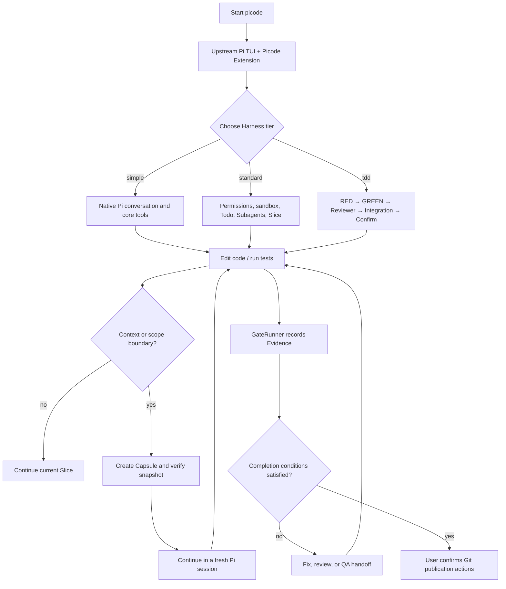

# Picode V3

<p align="right"><a href="README.md">中文</a></p>

Picode V3 is a lightweight development Harness for small-to-medium software and game
projects. It keeps the upstream Pi Agent runtime, TUI, session format, and extension
model, then adds development workflow, permissions, testing, task slicing, and
observability as extensions. It does not rewrite the Pi Agent, create a separate Rust
Core, or force every task into a heavyweight engineering process.

<span style="color:red"><strong>Current status: work in progress, not a stable release.</strong> The codeable P0–P4 scope passes local automated verification, but Linux/macOS hardware validation, real providers, a real medium-project drift experiment, Windows sandbox validation, and optional third-party component installation are not fully accepted yet. Treat this build as a development test release.</span>

## Design principles

- **Keep Pi small**: Simple mode stays close to upstream Pi; capable models are not buried under excessive prompt or Harness rules.
- **Governance on demand**: Simple, Standard, and TDD are session-level tiers. Capabilities are split into resident, discoverable lazy-loaded, and disabled tiers.
- **Facts are not prompts**: Prompts describe collaboration style; Guard, TaskControl, GateRunner, and file authority enforce facts and invariants.
- **Developer ownership**: Normal edits follow the configured permission policy. Commit, merge, push, and other publication actions always require explicit user confirmation.
- **Context continuity**: Long work is split into Slices. A source-linked, digest-checked Capsule transfers facts between sessions instead of trusting a model’s memory claim.
- **One workflow**: TUI, CLI, and future adapters share Store, Engine, Guard, and Devloop rather than creating another task database.

## Development loop



## Four core modules

| Module | Responsibility |
|---|---|
| **Store** | File authority, account vault, import compiler, Task/Capsule/Todo persistence, locks, and atomic writes |
| **Engine** | Pi lifecycle, capability activation, Subagents, Execution Epoch, Worktree, and sandbox adapters |
| **Guard** | allow/ask/deny, grants, permission policy, MCP arbitration, capability catalog, and trust digests |
| **Devloop** | Task, Slice/Capsule, context bridge, TDD state machine, Gates, Evidence, and Completion Labels |

These modules run in the Pi process and communicate through interfaces and a small event
bus. Picode does not run a separate Core service.

## Harness tiers

| Tier | Best for | Default behavior |
|---|---|---|
| `simple` | Small edits, experiments, simple pages | Native Pi prompt and core tools; no engineering governance injection |
| `standard` | Everyday medium-project development | Permissions, sandbox, Todo, Subagents, Worktree, Slice, and discoverable extensions |
| `tdd` | Features with explicit acceptance criteria | RED must be proven before production writes; Target Gate, independent Reviewer, Integration Smoke, and same-snapshot confirmation are required before completion |

Inside TUI:

```text
/harness simple
/harness standard
/harness tdd
```

Native Pi tools are never hidden. Long-tail capabilities are discovered through
`search_tools` and activated only when needed, keeping the full schema out of the
permanent context.

## Run

```powershell
cd D:\otherproject\picode\v3
npm ci
npm link
picode
```

Or run the launcher directly:

```powershell
node .\bin\picode.mjs
```

Picode ships with vendored Pi 0.84.0. Its data defaults to `~/.picode/`, isolated from
the system Pi data directory.

## CLI-first automation

The CLI is the only public automation surface for P0–P4. It does not parse TUI output
and does not require a TUI or Core process to be running:

```powershell
picode run --prompt "Inspect this project" --cwd D:\repo --jsonl --non-interactive
picode session create --cwd D:\repo --json
picode session send --session <id> --message "Continue" --jsonl
picode task status --task <id>
picode task wait --task <id> --timeout-ms 60000
picode gate status --task <id>
picode gate evidence --task <id>
picode harness get --session <id>
picode harness set --session <id> --tier tdd
picode account import
picode doctor --json
```

stdout contains versioned JSON/JSONL and stderr contains diagnostics. In non-interactive
mode, an operation requiring user approval fails closed with a stable exit code. HTTP/SSE
starts only when `PICODE_DEBUG_API=1` and is an internal diagnostic transport, not a
public compatibility interface.

## Projects referenced and learned from

Picode does not copy these projects wholesale. It selectively adopts stable interfaces,
patterns, and lessons within their applicable scope and licenses:

- **earendil-works/pi**: Pi Agent runtime, upstream TUI, session format, and Extension API foundation.
- **pi-subagents**: delegation, asynchronous work, lifecycle artifacts, Worktree isolation, and Watchdog review.
- **pi-landstrip**: cross-platform sandbox provider seam; policy remains owned by Picode Guard.
- **pi-mcp-adapter**: external MCP search, description, calls, and approval arbitration.
- **pi-plan-mode / pi-goal**: read-only planning and bounded goal progression.
- **pi-web-access**: web search and fetch extension available to the Simple tier.
- **pi-cache-optimizer**: provider cache compatibility and hit-rate diagnostics; prompt rewriting is disabled.
- **pi-lens**: LSP diagnostics and impact assistance.
- **mattpocock/skills**: optional software-engineering skill collection and progressive loading model.
- **Herdr**: optional multi-task terminal orchestration runtime; it does not replace the Pi Subagent foundation.
- **Codebase Memory MCP**: optional repository structure indexing and long-term memory provider.
- **Grok Build**: reference for project-context discovery, tool surfaces, permission approval, and task-state presentation.

See [PICODE-V3-DESIGN.md](PICODE-V3-DESIGN.md), [MODULES.md](docs/design/MODULES.md),
[CONTEXT.md](CONTEXT.md), and the [ADR directory](docs/adr) for decisions, sources,
versions, and trade-offs.

## Verification

```powershell
npm run check
npm run smoke:pi-rpc
npm run smoke:package
```

Current baseline: 68 test files and 413 tests pass. TypeScript, module boundaries,
locked dependencies, real Pi RPC, npm packaging, installation, and CLI doctor smoke
are verified. See [P0-P4-ACCEPTANCE.md](docs/verification/P0-P4-ACCEPTANCE.md) for the
evidence record.

## Roadmap

### P5 deferred work

- Full Linux/macOS/Windows real-machine validation and stronger Windows sandbox probes;
- Explicit `/pi-compress` and `/pi-correct` context compression/correction modules;
- Real-provider cache hit-rate measurements and a medium-project Slice drift experiment;
- Mobile/desktop remote control reusing the same Control Interface;
- A stateless Picode Control MCP adapter only if the CLI cannot cover a target host;
- Verifiable third-party component install, update, rollback, and platform matrix;
- Game-oriented verification adapters: headless runs, deterministic replay, and golden snapshots.

### Future product direction

GUI, remote collaboration, and a richer extension marketplace will be evaluated after the
core Pi workflow is stable. They must not make Simple mode heavy or create a second
session, task, or permission authority.

## Contribution and limitations

This repository is under active refactoring. Tests, cross-platform validation, upstream
compatibility reports, and extension adapter suggestions are welcome. Read the design
documents and ADRs before changing core architecture, permissions, Gates, or file authority.

<span style="color:red"><strong>Do not interpret a green automated test suite as product completion.</strong> Real providers, optional third-party components, cross-platform sandboxing, and medium-project drift still require separate acceptance.</span>

## License and acknowledgements

Picode is released under the MIT License. Thanks to Pi Agent and its ecosystem for the
composable runtime, TUI, and extension interfaces. Picode is an independent folk project
built around Pi.
