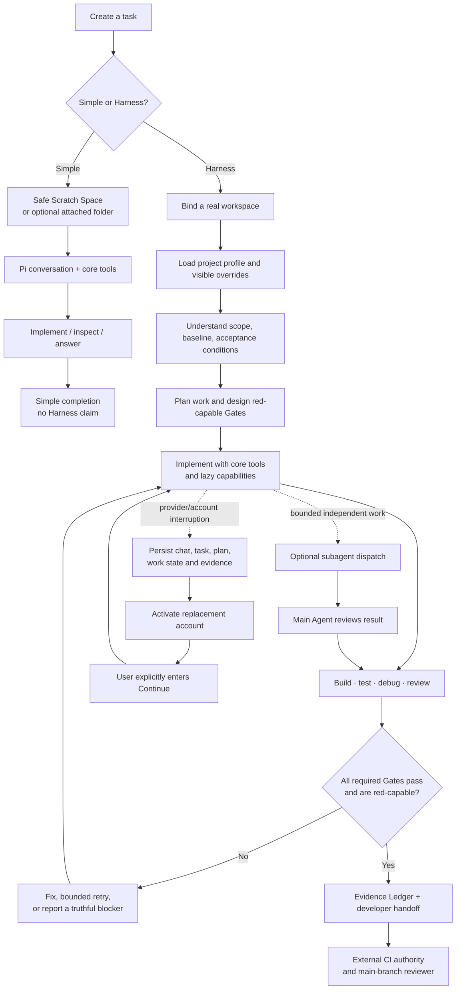
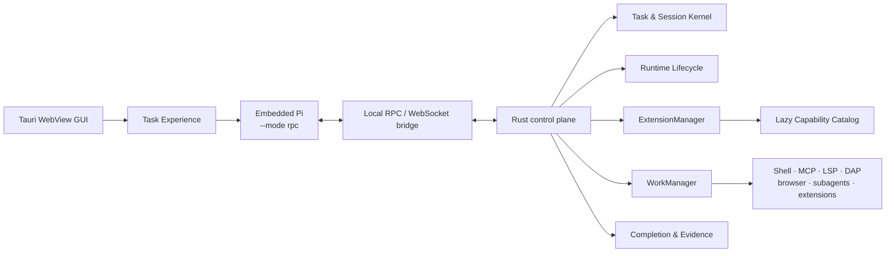

# Picode

**English** | [简体中文](./README.zh.md)

> ⚠️ **Major rewrite in progress.** The current public codebase is being refactored from the ground up. The previous architecture had a number of **fatal design problems** (control-plane / agent boundaries, harness trust assumptions, and related structural issues). Treat what is on `main` today as transitional and unstable — do not build production workflows or long-lived forks on it until the rewrite lands.

> A lightweight, multi-provider desktop development harness built on Pi.

Picode is a local desktop workspace for the [Pi coding agent](https://github.com/earendil-works/pi) and a maintained fork of [Picot](https://github.com/shixin-guo/picot). It is designed for personal software and game development: small enough for a quick fix, but able to carry a medium-sized project through implementation, local verification, recovery, and handoff.

Picode keeps Pi as the agent runtime and uses a Tauri 2 / Rust control plane. The product direction below describes the intended shape after the rewrite; much of the shipped tree still reflects the older design that is being replaced.

> Validated most heavily on Windows. Back up important conversations and review agent actions before using it on valuable projects.

## Why Picode

Most coding-agent applications optimize either for a fast single session or for a large autonomous platform. Picode takes a different position: a low-overhead personal development workstation that can preserve work across providers, accounts, chats, projects, restarts, and operating systems.

| Picode advantage | What it means in practice |
|---|---|
| **Pi at the core** | The model loop remains Pi instead of being reimplemented inside the GUI. Picode adds a desktop control plane around a compact agent runtime. |
| **Simple when the task is simple** | A Simple Task starts in a safe Scratch Space without workspace discovery, Git policy, LSP, MCP, DAP, or extension processes. |
| **A complete optional development loop** | A Harness Task can bind a repository, plan work, manage background jobs and subagents, run local gates, retain evidence, and prepare a reviewable handoff. |
| **Provider-independent continuity** | Codex, Claude, Cursor, and compatible APIs can coexist. Chats and task state survive account interruption; execution resumes only after the user explicitly continues it. |
| **Capabilities without permanent weight** | Optional tools are discoverable through lightweight manifests. Their schemas, processes, servers, browsers, and runtimes load only when invoked. |
| **Completion backed by evidence** | A green Gate is not automatically trusted. Picode records the result and requires a controlled red probe when a Gate is introduced or materially changed. |
| **Desktop observability** | The GUI exposes Agent Runs, subagents, jobs, process ownership, resource use, task bindings, extension state, and recent errors. |
| **Portable long-project state** | Selective chat import, workspace rebinding, encrypted backups, compressed context packages, and path normalization support machine and OS migration. |

## Core philosophy

### 1. Stronger models need less imposed harness

Picode does not assume that every capable model needs a long system prompt, a mandatory workflow, or a stack of automatically invoked Skills. The default path stays close to Pi. Structure is added only when the task, the user, or the project requires it.

- **Simple Task** is the direct path: conversation plus Pi's core capabilities.
- **Harness Task** is the engineering path: workspace, plan, Gates, evidence, recovery, and optional isolation.
- An explicitly invoked user Skill may override the task workflow. The override remains visible and task-scoped.
- Authorization and destructive-operation boundaries remain enforced by the underlying APIs, not by prompt wording.

### 2. Lightweight means lazy residency, not missing capabilities

Picode does not measure simplicity by deleting tools that real development needs. It separates capability availability from memory residency:

1. **Resident Core** — lightweight chat, task, authorization, filesystem/process primitives, Git metadata, and monitoring control.
2. **Discoverable Lazy Capability** — enabled and searchable, but its full schema, implementation, and processes load only when invoked.
3. **Disabled User Module** — visible in Settings but absent from the model catalog and forbidden from starting processes, ports, or network activity.

The unified extension lifecycle is:

```text
Discovered → Enabled → Trusted → Running
```

Enabled does not mean running. Trusted does not grant extra permissions. Disabled means zero model visibility and zero runtime activity.

### 3. A development Harness must close the loop

Picode targets the local responsibilities of a developer working on software or a game: understand, inspect, plan, edit, build, test, debug, review, and hand off. It does not attempt to replace the CI authority, the main-branch reviewer, the release owner, the game engine, or the IDE.

It is deliberately not a general research, writing, or art-production platform. Optional integrations may support engineering work, but the product boundary remains software development.

### 4. “Green” is not proof unless the Gate can turn red

A command returning exit code zero proves only that one command returned zero. A Picode Completion Gate has a declared predicate, bounded output, retained evidence, and—when introduced or changed—a controlled negative test demonstrating that the same Gate rejects a bad candidate.

### 5. Continuity belongs to the task, not the provider session

Chat, Task Run, plan, evidence, workspace identity, and account execution epoch are separate durable concepts. If account A disconnects, only work owned by A stops. Account B may take over the preserved task, but no model or tool call starts until the user explicitly enters **Continue**.

## Development workflow

The same desktop application supports a fast path and a full engineering path. Neither is silently forced onto the other.



### What the workflow guarantees

- A Simple Task never claims Harness verification.
- A Harness Task cannot execute against an imported or restored workspace until the path is rebound on the current machine.
- Optional Git worktrees, write leases, LSP, DAP, MCP, browser automation, and professional modules activate only when selected by task policy or the user.
- Subagents receive bounded delegation contracts and cannot enlarge the authority assigned by the main Agent.
- Local Gate evidence supports developer handoff; it does not impersonate CI or merge approval.

## Current capabilities

### Providers, accounts, and models

- Manual import of supported local Codex, Claude, and Cursor configurations.
- Reviewed JSON credential import; no automatic credential harvesting.
- Codex official OAuth and OpenAI-compatible reverse-proxy channels.
- Custom OpenAI-compatible and Anthropic-compatible providers.
- Provider-aware model selection, including identical model names from different providers.
- Multiple stored accounts, with at most one active account per provider.
- Explicit task continuation after account replacement.
- Separate official Cursor SDK API-key and experimental Cursor Desktop/CLI OAuth channels.

Secrets are normalized into the protected Account Vault. Picode does not retain imported source JSON as a live credential store.

### Chats, migration, and recovery

- Selective Codex, Cursor, and Claude history scanning and import.
- Human-readable title, recent-message preview, time, size, source, archive, and sorting filters.
- Deduplication, reasoning filtering, full-context viewing, and optional full reasoning import.
- Mandatory Workspace Binding before imported chats may execute tools.
- Cross-platform workspace identity and Windows/Linux/macOS path normalization.
- Lossless chat backups with encryption enabled by default.
- Compressed context packages for long-project transfer.
- Archive state, soft deletion, confirmation-protected purge, and non-destructive rewind foundations.

Chat backups do not package project files.

### Harness and runtime

- Explicit Simple Task and Harness Task creation.
- Durable Task Runs, account execution epochs, plans, work state, and evidence.
- Managed shell jobs, persistent code execution, browser runtime, code-intelligence and debugger adapters.
- User-configurable subagent model policy and integrated [pi-subagents](https://github.com/nicobailon/pi-subagents).
- Runtime Monitor for Agent/subagent relationships, CPU, memory, usage, wait states, and suspected stalls.
- Completion coordination with Gate results, red probes, retry state, and evidence.
- Unified ExtensionManager and WorkManager ownership for Skills, Hooks, MCP, LSP, DAP, Firstmate, and native extension processes.

### Extension governance

Extension Manifest v2 records source, pinned version or commit, content hash, license, platform support, permissions, components, health checks, and resource limits. Heavy processes run through a common adapter with task/run ownership, timeout, cancellation, crash reporting, and bounded output.

The Professional Extensions GUI shows actual lifecycle state, provenance, version, permissions, recent errors, processes, and task bindings. Skill collections such as `mattpocock/skills` are presented as one expandable package rather than dozens of unrelated entries.

## Architecture



The GUI and future headless/remote clients use the same task and chat control boundaries. Agent execution remains local to the computer running Picode.

## Project status

The P0–P4 production paths described in [Harness V2](./docs/P0-P5-HARNESS-V2.md) are connected and covered by local Gates. P5 remote and experimental capabilities remain planned and disabled by default.

Picode's desktop governance, multi-account continuity, extension lifecycle, and verification model are ahead of its execution depth in some advanced areas. LSP, DAP, long-lived MCP, browser automation, subagent recovery, and context compaction are usable but still being deepened. See the candid [Picode vs. oh-my-pi pipeline review](./docs/research/picode-vs-oh-my-pi-pipeline-2026-08-01.md).

Linux and macOS portability is an architectural requirement, but Windows currently receives the most hands-on validation.

## Build from source

Requirements:

- [Rust](https://www.rust-lang.org/tools/install)
- [Bun](https://bun.sh/)
- [Tauri 2 platform prerequisites](https://v2.tauri.app/start/prerequisites/)
- Git

```bash
git clone https://github.com/awangs1986/picode.git
cd picode
bun install --frozen-lockfile
bun run dev
```

Build a release:

```bash
bun run build
```

Run the main local checks:

```bash
bun run check
bun run test
bun run check:rust
```

## Design and implementation documents

- [Harness V2: P0–P5](./docs/P0-P5-HARNESS-V2.md)
- [Implementation roadmap](./ROADMAP.md)
- [Domain model](./CONTEXT.md)
- [Architecture Decision Records](./docs/adr/)
- [Picode vs. oh-my-pi pipeline review](./docs/research/picode-vs-oh-my-pi-pipeline-2026-08-01.md)

## Upstream and acknowledgements

Picode is a fork and derivative work of [Picot](https://github.com/shixin-guo/picot). Picot provided the desktop interaction model, Tauri foundation, session UI, and much of the original integration work that made this project possible. We sincerely thank its maintainers and contributors.

Picode is powered by the [Pi coding agent](https://github.com/earendil-works/pi). Pi provides the compact agent runtime, RPC mode, session format, model/provider integration, and extension ecosystem at the center of Picode. We equally thank Pi's maintainers and contributors.

Advanced subagent orchestration uses [pi-subagents](https://github.com/nicobailon/pi-subagents). Optional capabilities retain their respective upstream licenses and notices. Picode follows a capability-source ladder: prefer a compatible Pi package, then study Oh My Pi and comparable open-source agents, and write a Picode-specific implementation only when earlier options do not fit.

Picode is an independent community project and is not affiliated with or endorsed by OpenAI, Anthropic, Cursor, xAI, or their respective products.

## License

Picode is distributed under the [MIT License](./LICENSE), consistent with Picot's license. Third-party components and bundled dependencies retain their respective licenses and notices; see [THIRD_PARTY_NOTICES.md](./THIRD_PARTY_NOTICES.md).
