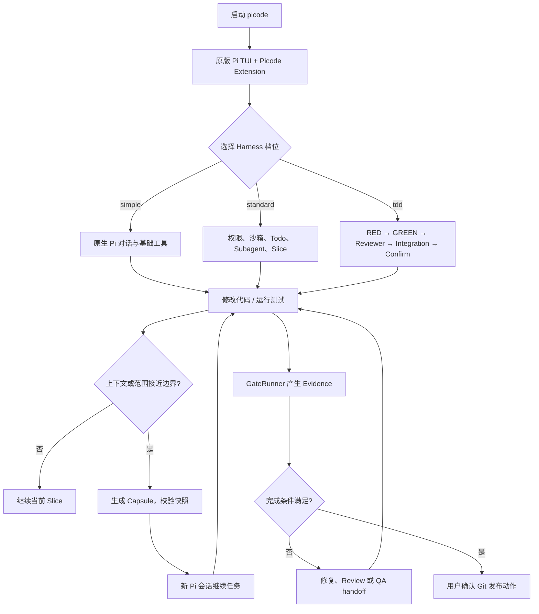

# Picode V3

<p align="right"><a href="README.en.md">English</a></p>

Picode V3 是一个面向中小型到中型软件、游戏工程开发的轻量化 Harness。
它以原版 Pi Agent 为运行时基础，通过 Extension-first 方式增加开发工作流、权限、
测试、任务切片和可观测性；不重写 Pi Agent，不另造 Rust Core，也不强迫所有任务
使用完整工程流程。

<span style="color:red"><strong>当前状态：开发中，尚未完善，不是稳定发行版。</strong> P0–P4 的可代码化范围已通过本机自动化验证，但 Linux/macOS 实机、真实 Provider、真实中型项目漂移实验、Windows 强沙箱和第三方可选组件安装仍未全部验收。请把当前版本当作开发测试版。</span>

## 核心理念

- **Pi 保持简洁**：Simple 模式接近原版 Pi；先进模型不被过度提示词和 Harness 约束。
- **治理按需出现**：Simple、Standard、TDD 是会话级档位，能力按一级常驻、二级可发现懒加载、三级默认停用分层。
- **事实与提示词分离**：提示词负责协作方式，Guard、TaskControl、GateRunner 和文件权威负责事实与强制条件。
- **开发者拥有最终权力**：普通文件修改可按权限策略执行；commit、merge、push 等发布动作永远需要用户确认。
- **上下文抗失真**：长任务切成 Slice，用带来源指针和摘要校验的 Capsule 交接；不依赖模型声称“我记得”。
- **一个 Workflow**：TUI、CLI 和未来适配器共享同一套 Store、Engine、Guard、Devloop，不建立第二套任务数据库。

## 用户视角的开发闭环



## 四个核心模块

| 模块 | 责任 |
|---|---|
| **Store** | 文件权威、账号 Vault、导入编译、Task/Capsule/Todo 持久化、锁和原子写入 |
| **Engine** | Pi 生命周期、能力激活、Subagent、Execution Epoch、Worktree 和沙箱调用侧 |
| **Guard** | allow/ask/deny、Grant、权限策略、MCP 仲裁、能力目录与信任摘要 |
| **Devloop** | Task、Slice/Capsule、上下文桥接、TDD 状态机、Gate、Evidence、Completion Label |

领域模块在 Pi 进程内通过接口和事件总线协作；Picode 不运行独立 Core 服务。

## 三种 Harness 档位

| 档位 | 适用场景 | 默认行为 |
|---|---|---|
| `simple` | 小改动、实验、简单页面 | 保留 Pi 原生提示词和基础工具，零工程治理注入 |
| `standard` | 日常中型开发 | 权限、沙箱、Todo、Subagent、Worktree、Slice、可发现扩展 |
| `tdd` | 需要明确验收的功能 | 先证明 RED，再允许生产代码写入；Target Gate、独立 Reviewer、Integration Smoke、同快照确认后才能完成；Reviewer 技术失败只允许一次重试，仍不可用则如实转交 QA |

在 TUI 中输入：

```text
/harness simple
/harness standard
/harness tdd
```

切换成功后，Picode 会说明沙箱、MCP、工具面、Watchdog、验证策略和默认提示词
发生了哪些变化。Harness 的默认提示词级别为 `simple → none`、
`standard → lean`、`tdd → full`。如只想改变当前会话的提示词引导强度：

```text
/system prompt
/system prompt none
/system prompt lean
/system prompt full
```

不带级别时会显示选择菜单。该命令不改变 Harness、工具、权限、沙箱或 Gate；
下一次切换 Harness 会清除手动覆盖并恢复新档位默认值。

Standard/TDD 会话可用 `/permissions readonly|auto|full|danger-full-access` 调整授权密度。默认
`auto`；`full` 会在当前会话放行常规命令，仍会询问破坏性操作以及
commit/merge/push 等 Git 所有权操作，并且不会关闭 OS 沙箱。第一次审批时也
可以直接选择“Allow routine operations for this session”。

`danger-full-access` 精确对应 Codex 的 `approval_policy=never` 加
`sandbox_mode=danger-full-access`：当前会话不再弹出工具审批，并关闭 OS 沙箱，
包括破坏性操作与 Git 所有权操作也会直接执行。它不会取消 TDD Gate，也不会
覆盖用户通过强制工作区切换建立的旧工作区禁写 fence。仅应在可信仓库中显式使用。

Agent 工作期间可输入 `/insert <补充指令>`：当前工具不会被取消，补充指令会在
工具完成后、下一次模型调用前插入同一回合。若回合已经结束，它会自动成为新的
普通消息而不会丢失。需要等当前工作全部结束后再执行的消息仍使用 Pi 原生
Follow-up（默认 `Alt+Enter`）。

如需重新检查推荐组件，在 TUI 输入 `/reinstall`。Picode 会依次检测
`mattpocock/skills`、Herdr 和 CodebaseMemoryProvider，只对缺失项分别询问；
已安装项不会重复提示。启用可选能力不等于启动常驻进程。

Pi 原生工具不会被隐藏。长尾能力由 `search_tools` 发现，需要时才激活，避免所有
工具 Schema 常驻上下文。

需要彻底改到另一个工程时，在 TUI 输入：

```text
/workspace D:\path\to\new-project
```

这是强制切换，不是普通的目录跳转。Picode 会先明确警告当前对话上下文不会继承；
确认后等待当前回合结束，在新工作区的标准 `AGENTS.md` 写入受管边界，重新启动一份
原版 Pi 会话，并由 Guard 永久拒绝该工作区谱系对旧工作区的写入。Standard/TDD 下
相同禁令也会编译到 Landstrip 沙箱策略。要保留当前对话，请新开 TUI，而不要使用
该命令。

## 运行

```powershell
cd D:\otherproject\picode\v3
npm ci
npm link
picode
```

如果尚未执行 `npm link`，也可以直接运行：

```powershell
node .\bin\picode.mjs
```

Picode 固定携带 vendored Pi 0.84.0，数据默认写入 `~/.picode/`，与系统 Pi 数据
目录隔离。

## CLI-first 自动化

完整命令、RPC 协议、退出码和 PowerShell 示例见
[无头模式使用手册](docs/HEADLESS-USAGE.zh.md)。需要独立测试人员做全量黑盒验收时，使用
[无头完整产品测试指南](docs/verification/HEADLESS-FULL-PRODUCT-TEST-GUIDE.zh.md)。

CLI 是 P0–P4 唯一公开自动化入口，不解析 TUI 输出，也不要求先启动 TUI 或 Core：

```powershell
picode run --prompt "检查当前项目" --cwd D:\repo --jsonl --non-interactive
picode session create --cwd D:\repo --json
picode session send --session <id> --message "继续" --jsonl
picode session branch --session <id> --from <entry-id>
picode slice create --session <id> --intent "下一阶段"
picode subagent status --session <id>
picode capability status
picode chat preview --source codex --path D:\history
picode task status --task <id>
picode task wait --task <id> --timeout-ms 60000
picode gate status --task <id>
picode gate evidence --task <id>
picode harness get --session <id>
picode harness set --session <id> --tier tdd
picode account import
picode doctor --json
```

stdout 是版本化 JSON/JSONL，stderr 只输出诊断；非交互模式遇到需要用户授权的操作
会 fail-closed 并返回稳定退出码。HTTP/SSE 仅在 `PICODE_DEBUG_API=1` 时作为内部
诊断传输启动，不是公共兼容接口。

## 已引用和学习的项目

Picode 不是把这些项目整体复制进来，而是按稳定接口、许可证和适用范围选择性吸收：

- **earendil-works/pi**：Pi Agent Runtime、原版 TUI、会话格式和 Extension API 的基础。
- **pi-subagents**：Subagent 委派、异步任务、生命周期工件、Worktree 隔离和 Watchdog Review。
- **pi-landstrip**：跨平台沙箱 Provider 的调用侧；策略仍由 Picode Guard 决定。Windows Harness 在同一沙箱边界内使用系统 PowerShell，避免 Git Bash/AppContainer 启动失败。
- **pi-mcp-adapter**：外部 MCP 的搜索、描述、调用和审批仲裁。
- **mattpocock/skills + Picode `/plan`**：随包携带固定的软件工程 Skills 快照；首次显式 `/plan` 时按需物化 `grill-with-docs` 依赖闭包并重载会话，启动时不整体加载。Picode 不再维护独立的 Plan/Goal 插件；用户也可显式运行 `/reinstall` 检查三项推荐组件。
- **pi-web-access**：Simple 档可用的 Web 搜索/抓取扩展。
- **pi-cache-optimizer**：Provider 缓存兼容与命中率诊断；Picode 禁止其改写提示词。
- **pi-lens**：LSP 诊断和影响范围辅助。
- **Herdr**：可选的多任务终端编排 Runtime；不替代 Pi Subagent 底座。
- **Codebase Memory MCP**：可选的代码库结构索引和长期记忆 Provider。
- **Grok Build**：项目上下文发现、工具面、权限审批和任务状态呈现的参考对象。

详细决策、来源、版本和取舍见 [PICODE-V3-DESIGN.md](PICODE-V3-DESIGN.md)、
[MODULES.md](docs/design/MODULES.md)、[CONTEXT.md](CONTEXT.md) 和
[ADR 目录](docs/adr)。

## 当前验证结果

```powershell
npm run check
npm run smoke:pi-rpc
npm run smoke:package
```

当前基线：77 个测试文件、495 项测试通过；TypeScript、模块边界、锁定依赖、真实
Pi RPC、npm 打包安装和 CLI doctor smoke 均已验证。

2026 年 8 月的 Godot 4.7 .NET 纵向黑盒测试进一步验证了：Picode 可以通过自身
Web/下载链路取得官方 Godot 资产，驱动 C# 项目的 NUnit、构建与无头 Smoke，发现
`csharp-ls`，运行 Subagent，并保存 Slice/Capsule 与 Worktree 状态。测试暴露的
Reviewer 技术失败锁死 GREEN、Gate 超时遗留子进程和死亡 Writer Lease 已加入回归
测试并修复。完整故事与复测步骤见
[Godot TetraShift 端到端任务书](docs/verification/GODOT-TETRASHIFT-END-TO-END-TEST.zh.md)；
这仍不代表跨平台和所有可选 MCP 配置已经通过发布验收。详细基础证据见
[P0-P4-ACCEPTANCE.md](docs/verification/P0-P4-ACCEPTANCE.md)。

## 未来计划

### P5：延后能力

- Linux/macOS/Windows 的完整实机验证和更强的 Windows 沙箱探针；
- `/pi-compress`、`/pi-correct` 显式上下文压缩与纠偏模块；
- 真实 Provider 缓存命中率和中型项目 Slice 漂移实验；
- 手机/桌面远程控制，复用同一 Control Interface；
- 仅在 CLI 无法覆盖目标宿主时增加无状态 Picode Control MCP Adapter；
- 可验证的第三方组件安装、更新、回滚和平台兼容矩阵；
- 游戏领域验证适配器（无头运行、确定性回放、黄金快照）。

### 未来产品方向

GUI、远程协作和更丰富的扩展市场会在核心 Pi Workflow 稳定后单独评估；它们不能
反过来迫使 Simple 模式变重，也不能创建第二套会话、任务或权限权威。

## 贡献和当前限制

当前仓库处于重构开发阶段。欢迎提交测试、跨平台验证、Pi 上游兼容性报告和扩展
适配建议；涉及核心架构、权限、Gate 或文件权威的修改，请先阅读设计文档和 ADR。

<span style="color:red"><strong>请勿把当前自动化测试全绿理解为产品已经完成。</strong> 真实 Provider、第三方可选组件、跨平台沙箱和中型项目漂移仍需要单独验收。</span>

## 许可证和致谢

Picode 以 MIT 许可证发布。感谢 Pi Agent 及其生态项目提供可组合的 Runtime、TUI
和扩展接口；Picode 是围绕 Pi 的独立 folk/衍生开发路线。
