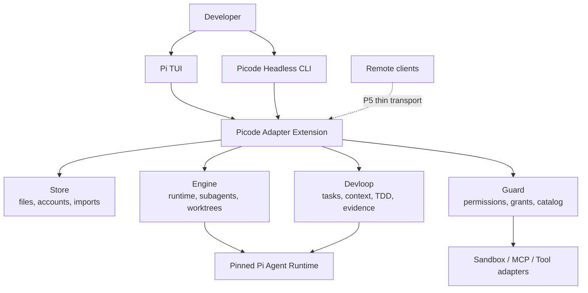
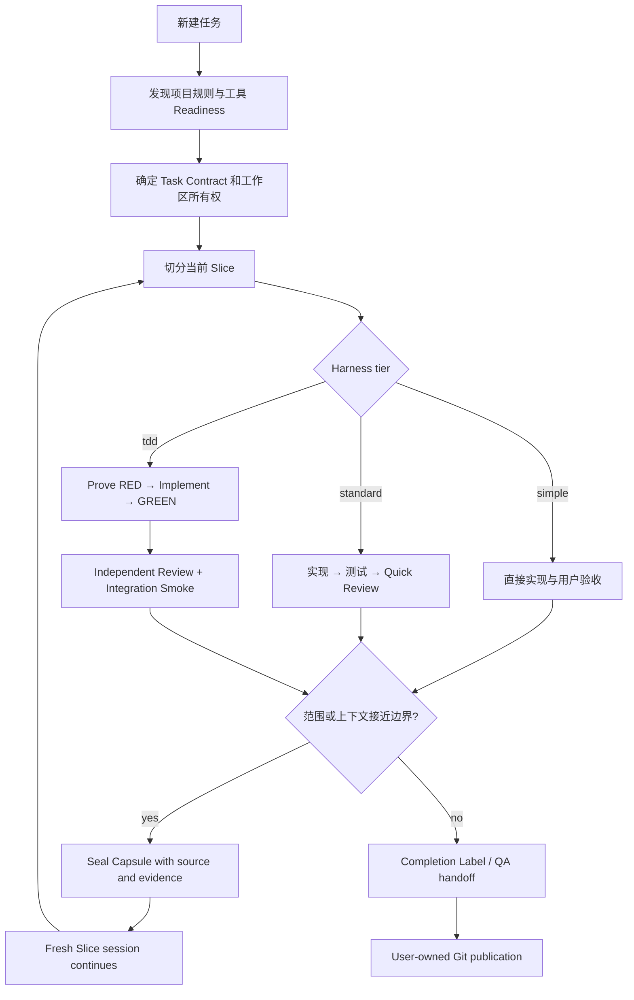

# Picode

<p align="right"><a href="README.en.md">English</a></p>

**Picode 是一个独立的、面向真实软件开发的轻量化 Agent Harness。**

它把经过固定版本验证的 [Pi Agent](https://github.com/earendil-works/pi) Runtime、TUI、会话格式和扩展 API 作为运行基础，在同一进程内增加权限、沙箱、任务状态、Subagent、Worktree、TDD Gate、长上下文治理和 CLI 自动化。Picode 拥有自己的产品边界、架构、数据目录、发布节奏和开发路线，不是其他桌面项目的延续或改名版本。

> [!WARNING]
> **当前仍是开发测试版，不是稳定发行版。** Windows 主路径和可代码化的 P0–P4 合同已经通过自动化验证；Linux/macOS 实机、真实 Provider 长周期测量、部分第三方组件和强 Windows 沙箱仍需单独验收。

## 为什么做 Picode

原版 Pi 的优势是小、快、可扩展，并且不替用户规定工作流。大型一体化 Agent 的优势是开箱即用，但固定提示词、常驻工具和完整治理也可能让小任务变重。Picode 选择中间路线：

- 小任务保持接近原版 Pi；
- 中型工程按需获得完整开发闭环；
- 流程事实由代码和证据强制，不靠提示词反复提醒模型；
- 工具、MCP、LSP 和专业扩展只在需要时发现或激活；
- 不用独立 Core、第二套会话数据库或后台常驻服务换取功能。

目标不是成为“拥有最多工具的 Agent”，而是让一个开发者能在有限上下文、有限时间和真实代码库里可靠地完成：理解 → 修改 → 验证 → 交接。

## 核心设计原则

1. **保留 Pi 的简洁性**：Pi Agent Loop、TUI、原生工具和 JSONL 会话仍是运行主干；Picode 优先使用公开扩展接口，源码补丁只作最后手段。
2. **治理可以升降档**：`simple / standard / tdd` 是会话级档位，不需要为一次小修改启动完整 Harness。
3. **提示词不拥有事实**：提示词只说明协作方式；Guard、Task、Gate、Evidence、Workspace Fence 和 Worktree 才是确定性权威。
4. **文件是权威**：Task、Capsule、Grant 和 Evidence 使用可审计文件保存；索引可以重建，不引入隐藏数据库真相。
5. **开发者拥有最终权力**：常规操作可以按会话授权；发布和高风险操作保留明确边界。`danger-full-access` 必须由用户显式选择。
6. **长任务必须可交接**：Slice 控制工作颗粒，Capsule 保存逐字事实、来源、决策、变更、未决项和验证引用，不让摘要替代验收契约。
7. **先做可红的 Gate**：TDD 不是“测试显示绿色”，而是先证明 Gate 有能力失败，再接受同一候选快照的 GREEN、Review 和 Integration 证据。
8. **能力按成本出现**：Pi 原生工具永远保留；长尾能力经 Readiness、信任和任务档位过滤后才进入模型可见面或运行态。
9. **一个 Workflow，多种入口**：TUI 和无头 CLI 使用相同的 Store、Engine、Guard、Devloop；远程客户端只能成为薄 Adapter，不能产生第二套权限或会话权威。

## 和其他 Coding Agent 的区别

下面是产品定位差异，不是跑分或“谁更聪明”的排名：

| 对象 | 典型取向 | Picode 的选择 |
|---|---|---|
| [原版 Pi](https://github.com/earendil-works/pi) | 极简 Agent、扩展优先，不内置固定权限/Todo/MCP/Subagent 工作流 | 保留 Pi 运行时和 TUI，在其上提供可切换、可验证的工程 Harness 发行版 |
| [Grok Build](https://github.com/xai-org/grok-build) | 完整 TUI、工具、沙箱、MCP、Headless/ACP 形成一体化产品 | 学习其成熟 Context、权限和工具模式，但把治理拆成会话档位，并把非核心能力做成懒加载扩展 |
| [OpenCode](https://github.com/anomalyco/opencode) | 多 Provider、多客户端和 Client/Server 产品面广 | Picode 更聚焦本地开发闭环、TDD Evidence、Slice/Capsule 与工作区所有权，不追求同等客户端广度 |
| [Codex CLI](https://github.com/openai/codex) 等一体化 Agent | 产品提供统一的审批、沙箱、计划和执行体验 | Picode 允许从近原生 Pi 到严格 TDD 动态升降，不把同一套重治理强加给所有任务 |
| [Oh My Pi](https://github.com/can1357/oh-my-pi) 等深度增强 Runtime | 通过更深的 Runtime 修改快速获得大量内建能力 | Picode 优先保持固定 Pi 版本的上游兼容，以模块和扩展组合能力，降低长期合并税 |

Picode 不要求比这些项目“功能更多”。它的差异化是：**轻量运行主干 + 可选完整工程闭环 + 可审计证据 + 长任务抗失真。**

## 架构



Picode 是 **TypeScript-first、Extension-first、无独立 Core** 的单包应用。四个领域模块活在 Pi 进程内，由 Adapter Extension 组合：

| 模块 | 唯一责任 |
|---|---|
| **Store** | 文件权威、账号 Vault、导入编译、Task/Capsule/Todo 持久化、锁与原子写 |
| **Engine** | Pi 生命周期、能力激活、Subagent、Execution Epoch、Managed Worktree、沙箱调用侧 |
| **Guard** | allow/ask/deny、Grant、权限档位、Workspace Fence、MCP 仲裁、能力目录与信任摘要 |
| **Devloop** | Task/Slice/Capsule、Context Governor、TDD 状态机、Gate、Evidence、Completion Label |

领域模块互不直接依赖；组合根通过窄接口接线。Session 仍由 Pi 管理，Picode 不复制会话权威。

## 三档 Harness

| 档位 | 适用场景 | 行为 |
|---|---|---|
| `simple` | 小改动、探索、一次性脚本 | 保留 Pi 原生提示词和工具；不注入工程流程；Standard/TDD 能力不可搜索或激活 |
| `standard` | 日常中型开发 | 增加权限、沙箱、Todo、Subagent、Worktree、Readiness、Slice/Capsule 和快速 Review |
| `tdd` | 有明确验收契约的功能 | 在生产写入前要求真实 RED；随后验证 GREEN、独立 Review、Integration 和同快照 Completion Label |

```text
/harness simple
/harness standard
/harness tdd
```

切换后 TUI 会明确说明工具、沙箱、MCP、Watchdog、验证和提示词发生了什么变化。提示词强度也可独立调整：

```text
/system prompt none
/system prompt lean
/system prompt full
```

## 从需求到完成的开发闭环



### 克制的 TDD

Picode 的 TDD 面向开发者本地闭环，不试图取代专门 CI 和 QA：

- Gate 必须先有受控红探针；零测试匹配不能算通过；
- 默认限制 Reviewer 和修复轮次，避免游戏/软件项目被自动评判拖入死循环；
- Flaky 结果单独标记并转入 QA Risk，不反复消耗修复预算；
- 跨模块任务必须包含 Integration Gate，不能只把每个模块单测全绿当完成；
- commit、merge、push 仍是用户拥有的发布动作。

## 上下文与长会话

Picode 把上下文当作编译产物，而不是无限增长的聊天字符串：

- **Immutable Prefix**：稳定的 system prompt 和工具 Schema，减少 Provider 缓存失效；
- **Append-only Log**：Pi JSONL 会话不就地改写；
- **Volatile Scratch**：临时计划和推理不成为永久权威；
- **Tool Output Retention**：大工具输出完整值外置，活动上下文只保留预览和内容指针；
- **Context Governor**：每次 Provider 请求前计算 system、工具 Schema、消息、Reasoning、工具结果和输出预留；接近有效窗口时先编译有界上下文，禁止原始超预算请求继续发送；
- **Slice/Capsule**：长任务跨新会话接续时，逐字事实从权威源复制，叙事才允许摘要。

自动压缩可以改变持久会话，但不能关闭 Context Governor 这道防卡死边界。

## 工具与扩展分层

1. **一级：常驻核心**——Pi 原生 `read/write/edit/bash` 及 Picode 的必要工程工具；Pi 原生工具不会被隐藏。
2. **二级：可发现、懒加载**——已启用且 manifest 摘要已获信任；`search_tools` 可以发现，但未调用时不启动进程。
3. **三级：默认停用**——模型完全不可见、零进程、零端口、零网络；用户启用并信任后才进入二级。

`Enabled ≠ Running`，`Trusted ≠ 获得更高权限`。能力是否存在、是否可信、是否运行和本次操作是否允许，是四个独立事实。

主要集成包括：

- `pi-subagents`：隔离上下文、异步委派、模型策略、Worktree 和 Watchdog；
- `pi-landstrip`：Sandbox Provider；策略由 Picode Guard 拥有；
- `pi-mcp-adapter`：MCP 搜索、描述、调用与审批桥接；
- `pi-lens`：按语言服务 Readiness 暴露 LSP 能力；
- `pi-web-access`：Web 搜索和抓取；
- `pi-cache-optimizer`：Provider 缓存兼容与诊断，禁止改写 Picode 提示词；
- `mattpocock/skills`：`/plan` 首次使用时只物化 `grill-with-docs` 依赖闭包；
- Herdr、CodebaseMemoryProvider、微信 iLink：可选或默认停用的外部能力。

## 权限与工作区

```text
/permissions readonly
/permissions auto
/permissions full
/permissions danger-full-access
```

- `readonly`：拒绝写入和有副作用操作；
- `auto`：常规操作自动处理，高风险操作询问；
- `full`：当前会话放行常规开发操作，但保留破坏性和 Git 所有权边界；
- `danger-full-access`：不询问并关闭 OS 沙箱，只能由用户明确选择；它不绕过 TDD Gate 和已建立的 Workspace Fence。

强制切换工程使用：

```text
/workspace D:\path\to\new-project
```

Picode 会警告旧上下文不再适用，在目标 `AGENTS.md` 写入受管边界，并永久拒绝该工作区谱系写回旧工作区。

## TUI、CLI 和远程入口

- `picode` 启动增强后的 Pi TUI；关闭前台进程会终止其拥有的未完成任务。
- CLI 是 P0–P4 的稳定自动化接口，输出版本化 JSON/JSONL，不解析 TUI 文案，也不依赖常驻 Core。
- `/server`、Web/Android 和微信属于传输 Adapter：它们必须连接现有 Host Authority，并遵守 Chat Writer Lease，不能拥有第二套账号、权限或任务状态。

常用 CLI：

```powershell
picode run --prompt "检查当前项目" --cwd D:\repo --jsonl --non-interactive
picode session create --cwd D:\repo --json
picode session send --session <id> --message "继续" --jsonl
picode session branch --session <id> --from <entry-id>
picode slice create --session <id> --intent "下一阶段"
picode subagent status --session <id>
picode task status --task <id>
picode gate evidence --task <id>
picode harness set --session <id> --tier tdd
picode account import
picode tools doctor --json
picode doctor --json
```

完整说明见 [无头模式使用手册](docs/HEADLESS-USAGE.zh.md)。

## 安装与运行

当前开发版要求 Node.js `>=22.19.0`：

```powershell
git clone https://github.com/awangs1986/picode.git
cd picode
npm ci
npm link
picode
```

不建立全局链接也可以直接运行：

```powershell
node .\bin\picode.mjs
```

Picode 固定依赖 Pi `0.84.0`，数据默认写入 `~/.picode/`，不读写系统 Pi 的默认数据目录。

## 账号与历史导入

`/pico-import` 或 `picode account import` 会打开一次性的本机 Web Wizard；Pi 的 `/import` 保持完整的原生会话导入语义。Wizard 支持：

- 嗅探本机 Codex、Cursor 和其他受支持 Agent 的历史来源，并允许用户修改路径；
- 预览、筛选、去重、工作区绑定和选择性聊天导入；
- OAuth、API Key、OpenAI Compatible、Anthropic 和自定义 Base URL；
- 多账号保存、单 Provider 单活跃账号；导入不会静默替换当前账号；
- `/pico-login`、`/pico-logout` 与 `/pico-account` 分别负责 Picode Vault 的登录、登出和账号切换；登出会清除凭据并立即撤销活跃 Provider，同时保留聊天和会话连续性资料；
- 历史 Tool Trace 通过 ImportCompiler 映射到当前语义，不注册污染 Schema 的同名假工具。

浏览器不是账号权威，不持久保存凭据；完成、取消、超时或 TUI 退出都会销毁临时 Wizard 状态。

## 验证状态

```powershell
npm run check
npm run smoke:pi-rpc
npm run smoke:package
```

当前自动化基线：

- TypeScript 类型、模块边界和锁定依赖检查通过；
- **111 个测试文件、658 项测试通过**；
- 真实 Pi RPC、Windows PowerShell/中文路径、TDD RED→GREEN、取消恢复、Writer Lease、MCP/工具边界和全新 npm 安装 Smoke 均有回归测试；
- Godot 4.7 .NET 纵向故事验证了下载、C# 测试/构建、无头运行、Subagent、LSP Readiness、Slice/Capsule 和 Worktree 主路径。

自动化全绿不等于产品完成。跨平台实机、真实账号/Provider、可选 MCP Server 和中型项目 Slice 漂移仍使用独立验收报告，不会把 `blocked`、`skipped` 或 `not_run` 写成 `passed`。

详见 [P0–P4 验证记录](docs/verification/P0-P4-ACCEPTANCE.md) 和 [完整黑盒测试指南](docs/verification/HEADLESS-FULL-PRODUCT-TEST-GUIDE.zh.md)。

## 设计文档

建议按以下顺序阅读：

1. [PICODE-V3-DESIGN.md](PICODE-V3-DESIGN.md)：产品范围与决策入口；
2. [CONTEXT.md](CONTEXT.md)：领域术语和唯一权威；
3. [MODULES.md](docs/design/MODULES.md)：四模块和接口边界；
4. [ADR](docs/adr)：关键选择的原因；
5. [Context 风险评审](docs/design/CONTEXT-STRATEGY-RISK-REVIEW-2026-08-12.md)：真实超限证据与 Context Governor。

## 路线图

P5 和未来范围包括：

- Linux/macOS/Windows 完整实机矩阵和更强 Windows 沙箱；
- `/pi-compress`、`/pi-correct` 显式压缩与纠偏；
- 真实 Provider 缓存命中率和中型项目 Slice 漂移实验；
- Web/Android 远程客户端与多入口 Chat Writer Lease 验收；
- 第三方扩展安装、更新、回滚和资源限制；
- 游戏开发可选验证 Adapter：无头运行、确定性回放、黄金快照。

这些能力不能让 Simple 模式变重，也不能建立第二套 Runtime 或状态权威。

## 来源、致谢与许可证

Picode 是独立项目，但尊重并清楚记录所依赖和学习的开源工作：

- Pi Agent 提供 Runtime、TUI、模型抽象和 Extension API；
- Grok Build 为 Context 发现、权限、工具和 Headless 产品形态提供成熟参考；
- Reasonix 为缓存友好的 Immutable Prefix / Append-only Log / Volatile Scratch 提供参考；
- 微信文本适配参考 MIT 许可的 `NousResearch/hermes-agent`；
- 每个随包或可选组件的版本、来源和边界记录在设计文档、锁文件及 provenance 文件中。

Picode 以 [MIT License](LICENSE) 发布。
