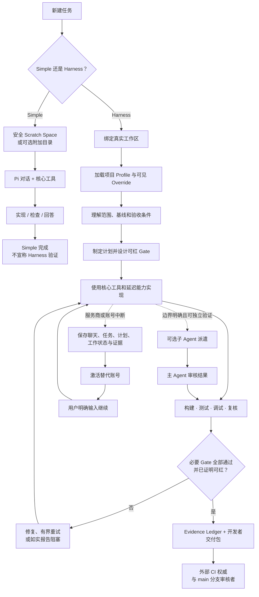
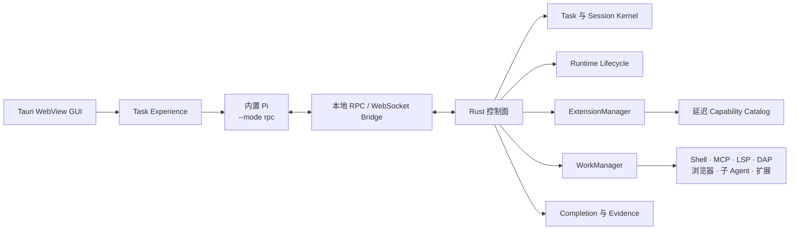

# Picode

[English](./README.md) | **简体中文**

> ⚠️ **项目正在大规模重构。** 当前公开代码库正从底层重写。旧版本存在多处**致命的设计问题**（控制面与 Agent 边界、Harness 信任假设及相关结构缺陷）。请把现在 `main` 上的内容视为过渡、不稳定状态——在重构落地前，不要基于它搭建生产工作流，也不要做长期 fork。

> 基于 Pi 的轻量、多服务商桌面开发 Harness。

Picode 是面向 [Pi coding agent](https://github.com/earendil-works/pi) 的本地桌面开发工作台，也是 [Picot](https://github.com/shixin-guo/picot) 的持续维护 fork。它服务于个人软件与游戏开发：小任务可以直接开始，中型工程则可以完成实现、本地验证、恢复和交付的完整闭环。

Picode 保留 Pi 作为 Agent 内核，使用 Tauri 2 / Rust 构建桌面控制面。下文产品方向描述的是重构后的目标形态；仓库里大量代码仍属于正在被替换的旧设计。

> 目前主要在 Windows 上验证。用于重要工程前，请备份聊天记录并审查 Agent 将要执行的操作。

## 为什么选择 Picode

多数 Coding Agent 产品要么追求单个会话的即时效率，要么发展成庞大的自治平台。Picode 选择另一条路线：成为一个低开销的个人开发工作站，让工作可以跨服务商、账号、聊天、项目、程序重启和操作系统持续存在。

| Picode 的优势 | 对实际使用的意义 |
|---|---|
| **以 Pi 为内核** | 模型循环仍由 Pi 执行，而不是在 GUI 中重写一套 Agent。Picode 在轻量内核外增加桌面控制面。 |
| **简单任务保持简单** | Simple Task 在安全 Scratch Space 中直接启动，不扫描工作区，也不启动 Git 策略、LSP、MCP、DAP 或扩展进程。 |
| **可选的完整开发闭环** | Harness Task 可以绑定仓库、规划任务、管理后台工作和子 Agent、执行本地 Gate、保存证据并生成可审核交付。 |
| **不依赖单一服务商的连续性** | Codex、Claude、Cursor 和兼容 API 可以共存。账号中断不会丢失聊天和任务，只有用户明确继续后才恢复执行。 |
| **能力完整但不常驻** | 可选工具只用轻量 Manifest 提供发现能力；完整 Schema、进程、服务器、浏览器和运行时只在调用时加载。 |
| **用证据说明完成** | Gate 变绿不会自动被信任。Picode 保存结果，并要求新增或重大修改的 Gate 通过受控红探针证明自己能拒绝错误候选。 |
| **桌面可观测性** | GUI 展示 Agent Run、子 Agent、后台 Job、进程归属、资源消耗、任务绑定、扩展状态和最近错误。 |
| **长项目可迁移** | 选择性聊天导入、工作区重新绑定、加密备份、压缩上下文包和跨平台路径规范化，支持换机器和换系统。 |

## 核心理念

### 1. 越先进的模型，越不需要被过度 Harness

Picode 不假设每个强模型都需要很长的系统提示词、强制工作流或自动调用的一整套 Skills。默认路径尽量接近原始 Pi；只有任务、用户或项目确实需要时才增加结构。

- **Simple Task** 是直接路径：对话加 Pi 核心能力。
- **Harness Task** 是工程路径：工作区、计划、Gate、证据、恢复和可选隔离。
- 用户明确调用的 Skill 可以覆盖当前任务的工作方法；覆盖是可见且仅对当前任务生效的。
- 授权和破坏性操作边界由底层 API 执行，而不是依赖提示词约束。

### 2. 轻量不是缺少能力，而是不让能力无意义常驻

Picode 不会为了看起来精简而删除真实开发所需的工具。它把“可以使用”与“已经占用内存运行”分开：

1. **Resident Core**：轻量的聊天、任务、授权、文件/进程基础操作、Git 元数据和监控控制面。
2. **Discoverable Lazy Capability**：已经启用并可被搜索，但完整 Schema、实现和进程只有调用时才加载。
3. **Disabled User Module**：在设置中可见，但模型无法搜索和调用，也禁止启动进程、端口或网络活动。

统一扩展生命周期为：

```text
Discovered → Enabled → Trusted → Running
```

启用不等于启动；信任不等于增加权限；停用则意味着模型不可见且运行成本为零。

### 3. 开发 Harness 必须形成工作闭环

Picode 对应的是软件或游戏开发者在本地承担的职责：理解需求、检查工程、制定计划、修改代码、构建、测试、调试、复核和交付。它不会取代 CI 权威、main 分支审核者、发布负责人、游戏引擎或 IDE。

Picode 也不会把自己扩张成通用科研、写作或艺术生产平台。可选集成可以帮助开发工作，但产品边界始终是软件工程。

### 4. Gate 变绿不等于 Gate 有效

命令返回 0 只能证明这次命令返回了 0。Picode 的 Completion Gate 包含明确判断条件、有界输出和可保留证据；当 Gate 被新增或重大修改时，还必须通过受控负例证明同一条 Gate 确实能够变红。

### 5. 任务连续性不应该依附于某个账号会话

聊天、Task Run、计划、证据、工作区身份和账号执行阶段是不同的持久对象。A 账号中断时，只停止属于 A 的工作；B 账号可以接管保存下来的任务，但在用户明确输入 **继续** 之前，不会自动触发模型请求或工具执行。

## 完整开发流程

同一个桌面应用同时提供快速路径和完整工程路径，二者不会互相强制污染。



### 这条开发流保证什么

- Simple Task 永远不会冒充通过 Harness 验证。
- 导入或恢复的 Harness Task 在当前机器重新绑定工作区前，不能执行工程工具。
- Git Worktree、Write Lease、LSP、DAP、MCP、浏览器自动化和专业模块，只在任务策略或用户明确选择时启用。
- 子 Agent 得到的是有边界的 Delegation Contract，不能扩大主 Agent 分配的权限和任务范围。
- 本地 Gate 证据用于开发者交付，不会冒充 CI 认证或合并批准。

## 当前能力

### 服务商、账号与模型

- 手动导入受支持的本机 Codex、Claude 和 Cursor 配置。
- 经过预览确认的 JSON 凭据导入，不自动收集账号信息。
- Codex 官方 OAuth 与 OpenAI 兼容反代通道。
- 自定义 OpenAI 兼容与 Anthropic 兼容服务商。
- 模型选择显示所属服务商，同名模型不会错误合并。
- 可以保存多个账号，但同一服务商同时最多激活一个账号。
- 更换账号后必须明确继续任务。
- Cursor 官方 SDK API Key 与实验性 Desktop/CLI OAuth 通道彼此独立。

密钥会被规范化存入受保护的 Account Vault；Picode 不会把导入的源 JSON 当作长期凭据仓库。

### 聊天、迁移与恢复

- 选择性扫描和导入 Codex、Cursor、Claude 聊天。
- 显示可读标题、最近消息摘要、时间、大小、来源和归档状态，并支持筛选排序。
- 来源会话去重、思考内容过滤、完整上下文浏览和可选全量思考导入。
- 导入聊天执行工具前必须完成 Workspace Binding。
- 跨平台工作区身份与 Windows/Linux/macOS 路径规范化。
- 无损聊天备份，默认选择加密。
- 用于长项目迁移的压缩上下文包。
- 归档、软删除、二次确认永久删除和非破坏式 Rewind 基础能力。

聊天备份不会打包项目文件。

### Harness 与运行时

- 明确的新建 Simple Task 与 Harness Task 入口。
- 持久化 Task Run、账号执行阶段、计划、工作状态和证据。
- 受管 Shell Job、持久代码执行、浏览器运行时、代码智能与调试 Adapter。
- 用户可配置子 Agent 模型策略，并集成 [pi-subagents](https://github.com/nicobailon/pi-subagents)。
- Runtime Monitor 展示主/子 Agent 关系、CPU、内存、用量、等待状态和疑似停滞。
- Completion Coordinator 管理 Gate 结果、红探针、重试状态和证据。
- ExtensionManager 与 WorkManager 统一管理 Skills、Hooks、MCP、LSP、DAP、Firstmate 和原生扩展进程。

### 扩展治理

Extension Manifest v2 记录来源、固定版本或 Commit、内容哈希、许可证、支持平台、权限、组件、健康检查和资源限制。重型进程通过统一 Adapter 启动，带有任务/Agent Run 归属、超时、取消、崩溃报告和有界输出。

“专业扩展”界面展示真实生命周期、来源、版本、权限、最近错误、运行进程和任务绑定。`mattpocock/skills` 之类的 Skill 集合会显示成一个可展开的软件包，而不是几十个互不相关的条目。

## 架构



桌面 GUI 与未来的 Headless/远程客户端会使用同一套任务和聊天控制边界。Agent 的实际执行仍然留在运行 Picode 的本机。

## 项目状态

[Harness V2](./docs/P0-P5-HARNESS-V2.md) 中的 P0–P4 生产链路已经接通并通过本地 Gate；P5 的远程与实验能力仍处于规划状态，并默认停用。

Picode 在桌面治理、多账号连续性、扩展生命周期和验证模型方面已经形成自己的优势，但部分高级执行能力仍在深化。LSP、DAP、长连接 MCP、浏览器自动化、子 Agent 恢复和上下文压缩目前可用，但成熟度仍需继续提高。可阅读如实记录差距的 [Picode 与 oh-my-pi 开发管线复评](./docs/research/picode-vs-oh-my-pi-pipeline-2026-08-01.md)。

Linux 和 macOS 可移植性是架构要求，但目前 Windows 得到了最多的实际验证。

## 从源代码构建

环境要求：

- [Rust](https://www.rust-lang.org/tools/install)
- [Bun](https://bun.sh/)
- [Tauri 2 对应平台构建依赖](https://v2.tauri.app/start/prerequisites/)
- Git

```bash
git clone https://github.com/awangs1986/picode.git
cd picode
bun install --frozen-lockfile
bun run dev
```

构建发行版：

```bash
bun run build
```

运行主要本地检查：

```bash
bun run check
bun run test
bun run check:rust
```

## 设计与实施文档

- [Harness V2：P0–P5](./docs/P0-P5-HARNESS-V2.md)
- [实施路线图](./ROADMAP.md)
- [领域模型](./CONTEXT.md)
- [架构决策记录](./docs/adr/)
- [Picode 与 oh-my-pi 开发管线复评](./docs/research/picode-vs-oh-my-pi-pipeline-2026-08-01.md)

## 上游与致谢

Picode 是 [Picot](https://github.com/shixin-guo/picot) 的 fork 和衍生项目。Picot 提供了桌面交互模型、Tauri 基础、聊天界面，以及大量让本项目得以成立的早期集成工作。在此真诚感谢 Picot 的维护者和贡献者。

Picode 由 [Pi coding agent](https://github.com/earendil-works/pi) 驱动。Pi 提供本项目核心的轻量 Agent 运行时、RPC 模式、聊天格式、模型/服务接入和扩展生态。在此同样真诚感谢 Pi 的维护者和贡献者。

高级子 Agent 编排使用 [pi-subagents](https://github.com/nicobailon/pi-subagents)。可选能力继续遵守各自上游的许可证与声明。Picode 遵守能力来源阶梯：优先寻找兼容的 Pi 包，其次研究 Oh My Pi 和其他同类开源 Agent，只有前面的方案不适合时才编写 Picode 专用实现。

Picode 是独立社区项目，与 OpenAI、Anthropic、Cursor、xAI 或其产品不存在官方隶属或背书关系。

## 许可证

Picode 按照 [MIT License](./LICENSE) 发布，与 Picot 的许可证保持一致。第三方组件和随附依赖继续遵守各自许可证与声明，详见 [THIRD_PARTY_NOTICES.md](./THIRD_PARTY_NOTICES.md)。
