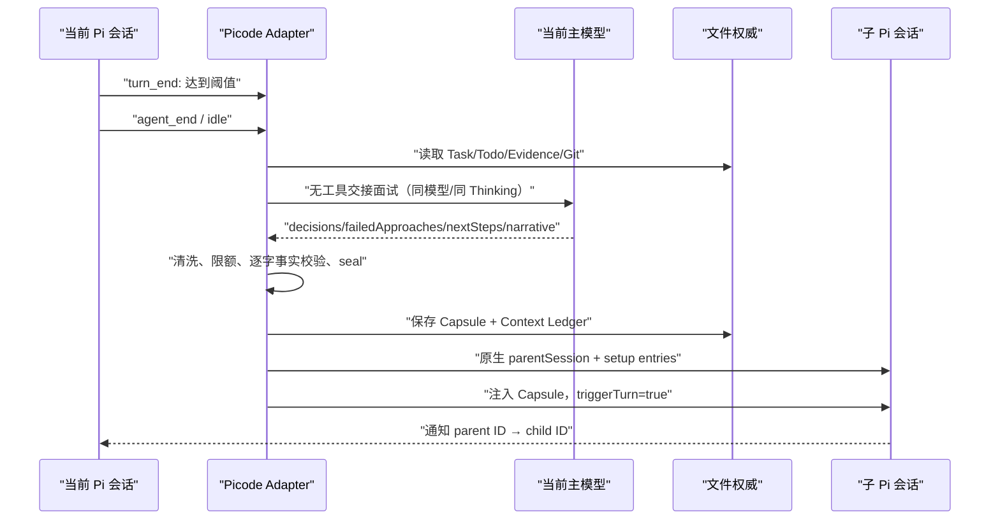

# Picode Auto Slice / Capsule 实现与评审基线

> 日期：2026-08-16
> 状态：P0–P3 已实现；P4 真实长任务 A/B 尚未执行
> 最高裁决标准：**在尽可能小的体积下，让开启 Slice/Capsule 时的真实任务漂移低于关闭时。**

## 1. 产品裁决

Picode 不把 Capsule 当作“更完整的聊天摘要”，而把它当作长任务跨会话继续所需的最小交接集。

- 结构全绿不等于产品有效；只有真实 A/B 中 Slice-on 的漂移稳定低于 Slice-off，机制才算成功。
- 即使只稳定改善一点，也属于成功；若 Slice-on 更差，就必须继续缩减或修正交接集。
- 新字段必须由真实漂移样本证明有价值，不能为了 schema 完整而扩张上下文。
- 原 Pi JSONL 始终完整保留；Capsule 不替代 transcript、Git、Task、Todo 或 Evidence。

当前实现已经闭合确定性生命周期和失败回退，但尚未用真实中型项目证明净收益。因此正确标签是：

**Implemented, Experimentally Opt-in, Product Benefit Not Yet Proven.**

## 2. P0–P4 状态

| 阶段 | 状态 | 结果 |
|---|---|---|
| P0 | 已实现 | 漂移评分器、成对 A/B 裁决器、可执行 `gate:slice-drift`；判据为至少 3 对、改善占多数、质量不退化 |
| P1 | 已实现 | 当前主模型打包语义区；无工具、同模型、同 Thinking；Host 注入 Task/Todo/Git/Evidence；Capsule 2–6K 目标、8K 硬上限 |
| P2 | 已实现 | Standard/TDD 实验性 Auto Slice；分档阈值；父子 Pi JSONL；自动切换并继续；旧会话完整保留 |
| P3 | 已实现 | Pi compaction fallback、确定性 Revision、诚实降级、幂等 Capsule、supersession、未知 mutation 默认阻止 |
| P4 | 未执行 | 真实 Provider、中型项目、同模型多次 A/B；不得用单元测试代替 |

## 3. 权威与模块边界

| 组件 | 唯一责任 |
|---|---|
| Devloop/task | Slice 政策、Capsule 契约、预算、封存、注入资格、漂移裁决 |
| Store | Task/Capsule/Evidence 文件的原子持久化与索引；不解释 Capsule 内容 |
| Engine | Pi 会话生命周期与 JSONL 种子持久化；不拥有第二套 Session |
| Guard | 工具权限、工作区和副作用分类；硬边界下未知工具按 possible mutation 处理 |
| Adapter Extension | 将 Pi 生命周期事件组合进上述 Interface；不复制领域事实 |
| Pi | 模型循环、TUI、模型、Thinking、JSONL transcript 与原生会话链 |

Pi 仍是会话权威。Picode 只增加一个最小兼容 Seam，使扩展能在 `agent_end` 或真正 idle 的稳定边界创建原生父子会话；升级 vendored Pi 时由固定布局测试验证该补丁。

## 4. 用户行为

### 4.1 开启方式

- Simple：保持原版 Pi 行为，不弹 Auto Slice 建议，不启用强制 Slice。
- Standard/TDD：Task 第一次进入时逐 Task 询问是否开启实验性 Auto Slice。
- 可用 `/pico-slice-auto on|off|status` 修改当前 Task 设置。
- 用户拒绝后不反复打扰；手动 `/slice <next intent>` 仍可使用。

### 4.2 阈值

| Endpoint 实测窗口 | Reliable Working Context Ceiling | Auto Slice 阈值 |
|---:|---:|---:|
| 小于 400K | Endpoint 实测窗口 | 80% |
| 400K 及以上 | 400K | 320K（大窗口中的实际百分比随窗口降低） |

400K 是保守的产品可靠性边界，不伪装成模型物理容量，也不声称能证明该范围内
绝不漂移。阈值只负责提前触发交接；P4 仍必须根据真实 A/B 判断是否继续下调。

### 4.3 无感续接

触发点先在 `turn_end` 记录，真正打包和替换只在 Agent 已 settled 后执行：

新会话以 `relation: slice-continuation` 记录 `rootSessionId`、`parentSessionId` 和 `sliceIndex`。原父 JSONL 不被重写或删除，resume 时仍可恢复完整历史链。

## 5. Capsule 内容

### 5.1 确定性事实区（Host 提供）

- Task 标题、Task Revision；
- 精确验收条件；
- Harness 档位、当前阶段、未完成 Todo；
- Git workspace / HEAD / content digest；
- changed files（最多 200 条，超出数量显式记录）；
- Gate/Evidence 指针；
- 来源 session、模型、Thinking、父子链和触发时 usage。

Task 标题与验收条件作为 `verbatimFacts`，由 Resolver 重读权威内容，校验 source digest 和逐字包含关系。模型不能修改这些事实。

### 5.2 语义区（当前主模型提议）

- `decisions[]`：已定决策和一句理由；
- `failedApproaches[]`：已失败路径，避免新会话重犯；
- `nextSteps[]`：下一步最小入口；
- `narrative`：唯一允许自由摘要的补充叙事。

必须使用当前会话主模型和当前 Thinking；不允许改用 Subagent，也不暴露任何工具。结果只作为不可信语义候选，经 schema、秘密清洗和预算器处理。

### 5.3 体积纪律

- 目标为约 2–6K Token；
- 8K Token 为硬上限；
- 超限先删除/截短 narrative，再缩减可选语义；
- 必要事实仍超限则拒绝 Capsule 并回退 Pi compaction；
- 不纳入完整旧聊天、完整 tool log、reasoning、全量 diff、Skill 正文或秘密。

## 6. Capsule 身份与真实性

`picode.capsule/v1` 绑定：

- `taskId + taskRevision`；
- `workspaceSnapshot`；
- `capsuleId + digest`；
- `sourceSession + lineage`；
- `status: draft → sealed → superseded`。

注入前必须满足 sealed、schema、Task、Revision、digest 及可用的 workspace identity 全部一致。旧 Capsule 只有在新子会话 setup、注入与 JSONL 种子持久化成功后才标记 `superseded`；中途失败不会提前摧毁可恢复状态。

同一 Task/Revision/source session/intent 产生确定性 Capsule ID。重试先读取既有 Capsule，不重新消费模型 Token，也不制造重复事实包。

## 7. Revision 规则

Revision 不依赖模型判断“需求是否变化”，也不要求用户记得手动更新。以下确定性事件递增：

- Task 标题改变；
- 验收条件改变；
- 工作区重绑；
- 成功完成 rewind/tree change。

Harness 档位和 Auto Slice 开关本身不改变任务语义，因此不递增。只有成功的 `session_tree` 才记录 rewind，取消的预操作不会误使 Capsule stale。

## 8. 失败与降级

| 失败 | 行为 |
|---|---|
| 当前模型打包失败/超时/格式错误 | 不切会话；通知并请求 Pi durable compaction |
| 自动切片时 Git HEAD 或 content digest 缺失 | 在调用模型前拒绝自动 Capsule，诚实说明 degraded 并回退 Pi compaction |
| 手动 `/slice` 的 snapshot 不完整 | 允许生成，但 Capsule 渲染首部明确标为 DEGRADED 和跳过项 |
| Capsule 来源、digest、Task/Revision/Snapshot 不符 | fail-closed，拒绝 seal/inject |
| 子会话创建取消或失败 | 保留父会话与 sealed Capsule；回退 Pi compaction |
| Pi threshold compaction 与 Auto Slice 同时触发 | Auto Slice 开启时只取消 threshold compaction；manual/overflow 仍是 fallback |
| 硬边界遇到未知第三方工具 | 默认 possible mutation，阻止副作用；已证明只读的工具才允许 |

自动续接不是依赖模型调用 Workflow Engine：阈值、stable boundary、identity、seal、切换和 fallback 都由确定性生命周期代码执行。

## 9. Context Governor 与原生压缩

Auto Slice 是面向长期任务连贯性的首选交接机制；Context Governor 仍是每次 Provider 请求前的防溢出硬预算。二者职责不同：

- Slice：在较早阈值创建新会话，降低长任务漂移；
- Governor：防止任何单次请求超出有效窗口；
- Pi compaction：Auto Slice 失败、未开启、手动压缩或紧急 overflow 时的 fallback。

Auto Slice 开启时不会关闭 Governor，也不会取消 Pi 的 manual/overflow 压缩。

## 10. P0 效果 Gate

`npm run gate:slice-drift -- <paired-observations.json>` 对成对样本使用同一评分规则：

- 关键事实丢失；
- 废弃需求复活；
- Gate 漏跑；
- 重复失败路径；
- 隐藏验收失败；
- 产品质量回归。

最小裁决要求：至少 3 对；Slice-on 改善占多数；不得以质量退化换低漂移。此 Gate 是可重复的产品裁判，不是模型自评。

## 11. 已自动验证的内容

聚焦测试覆盖：

- 400K 可靠上限、320K 自动触发与旧手动 soft/hard 规则；
- 当前主模型/Thinking、无工具打包与秘密清洗；
- Capsule 预算、真实性、digest、渲染和生命周期；
- Task Revision、Auto Slice 持久状态；
- settled boundary 自动续接、父子 lineage、`triggerTurn=true`；
- 打包失败和 degraded identity 回退；
- 手动 `/slice` 幂等；
- vendored Pi Seam 的固定布局、重复 patch 和升级失败红灯。

这些测试证明 P0–P3 的机械合同，不证明真实项目里 Slice-on 比 Slice-off 更好。

## 12. P4 真实验收

P4 使用同一 Picode、同一 Provider、同一模型、同一 Thinking、同一 Simple/Standard 基线，只改变 Auto Slice：

1. 至少一个中型仓库；
2. 2–3 个跨模块长任务；
3. 每个任务 A（关闭）/B（开启）至少 3 对；
4. 隐藏验收和机器计分，不采信 Agent 自述；
5. 同时记录交接 Token、首次恢复轮数、失败路径复活和最终 Gate；
6. 若 B 没有稳定优于 A，Auto Slice 继续保持实验性，不默认开启；
7. 若 B 稳定小幅改善且不降低产品质量，即达到第一版成功标准。

## 13. 明确不做

- 不增加第二套 Session/Chat 数据库；
- 不用 Subagent 打包 Capsule；
- 不追求对开放世界“所有重要事实均已收录”的伪保证；
- 不添加 transaction journal；本地单用户由确定性 ID、原子文件和可重试收敛；
- 不让模型自述 scope drift 触发强制切片；
- P4 数据出来前不再叠加第五层上下文机制。
