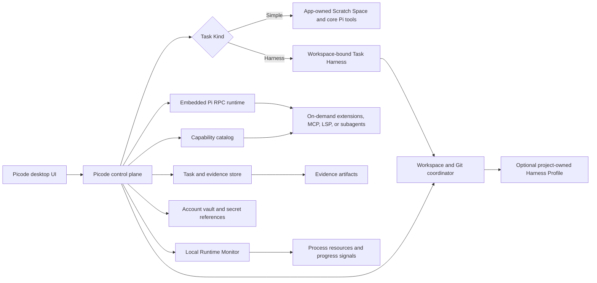

# Task execution specification

Status: accepted product specification

Decision date: 2026-07-30

Product: Picode

## 1. Outcome

Picode is a lightweight desktop interface around the upstream Pi agent runtime. It supports immediate Pi-native work for simple conversations and optional, higher-assurance Harness Tasks for large projects without turning the latter into a universal prerequisite.

The product must preserve Pi's provider, session, compaction, RPC, and extension behavior while adding a durable control plane for workspaces, accounts, tasks, verification, evidence, secrets, and optional capabilities.

## 2. Scope

This specification covers:

- explicit Simple Task and Harness Task creation;
- app-owned Scratch Space for workspace-free Simple Tasks;
- project-owned Harness Profiles;
- durable Chat Sessions, Task Runs, and Execution Epochs;
- account interruption and explicit continuation;
- baseline-aware verification and evidence retention;
- optional Git-managed development workspaces and concurrent write isolation;
- temporary secrets and durable Secret References;
- core, global, and task-bound tool capabilities;
- lazy LSP, qualified Subagent routing, and user-selected Subagent model candidates;
- local Agent Run monitoring, usage accounting, and stall assessment;
- cross-platform workspace restoration.

It does not require engine-specific Unity, Unreal, Godot, or other game-development behavior. Those capabilities belong in project adapters or extensions when a project's own harness exposes them.

It also does not move browser control, phone remote control, large agent teams, continuous memory services, or other high-cost features into the resident core.

## 3. Non-negotiable invariants

1. Pi remains the agent runtime. Picode does not reimplement the Pi loop.
2. Every Task Run has an explicit Task Kind: Simple or Harness.
3. A Simple Task starts without selecting a user workspace or loading a Harness Profile; its initial execution area is app-owned Scratch Space.
4. A Harness Task binds a workspace and instantiates a Task Harness from a Picode template and any selected project Harness Profile.
5. A discovered command is not trusted until the user confirms it for a Harness Profile or invokes it explicitly for the current task.
6. Trusting a Harness Action does not automatically authorize every invocation of it.
7. Explicit user instructions and explicitly invoked Skills may create a visible, task-local Task Override, including replacement of template actions, Git strategy, or Completion Gates.
8. The underlying tool and API layer remains the enforcement boundary for actual capabilities, permissions, and destructive-operation confirmations.
9. A model's confidence or prose is never sufficient evidence for a Harness-verified completion claim.
10. Account replacement may hand Chat Session associations to the replacement account, but it never starts or resumes a Task Run.
11. A Task Run survives account, provider, channel, model, process, application, and operating-system interruptions.
12. A Task Run may resume through another account only after the user explicitly continues it.
13. Picode never discards, reverts, stages, commits, merges, or deletes user Git work without explicit authority.
14. Absolute paths are local bindings, never portable workspace identity.
15. Secrets never enter chat history, model context, logs, exports, or project configuration.
16. Non-core extension implementations are not resident merely because their capabilities are available.
17. Expensive checks, services, and indexes are activated only by an active Task Harness, a task requirement, an explicit Skill, or explicit user authority.
18. Configuring a cheaper Subagent model does not cause delegation or make that model suitable for every Subagent task.
19. Automatic Subagent model routing requires recorded Delegation Eligibility; price alone is never sufficient.
20. A Runtime Monitor distinguishes running, waiting, completed, failed, cancelled, suspected-stall, and unresponsive states; low CPU or long duration alone never proves a stall.
21. A suspected-stall assessment never automatically terminates an Agent Run.
22. Guidance may add structure or request planning, but it never weakens authorization, Gate, workspace, or completion policy.
23. Rewind is previewed and append-only: it records a compensating event and never silently deletes the audit journal.
24. Hooks are advisory lifecycle integrations and never gain completion authority.

## 4. System boundary



The desktop UI is a client of the same Chat Control Interface intended for a future Remote Control Extension. The control plane owns durable coordination; Pi owns model interaction and its native session semantics; optional capabilities remain replaceable and unloadable.

## 5. Ownership and persistence

| Information | Owner | Portable | Secret |
|---|---|---:|---:|
| Task Kind and task-local Task Override | Task Run | Yes | No |
| Harness actions, overlays, parameters, platform variants, completion gates | Optional Project Harness Profile and Task Harness | Yes | No |
| Scratch Space path | Picode user store | No | No |
| Absolute workspace path and machine binding | Picode user store | No | No |
| Chat Session and Task Run ledger | Picode user store and Chat Backup | Yes | No |
| Account credentials | Account Vault | No by default | Yes |
| Secret Reference locator | Picode user store | Only when the locator is portable | Sensitive metadata |
| Resolved secret value | Temporary protected memory or OS credential API | No | Yes |
| Bounded result preview and evidence metadata | Evidence Ledger | Yes | Redacted |
| Full logs and reports | Local Evidence Artifact store | Configurable | Redacted or locally encrypted |
| Task Extension bindings and `TOOLS.md` declaration | Task Run | Yes | No |
| Subagent Model Policy | Picode user store with optional Task Override | Configurable | No |
| Agent Run lineage, lifecycle, usage, and health history | Task Run and local runtime store | Configurable | Redacted |
| Operating-system CPU and memory samples | Local runtime store | No | No |
| Extension executables and machine paths | Local capability installation | No | No |

Chat Backups remain separate from workspace files and Account Vault secrets. A restored Simple Task may reopen in app-owned Scratch Space. A restored or imported workspace-bound task must bind its portable Workspace Identity to a current local directory before workspace tool execution.

## 6. Harness Task and Harness Profile

This section applies only to Harness Tasks. Choosing a Harness Task creates a Task Harness from a built-in template. A project-owned Harness Profile may refine that template. Discovery may recommend creating or updating a Profile, but it never changes a Simple Task into a Harness Task or forces Harness behavior on a workspace.

### 6.1 Storage and format

The confirmed profile is a project-owned, reviewable UTF-8 JSONC document with a strict versioned schema. The initial implementation should use `.picode/harness.jsonc`; schema migration must preserve older accepted versions or reject the whole document with a clear upgrade path.

The document contains only portable definitions. Absolute paths, credentials, local environment values, account identifiers, and machine-specific bindings are referenced through named local slots.

### 6.2 Discovery lifecycle

1. In a Harness Task, Picode inspects project rules, package scripts, build files, CI definitions, and other deterministic sources.
2. It creates a draft containing candidates and source provenance.
3. Conflicting candidates are displayed together with their sources and differences; source priority may sort them but never silently select one.
4. The user confirms the canonical actions.
5. Unselected candidates remain visible but disabled.
6. Only confirmed actions form the reusable Harness Profile contract. Explicit one-task actions remain Task Overrides and do not silently modify the project file.

The base profile applies to the workspace. Modules, packages, and subprojects may declare Profile Overlays. An overlay activates from the Task Run's actual target and changed paths, not from which chat window is open.

### 6.3 Action contract

Each Harness Action has a stable action ID and defines:

- purpose and applicability;
- source provenance and source fingerprint;
- typed parameters, allowed values, defaults, and parameter-specific approval requirements;
- explicit platform variants for Windows, Linux, and macOS;
- executable and argument array by default;
- an explicit shell type and platform when a shell expression is unavoidable;
- working-directory and local-slot requirements;
- timeout, expected cost, side-effect class, and risk tier;
- dependencies on other Harness Actions;
- structured success conditions;
- evidence, artifact, redaction, and retention policies;
- bounded retry policy;
- completion-gate mappings.

The Agent may fill only declared parameters. It may not append arbitrary arguments or translate commands and paths between operating systems. A missing confirmed platform variant blocks execution until the user supplies or confirms one.

Illustrative shape:

```jsonc
{
  "$schema": "https://picode.dev/schemas/harness/v1.json",
  "schemaVersion": 1,
  "profileId": "example-game",
  "actions": {
    "test.module": {
      "purpose": "Run tests for one confirmed module",
      "source": { "path": "package.json", "fingerprint": "sha256:..." },
      "parameters": {
        "module": { "type": "string", "allowed": ["editor", "runtime"] }
      },
      "risk": "read_only",
      "platforms": {
        "windows": { "program": "bun.exe", "args": ["run", "test:{module}"] },
        "linux": { "program": "bun", "args": ["run", "test:{module}"] },
        "macos": { "program": "bun", "args": ["run", "test:{module}"] }
      },
      "success": {
        "all": [
          { "exitCode": 0 },
          { "report": "localSlot:testReports/{module}.json", "parser": "vitest-json" }
        ]
      },
      "retry": { "maximumAttempts": 2, "markPassAfterRetryAsFlaky": true },
      "completionGateFor": ["module-code-change"]
    }
  }
}
```

### 6.4 Trust, authorization, and drift

Profile confirmation establishes that an action's engineering meaning is trusted. Invocation still passes Picode's allow, ask, or deny policy. Read-only, low-cost actions may run automatically; writes, deployment, destructive actions, secret use, and expensive whole-project checks follow their configured authorization policy.

Every confirmed action retains the fingerprint of its discovery source. Unchanged actions remain confirmed. Only actions whose source changed or disappeared become drifted and require review. Review is limited to the affected definitions.

## 7. Chat and task model

### 7.1 Chat Session

A Chat Session is the durable conversation container. It can contain sequential Task Runs. Different Chat Sessions can execute concurrently, including through different providers, subject to their effective task workflows and the underlying tool/API coordination.

### 7.2 Task Run

Every Task Run owns a versioned record of:

- Task Kind and, when applicable, Scratch Space or Workspace Identity;
- goal and acceptance conditions;
- plan and plan revisions;
- optional Profile fingerprint, instantiated Task Harness, active overlays, and Task Overrides;
- optional change scope and Git baseline when the selected workflow uses them;
- active and completed core or Harness Actions;
- provider/account Execution Epochs;
- main-Agent and Subagent Agent Run lineage, selected models, routing reasons, and usage;
- background jobs and cancellation state;
- evidence, attempts, decisions, and remaining work;
- continuation checkpoint.

Goal, acceptance, and plan updates append revisions rather than overwriting prior meaning. A Chat Session has at most one write-capable Task Run active at once. Its attributed background tests and read-only checks may run concurrently.

The new-task interface offers two explicit choices:

- **Simple Task** starts immediately with core Pi conversation and tools in app-owned Scratch Space. It does not require a workspace picker, Harness discovery, Git setup, LSP, MCP, subagents, or other extensions.
- **Harness Task** requires Workspace Binding and instantiates a reviewable Task Harness from the current Picode template, then applies any selected project Profile and visible Task Overrides.

A Simple Task may later attach a workspace and remain Simple, or the user may convert it into a Harness Task. Neither transition loses chat history, task state, account epochs, or existing evidence. Conversion records a new Task Kind revision rather than rewriting history.

### 7.3 Execution Epoch and account continuation

An Execution Epoch fixes provider account, channel, and model for one continuous portion of a Task Run. Selector changes apply to the next new task or the next explicitly continued epoch; they do not mutate a running epoch.

When account A is deactivated, replaced, logged out, or disconnected:

1. A's connections and associated running jobs stop.
2. Unrelated providers continue.
3. Affected Task Runs become suspended without losing context, tasks, or evidence.
4. Affected Chat Session associations and their preserved task information are handed to active account B, but no model request, command, or tool starts.
5. Only when the user enters the localized `continue` command in a specific chat does Picode create B's new Execution Epoch in the same Task Run.
6. Picode reconstructs the working state from the ledger and current workspace, then resumes the next safe unfinished step.
7. It interrupts only when B lacks a required capability or authority, or the workspace can no longer be reconciled safely.

### 7.4 Bounded autonomy

Without a stronger user instruction, the Agent may perform at most two evidence-based repair rounds within the existing goal, acceptance conditions, module/file scope, permissions, and dependency boundary. Continued failure, scope expansion, public-interface changes, new dependencies, or higher-risk actions require a report and an offer to enter question-driven adjustment mode.

The user may explicitly authorize multi-round testing or persistence until a stated terminal condition. That authorization does not override safety or permissions. The Agent must stop if evidence shows the method is infeasible, no attempt can produce new information, or execution has entered a repeated cycle.

### 7.5 Runtime observability

Every main-Agent and Subagent execution is represented as an Agent Run linked to its Task Run and, for a Subagent, to its parent Agent Run. The record exposes lifecycle state, foreground or background mode, provider, account, model, current or last action, start and end time, last progress time, waiting reason, token and cost usage when reported, and termination result.

Each Agent Run is carried by a distinct Runtime Instance. Pi, ACP, and future runtime protocols are translated by source adapters owned by Runtime Lifecycle; application entry points only submit raw events and identities. Runtime Lifecycle is the sole authority for semantic event ordering and state transitions, while Task Control, Work Manager, Context Engine, Session Kernel, and Completion Coordinator remain specialized projections or streaming stores.

Lifecycle Events are committed before required projections. If any required projection fails, the Runtime Instance becomes `Reconciling` and cannot claim completion until idempotent replay finishes. Event identity plus per-projection checkpoints prevent duplicate side effects. High-frequency text, reasoning, terminal chunks, and tool progress do not enter the durable lifecycle log; streaming stores handle them directly and bounded progress observations may be coalesced by Work identity.

`agent_end` ends one Agent Run turn and requests completion evaluation; it does not by itself complete the Task Run. A Simple Task uses the built-in policy to settle that Runtime Instance while leaving its conversational Task Run ready for another explicit turn. A Harness Task completes only after its active Completion Gates pass. The resulting Runtime transition is Completed, Running for a bounded Gate-requested continuation, Waiting for User, or Reconciling on evaluation failure.

Provider replacement or runtime reconnection preserves the Chat Session and Task Run but creates a new Agent Run and Runtime Instance linked to the previous Agent Run. Extensions receive read-only Lifecycle Events and Runtime state (including `Reconciling`) and may submit validated Runtime Intents through the owning task controls; direct begin, record, and end mutations are not part of the client control surface. Extensions cannot forge terminal events, replace runtime identity, or raise authority.

The Runtime Monitor presents active and recent Agent Runs as a hierarchy rather than as an undifferentiated process list. It also shows operating-system process identity, CPU, memory, and process uptime when available. When multiple Agent Runs share a process or a provider omits usage, Picode labels the value as shared, estimated, or unavailable instead of inventing per-Agent precision.

Health assessment uses process liveness, model-request state, tool state, permission or user waits, heartbeats, and meaningful progress signals. Waiting for a model response, a long tool, user input, or permission is a named state rather than a stall. `Suspected Stall` means progress is overdue with no known explanation; `Unresponsive` requires a failed process or control-plane probe. Either state is diagnostic and visible, but only the user or the effective task workflow may cancel, retry, or replace the Agent Run.

### 7.6 Adaptive Guidance, Task Experience, and rewind

Task Experience is the single public task/session seam used by desktop and headless clients. Its external interface exposes one creation intent and one lifecycle-transition intent; callers do not coordinate Task Control and Session Kernel themselves. Creating, starting, and explicitly continuing a task updates Task Control and appends the corresponding bounded semantic event to the canonical Session Kernel stream. A failed creation compensates any newly created empty Session instead of leaving an orphan, while a pre-existing Session is never removed. Pi JSONL remains the owner of full conversation bodies; task events do not duplicate streamed text, reasoning, or tool logs.

Guidance is independent from Assurance. `Lean` leaves a capable model with the ordinary Pi loop, `Adaptive` introduces only the structure justified by ambiguity, failures, omissions, or evaluated model reliability, and `Guided` is explicit. A user planning request is always honored. Harness completion Gates remain mandatory at every Guidance level.

Session rewind requires a fresh preview and exact confirmation. Applying it appends a rewind marker, preserves the full audit journal, and changes only the effective event projection. Workspace rewind remains a separate explicit Git-backed preview/apply operation; it is never inferred from conversation rewind.

## 8. Verification and completion

### 8.1 Scope selection

For a Harness Task, applicable checks are selected in this order:

1. explicit Profile mapping from changed path, target, and change type to Harness Actions;
2. local dependency graph;
3. LSP or symbol references;
4. actual Git change scope.

The chosen scope and its basis are visible. Uncertainty broadens verification or asks the user; it never silently narrows checks. A Simple Task uses only the checks requested by the user, chosen by Pi's ordinary workflow, or introduced by an explicit Skill; it does not imply a project Harness contract.

### 8.2 Baselines

Before the first Harness Task write, Picode captures the low-cost relevant baselines required by its active Task Harness. High-cost baselines run only when required by that Harness, explicitly authorized, or needed because no trustworthy historical baseline exists. A Simple Task does not automatically perform Harness baseline collection.

A historical baseline is reusable only when code state, Profile fingerprint, platform, and material environment identity match. Existing dirty-worktree content is recorded before Agent writes. Picode attributes only its own changed files and hunks; unisolatable overlap stops for user direction.

### 8.3 Success and failures

Harness success is evaluated from structured predicates such as exit code, expected artifacts, machine-readable reports, and bounded pattern matching. Model interpretation may explain evidence but cannot replace it.

New or worsened failures block verification. An unchanged Known Failure is reported separately. Without a comparable baseline or confirmed Known Failure, the Agent may not declare a failure unrelated merely by reading logs.

Harness retries occur only when declared by the active Task Harness or Task Override. Every attempt is retained. A pass after an earlier failure is reported as flaky, not as a clean first-pass result.

### 8.4 Completion labels

| Outcome | Required meaning |
|---|---|
| Simple completed | The requested Simple Task ended under ordinary Pi behavior; this is not a Harness verification claim. |
| Harness verified | Implementation is complete and every applicable gate in the effective Task Harness passed. |
| Harness verified with overrides | Every gate in the effective, visibly overridden Task Harness passed; the record names the changed or replaced template rules. |
| Implementation complete, Harness verification incomplete | Code work is complete, but a required effective gate was not authorized or could not run. |
| Suspended | Durable state exists, but continuation is required before more work. |
| Environment blocked | The requested work cannot proceed because a required environment or local binding is unavailable. |
| Failed | An applicable requested or Harness gate failed, the task was cancelled, or the accepted method became infeasible. |

Picode never labels a Simple Task as Harness verified. When a Task Override removes or replaces a template gate, completion is judged against the effective Task Harness and the override remains visible in the task ledger and completion label.

## 9. Evidence and secrets

Chat and task views retain bounded previews and structured summaries. Full output is stored as a content-addressed Evidence Artifact with configurable retention and capacity limits. When full content is removed, its summary, hash, and cleanup event remain in the Evidence Ledger.

Output passes through redaction before it reaches the UI, durable ledger, model context, or export. Sensitive Harness Actions may require locally encrypted artifacts and prohibit export.

One-off secrets use a protected temporary secret area and are destroyed when the Task Run finishes or is cancelled. Long-lived access uses a Secret Reference. Resolution occurs just in time and injects the value directly into the execution layer; the value is not copied into Picode's database or given to the model. Picode deletes only its own temporary material, never the user's referenced source file.

Operating-system credential services are preferred. User-selected files are allowed as references, with a warning that a plaintext file's protection depends on operating-system permissions.

## 10. Development workspace safety

Simple Tasks start in app-owned Scratch Space and require no user workspace. If the user attaches a workspace while keeping the task Simple, ordinary tool and API permissions apply; read-version or content-hash preconditions should protect edits when the underlying edit tool supports them. Git is not automatically initialized or required.

For a Harness Task, Git baseline capture, Write Leases, and Safe Worktrees are activated only when the effective Task Harness or an explicit user instruction selects Git-managed protection. In that mode Picode records repository identity, HEAD, branch, index, unstaged changes, and untracked files. Change attribution, review, recovery, and evidence use Git diffs and hunks, and every write still checks the content read by the Agent against the current file.

Selecting Git-managed protection does not itself authorize Picode to initialize, stage, commit, switch, reset, clean, merge, or delete Git state. Those operations remain explicit Harness Actions, Skill actions, or user commands and still pass through the underlying tool/API authorization boundary. Harness Profile edits are ordinary working-tree changes unless the effective task workflow says otherwise.

When Write Leases are enabled, a physical working directory grants one lease and concurrent writers require separate Safe Worktrees and branches. The first use of automatic task worktree creation requires the authority defined by the effective Task Harness or current user instruction. Integration and cleanup follow that same workflow and must be reported accurately; the default Harness template presents changes and guidance without automatically merging or deleting a Safe Worktree.

## 11. Capabilities, LSP, and subagents

### 11.1 Three capability scopes

1. Core work tools are the smallest resident set needed to search, read, edit, and execute.
2. Global Extensions are installed and enabled by the user. They are discoverable by Harness Tasks and by Simple Tasks only after the user explicitly enables extension discovery for that task.
3. Task Extensions are explicitly bound to a Task Run and restored with it.

Global and Task Extensions retain discoverability, not resident processes or full schemas. Each extension publishes a lightweight manifest to the local Capability Catalog. A resident `search_tools` capability searches that catalog. Only selection loads the complete schema and starts the implementation.

Task Extensions have a human-readable `TOOLS.md` declaration. When a task has such bindings, Picode parses the declaration at task start, restoration, and account continuation, then injects a compact capability digest. The Agent does not rely on remembering to read a file. Picode may also provide a small deterministic shortlist of relevant global capabilities without an extra model call, except that a new Simple Task receives no such shortlist until the user opts in.

### 11.2 LSP

Language servers start lazily only when the active task, explicit Skill, or Task Harness selects them. They provide navigation, references, type information, and post-write diagnostics, then stop after a configurable idle interval. Simple Tasks do not start an LSP by default. Whole-workspace prewarming occurs only when the effective task workflow requires it.

### 11.3 Subagents

Subagents are an optional, disabled-by-default extension. When the default Harness template enables them, they receive only independently verifiable work, a writing subagent uses a Safe Worktree, and the main Agent owns review, integration, and final Harness verification. An explicit user instruction or Skill may replace this task-local delegation workflow; the underlying tool/API permissions and the declared authority given to each subagent remain enforced.

The user may configure a Subagent Model Policy containing one or more eligible provider/model candidates and an explicit unavailable-model behavior: do not delegate, inherit the main model, or ask. Configuration makes a model available for routing; it does not force a Subagent to be created and does not authorize arbitrary automatic downgrade.

Before automatic routing to a configured candidate, the main Agent records Delegation Eligibility. The default policy admits only work that is:

- simple and narrowly described;
- bounded in time, output, files, and tools;
- independent of unresolved decisions and frequent user interaction;
- read-only or otherwise low-risk under the effective task workflow;
- understandable with a small, explicit context package;
- independently checkable by the main Agent or a deterministic result.

Typical eligible work includes file or symbol search, repository mapping, documentation lookup, bounded log classification, and summarization of supplied material. Architectural decisions, ambiguous investigation, writes, refactors, dependency changes, secret use, deployment, destructive operations, and work whose result cannot be checked are ineligible for automatic cheaper-model routing. They remain with the main Agent or require an explicit user-directed Agent/model choice.

Candidate selection considers declared model capabilities, context requirement, tool compatibility, provider/account availability, measured quality, expected latency, and expected cost. Price is a tie-breaker after suitability, not the eligibility test. Picode records the chosen model, routing reason, fallback, and result quality. A model becomes eligible for an automatic task class only after evaluation against the capable-model baseline demonstrates acceptable results for that class.

### 11.4 Capability acquisition

A missing capability must follow the Capability Source Ladder before greenfield implementation:

1. Search the Pi extension and package ecosystem for a compatible implementation. Prefer installing, wrapping, or contributing to an existing Pi-native capability when its behavior, maintenance, permissions, and runtime cost satisfy the specification.
2. If no Pi-native candidate is suitable, inspect Oh My Pi at a pinned commit for the equivalent behavior. Adapt the smallest mechanism needed by Picode rather than embedding or invoking the whole OMP distribution.
3. If OMP has no suitable mechanism, inspect comparable open-source agents, including OpenCode and legally inspectable Claude-style implementations, for algorithms, boundaries, tests, and failure handling.
4. Design a Picode-specific implementation only after the preceding sources have been examined and rejected with recorded reasons.

Every step produces a Capability Source Review that identifies candidates, versions or commits, licenses, required notices, security and permission implications, maintenance status, Pi compatibility, resident and active resource cost, rejected alternatives, and the selected integration form.

Source availability is not copying permission. Code may be copied or adapted only when its license permits the intended distribution and all notice obligations are preserved. Proprietary, unlicensed, source-available, or reverse-engineered material may be used only to understand public behavior or architecture; Picode must implement that behavior independently. A sourced capability does not silently change Task Kind, provider or account state, global settings, or project files; any task-local workflow change must be an explicit Task Override.

### 11.5 Explicit Skill precedence

An imported Skill receives workflow precedence only through Explicit Skill Invocation for the current Task Run. Installation, discovery, automatic matching, Agent recommendation, or appearance in the Capability Catalog does not grant override authority.

For workflow choices, precedence is:

1. the user's current, specific instruction;
2. an explicitly invoked Skill within its declared scope;
3. the effective Task Harness for a Harness Task;
4. the Task Run's existing plan;
5. Picode's default workflow and heuristics.

A Skill Workflow Override may change process order, preferred tools, investigation method, retry structure, context-loading procedure, output format, Harness Actions, Git strategy, and Completion Gates. It expires with its declared Task Run or narrower scope and never silently changes global settings, provider configuration, the project Harness Profile, or unrelated tasks. Its provenance and effect remain visible in the ledger.

The lowest-level tool and API layer, not the Harness template, enforces actual capability limits, permission prompts, secret handling, destructive-operation confirmations, and any host sandbox. An override cannot claim a capability or permission that layer did not grant. Account interruption still requires explicit `continue`, because it controls whether a new execution begins rather than how the development workflow is organized.

When an invoked Skill conflicts with the current Task Harness, Picode creates a Task Override and follows the Skill within its declared scope. It does not require the reusable project Profile to be edited. The completion label must describe the effective workflow and may not pretend that skipped or replaced template gates ran. More specific or later user instructions take precedence over a Skill; irreconcilable conflicts between explicitly invoked Skills require user direction rather than silent priority guessing.

### 11.6 Hooks, delegation contracts, and effective diagnostics

Typed Hook Points are `BeforeTool`, `AfterTool`, `Stop`, and `SubagentStop`. Disabled hooks start no process; enabled hooks must also be trusted and run through Work Manager. Hook output may advise continuation or block a transition, but cannot create Gate evidence or declare completion.

Every delegated unit carries a machine-readable Delegation Contract containing objective, allowed scope, required output, acceptance checks, stop conditions, effective tools, permissions, isolation, and parent-review requirement. The child cannot expand parent authority, and only the parent accepts the result.

The Effective Capability Report is read-only and task-specific. It exposes Resident Core entries, task bindings, catalog visibility, loaded state, prompt visibility, and provenance for project rules, Skills, and task overrides. Inspecting the report loads no capability and starts no process.

## 12. Performance and compatibility constraints

- Do not fork or replace the Pi provider/session core unless an upstream incompatibility makes it unavoidable.
- Preserve supported custom OpenAI-compatible and Anthropic-compatible provider flows.
- Keep upstream Picot changes reviewable by isolating Picode control-plane modules.
- Do not start LSP, MCP, debugger, subagent, or extension processes at application startup solely because they are installed.
- Start a Simple Task without workspace discovery, Harness loading, Git inspection, LSP, MCP, or extension process startup unless the user later requests one of them.
- Do not place full tool schemas, logs, project indexes, or workspace files in the model context by default.
- Use bounded previews, streaming storage, limited caches, lazy imports, and deterministic local search before adding model calls or vector databases.
- Sample runtime resources at a bounded adaptive interval and retain summaries rather than an unbounded high-frequency telemetry stream.
- Establish measured Windows startup, idle-memory, active-memory, and interaction-latency baselines before accepting performance claims.

## 13. Migration and compatibility

Existing Picode/Picot chat, account, backup, and compatibility identifiers remain readable. The current Super Agent task JSON is a legacy import source, not the normative Task Run schema. Migration must be versioned, transactional, and preserve source state until conversion succeeds.

Existing native Picode/Picot chats migrate as Simple Tasks unless durable source metadata proves that an explicit Harness workflow was already active. Migration must not infer Harness Task status merely because a chat once had a workspace path.

Imported Codex, Claude, and Cursor chats retain source provenance and archived state. They remain read-only until Workspace Binding. Continuing an external snapshot creates a Pi branch and then a Task Run; it never mutates the imported source record.

## 14. Specification acceptance

An implementation phase is complete only when its shipped behavior, schema migrations, UI copy in English and Simplified Chinese, focused tests, and relevant evidence agree with this specification. Harness evidence is required only for behavior delivered under a Harness Task or a release workflow that selects it. A feature hidden behind a flag or represented only in UI mock data does not count as implemented.

## 15. Decision traceability

| Decision | Accepted subject | Normative section | Primary roadmap level |
|---:|---|---|---|
| 1 | Discover a draft; only user-confirmed actions become contract | 6.2 | P1 |
| 2 | Root profile with scoped overlays | 6.2 | P1 |
| 3 | Profile trust is separate from execution authorization | 6.4 | P0–P1 |
| 4 | Stable structured Harness Action | 6.3 | P1 |
| 5 | Source fingerprints and focused drift review | 6.4 | P1 |
| 6 | Typed parameter templates; no arbitrary appended arguments | 6.3 | P1 |
| 7 | Explicit platform variants; no path or command translation | 6.3 | P1 |
| 8 | Conflicts shown for user selection; alternatives disabled | 6.2 | P1 |
| 9 | Confirmed profile stored with the project | 5, 6.1 | P1 |
| 10 | Portable project definitions separated from local bindings and secrets | 5, 6.1 | P0–P1 |
| 11 | Versioned strict JSONC for profiles; XML retained for language packs | 6.1, 14 | P0–P1 |
| 12 | Explicit validation mappings supplemented by local dependency evidence | 8.1 | P1–P2 |
| 13 | Harness verification requires all gates in the effective Task Harness | 8.4 | P1 |
| 14 | Baseline or confirmed Known Failure required to dismiss existing failures | 8.3 | P1 |
| 15 | Low-cost pre-write baseline; expensive baseline only when justified | 8.2 | P1 |
| 16 | Record dirty state and attribute only Agent-owned changes | 8.2, 10 | P0–P1 |
| 17 | Executable-plus-arguments by default; explicit typed shell actions | 6.3 | P1 |
| 18 | Structured success predicates; model interpretation is supplementary | 8.3 | P1 |
| 19 | Profile-declared bounded retry; pass-after-retry remains flaky | 8.3 | P1 |
| 20 | Bounded previews plus retained, hashed Evidence Artifacts | 9 | P1 |
| 21 | Temporary one-off secrets and durable Secret References | 9 | P0 |
| 22 | Chat as container for sequential versioned Task Runs | 7.1–7.2 | P0 |
| 23 | Explicit `continue` starts a seamless new account Execution Epoch | 7.3 | P0 |
| 24 | Two-round default autonomy with explicit persistence override and loop stop | 7.4 | P0 |
| 25 | Disabled-by-default, strictly delegated subagents in Safe Worktrees | 11.3 | P3 |
| 26 | Lazy, scoped LSP with idle shutdown | 11.2 | P2 |
| 27 | Content-version protection by default; Git management when the effective workflow selects it | 10 | P0–P3 |
| 28 | Core, global, and task capability scopes with lazy discovery | 11.1 | P2 |
| 29 | When Write Leases are enabled, one writer per physical worktree and Safe Worktrees for concurrency | 10 | P3 |
| 30 | Missing capabilities follow Pi → OMP → comparable open source → greenfield | 11.4 | All phases |
| 31 | Explicitly invoked user Skills create task-local overrides, bounded by underlying tool/API enforcement | 11.5 | P0–P2 |
| 32 | New tasks explicitly choose Simple or Harness; Simple requires no user workspace and Harness begins from an overridable template | 3, 7.2, 10 | P0–P1 |
| 33 | User-selected Subagent models are candidates only for evaluated, eligible simple work | 11.3 | P3 |
| 34 | Runtime Monitor shows Agent hierarchy, resources, usage, waiting reasons, and diagnostic stall states | 7.5 | P0–P3 |
